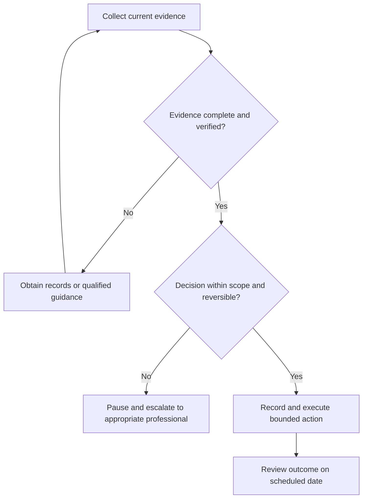

# Monthly Review

## Purpose

Review trends and adjust scope, capacity, and goals.

## Scope

This document covers weekly evidence, milestones, habits, performance reflection, risks, and lessons learned. The review evaluates evidence and process; it does not convert inference into fact or external outcomes into personal worth.

## Theory

Reliable decisions start with current evidence, explicit assumptions, reversible
steps, and a dated review. Records distinguish observations from interpretations
and prevent memory, urgency, or confidence from silently replacing evidence.

## Evidence Classification

| Class | Meaning | Use |
|---|---|---|
| Evidence | Registered authoritative material or verified records | Supports claims and observations |
| Best practice | Reusable control consistent with the evidence | Default until context requires change |
| Opinion | Preference or untested hypothesis | Label, time-box, and evaluate |

Evidence supports structured literacy and risk-aware decisions. Best practice is
to keep records minimal, private, current, and decision-linked. Opinion is
allowed only when marked and tested; it never overrides legal, professional, or
safety requirements.

## Framework

| Stage | Required input | Output | Control |
|---|---|---|---|
| Observe | Current records | Factual baseline | Verify provenance and period |
| Interpret | Baseline and assumptions | Bounded explanation | Separate fact from inference |
| Decide | Options and constraints | Decision record | State owner and reversibility |
| Act | Approved decision | Evidence of action | Protect private information |
| Review | New evidence | Continue, change, or stop | Use a dated trigger |

## Workflow

Aggregate weekly evidence, compare trends with decision thresholds, review goal validity, choose corrective actions, and schedule verification.

## Implementation

Use synthetic examples in public files and keep personal records under ignored
`private/` paths. Record the question, source data, assumptions, options,
opportunity cost, selected action, owner, due date, and review trigger. Verify
mutable rules with current authoritative local sources before acting.

## Decision Tree

Decision owner: the operator. Inputs must be current for the review period.
Irreversible, regulated, high-loss, or unclear decisions require escalation.

## Failure Modes

- Acting on stale, incomplete, promotional, or unverified information.
- Hiding assumptions or treating opinion as evidence.
- Optimizing a metric while ignoring risk, quality, privacy, or opportunity cost.
- Recording sensitive personal data in the public repository.

## Recovery

Pause the affected action, preserve available evidence, correct the record,
obtain qualified help where appropriate, reduce exposure, and schedule a review
of both the decision and the control that failed.

## Examples

A milestone lacking acceptance evidence is remediated instead of marked complete.

## Tables

The Evidence Classification and Framework tables are the canonical compact
summaries for this protocol.

## Mermaid Diagrams

The decision diagram routes incomplete, irreversible, regulated, or unclear
cases away from automatic action and into verification or professional review.

## Cross References

- [Phase Gate Review](phase-gate-review.md)
- [Review System](README.md)
- [Execution System](../03-execution-system/README.md)
- [Master Architecture](../../MASTER_ARCHITECTURE.md)

## References

- [Source register](../../references/source-register.yml)
- `SRC-ISO-9001-2015` and the Master Architecture review contract

## Further Reading

Consult the registered sources and current jurisdiction-appropriate official or
qualified professional material before applying a context-dependent decision.

## Next Steps

Create a private or synthetic record, run the decision tree, and schedule the
first evidence review.

## Acceptance Criteria

- [x] Evidence, best practice, and opinion are distinguished.
- [x] No personalized or guaranteed outcome is presented.
- [x] Decision ownership, escalation, privacy, and review controls are explicit.
