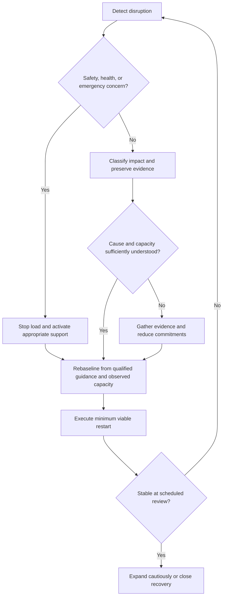

# Recovery System

## Purpose

Restore controlled execution after disruption through classification, containment, replanning, verification, and restart.

## Scope

This protocol covers all canonical recovery protocols, their selection logic, safety boundaries, and navigation. It is a systems-engineering control, not
motivational advice, clinical care, institutional policy, or an outcome
guarantee. Recovery duration remains uncertain and context-dependent.

## Theory

Recovery restores a safe, observable operating state before increasing demand.
The control loop is: detect, contain, classify, analyze, rebaseline, act, verify,
and learn. Calendar pressure never overrides safety, evidence, or capacity.

## Evidence Classification

| Class | Meaning | Rule |
|---|---|---|
| Evidence | Current records, direct observations, verified requirements | Use for classification and decisions |
| Best Practice | Reusable control consistent with architecture and evidence | Apply unless context requires escalation |
| Opinion | Preference, hypothesis, or unverified explanation | Label and test; never treat as cause |

Evidence includes timestamps, artifacts, acceptance results, capacity
observations, and current official requirements. Best practice is to change the
smallest controllable part of the system. Opinion may suggest an experiment but
cannot establish psychological, medical, or organizational facts.

## Framework

| Phase | Question | Output | Exit condition |
|---|---|---|---|
| Safety | Is anyone at risk or in need of qualified help? | Stop or escalation decision | Appropriate support activated |
| Containment | What must stop or be protected? | Stabilized obligations and evidence | Immediate impact bounded |
| Diagnosis | What failed and what is only inferred? | Cause hypothesis with confidence | Evidence gaps recorded |
| Replan | What fits current capacity? | Reduced commitments and owners | Dependencies and buffer visible |
| Restart | What smallest action produces evidence? | Controlled execution | Stop condition defined |
| Verify | Did the correction work without new harm? | Continue, change, or stop decision | Review recorded |

## Workflow

Detect disruption, make the situation safe, classify the failure, contain impact, rebaseline capacity, choose the canonical protocol, verify restart readiness, and review recurrence risk.

## Implementation

Create a private recovery record containing event, observed impact, safety
status, classification, evidence links, assumptions, root-cause hypotheses,
current capacity, removed scope, corrective actions, owners, deadlines, stop
conditions, and review dates. Use synthetic data in public examples. Corrective
action must address an observed or testable cause and include effectiveness
verification. Reassess risks after every material plan change.

## Contents

- [Failure Classification](failure-classification.md)
- [Missed Day Recovery](missed-day-recovery.md)
- [Missed Week Recovery](missed-week-recovery.md)
- [Illness and Emergency](illness-and-emergency.md)
- [Overload Recovery](overload-recovery.md)
- [Academic Crisis](academic-crisis.md)
- [Project Failure](project-failure.md)
- [Restart Protocol](restart-protocol.md)

## Dependencies

Recovery depends on current execution evidence, review decisions, health and
resilience safety boundaries, project records, and verified institutional
requirements where applicable.

## Navigation

- [Operation Renaissance](../README.md)
- [Review System](../13-review-system/README.md)
- [Health System](../10-health-system/README.md)
- [Master Architecture](../../MASTER_ARCHITECTURE.md)

## Future Content

Dashboards, KPIs, appendices, and generated recovery views remain outside this
sprint. No additional Recovery System filename is authorized.

## Decision Tree

The operator owns process decisions. Qualified professionals or authorized
institutions own clinical, emergency, legal, and institutional decisions.
Inputs must reflect the current event; irreversible or unsafe branches escalate.

## Failure Modes

- Compressing missed work into unsafe catch-up.
- Treating shame, confidence, or a single outcome as root-cause evidence.
- Expanding load before stability is observed.
- Hiding failures, overwriting evidence, or leaving actions ownerless.
- Using this protocol instead of qualified health or emergency support.

## Recovery

If the recovery attempt fails, return to safety and containment, reduce scope,
reclassify with new evidence, replace unsupported cause assumptions, involve the
appropriate support owner, and define a smaller verified restart.

## Examples

A disruption is classified before work is rescheduled, preventing a missed week from being treated as a missed day.

## Tables

The Evidence Classification and Framework tables define the protocol's
information controls and recovery phases.

## Mermaid Diagrams

The decision diagram prioritizes safety, makes uncertainty explicit, prevents
automatic load expansion, and returns unstable outcomes to classification.

## Cross References

- [Failure Classification](failure-classification.md)
- [Review System](../13-review-system/README.md)
- [Execution System](../03-execution-system/README.md)
- [Master Architecture](../../MASTER_ARCHITECTURE.md)

## References

- [Source register](../../references/source-register.yml)
- `SRC-NASA-SE-2016`
- `SRC-ISO-9001-2015`
- `SRC-WHO-STRESS-2020`

## Further Reading

Use current authorized institutional rules and qualified local health,
emergency, or support resources when the disruption crosses those boundaries.

## Next Steps

Record current observations, run the safety branch, select the applicable
canonical recovery protocol, and schedule the first verification review.

## Acceptance Criteria

- [x] Evidence, best practice, and opinion are separated.
- [x] Safety, capacity, ownership, corrective action, and verification are explicit.
- [x] No success, speed, examination, placement, or recovery outcome is guaranteed.
