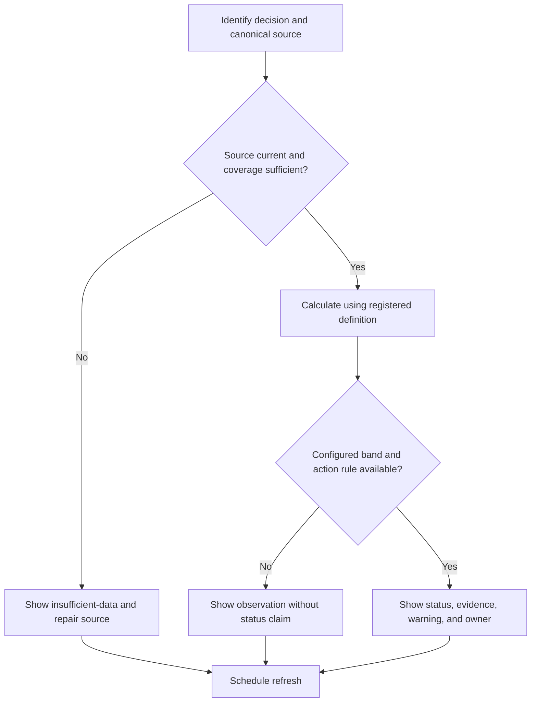

# Command Center

## Purpose

Provide the executive campaign view and route attention to the appropriate canonical dashboard.

## Scope

This document covers campaign objectives, current period, cross-system status, critical risks, blockers, evidence coverage, and next decisions. Dashboards are derived views and never own source data. It does not hardcode personal goals,
dates, institutions, organizations, benchmarks, targets, or guaranteed outcomes.

## Theory

Measurement is useful only when it supports a named decision. Visibility
requires provenance, freshness, coverage, uncertainty, and explicit action
rules. A proxy cannot replace the objective or its underlying evidence.

## Evidence Classification

| Class | Meaning | Display or measurement rule |
|---|---|---|
| Evidence | Verified canonical record for the reporting period | Show provenance, freshness, and coverage |
| Best Practice | Reusable control consistent with architecture | Apply until configuration or review changes it |
| Opinion | Preference, interpretation, or untested threshold | Label; never present as observed fact |

No benchmark or threshold is evidence merely because it is numeric. Thresholds
are configuration owned by an authorized review, with rationale and effective
date. Missing evidence produces `insufficient-data`, not an inferred value.

## Framework

| Field | Requirement | Validation |
|---|---|---|
| Decision | Name the question and owner | Decision changes for at least one state |
| Source | Link the canonical record | Path and stable ID resolve |
| Period | State observation and refresh window | Time basis is unambiguous |
| Quality | Report freshness, completeness, and uncertainty | Warnings accompany limitations |
| Status | Use on-track, at-risk, off-track, blocked, or insufficient-data | Band comes from configuration |
| Action | Name next decision, owner, and evidence | No status is actionless |

## Workflow

Refresh source metadata, assess data quality, summarize each system with the canonical status vocabulary, surface exceptions, and assign the next decision.

## Implementation

Store definitions in the canonical registry and sensitive observations under
ignored `private/` paths. A render reads source IDs, reporting period,
configuration, coverage, and refresh timestamp; it never writes back to the
source. Keep calculation logic, units, exclusions, missing-data behavior,
threshold bands, alerts, and review ownership explicit. Synthetic examples use
clearly labeled values that are not defaults.

## Decision Tree

The decision owner controls configuration. Data owners control source
corrections. Stale, private, ambiguous, or unconfigured observations cannot
silently become status claims.

## Failure Modes

- Entering data into a derived view or duplicating the source of truth.
- Fabricating targets, benchmarks, forecasts, or missing observations.
- Rewarding volume while ignoring quality, guardrails, or denominator changes.
- Hiding uncertainty, stale data, privacy limits, or conflicting evidence.
- Treating external outcomes as controllable performance.

## Recovery

Suppress the affected status, label data quality, restore the canonical source,
correct or version the definition, review incentives and thresholds, rebuild the
view, and record the resulting decision.

## Examples

The summary shows Finance and Research as insufficient-data while a verified health guardrail routes attention to the health-capacity view.

## Tables

The Evidence Classification and Framework tables define provenance, status,
quality, ownership, and action requirements.

## Mermaid Diagrams

The decision diagram prevents stale or unconfigured data from becoming a status
claim and routes defects back to the canonical source.

## Cross References

- [Campaign Status](campaign-status.md)
- [Dependency Registry](../../data/registries/dependency-registry.yml)
- [KPI Registry](../../data/registries/kpi-registry.yml)
- [Master Architecture](../../MASTER_ARCHITECTURE.md)

## References

- [Source register](../../references/source-register.yml)
- `SRC-NASA-SE-2016`
- `SRC-ISO-9001-2015`
- [Master Architecture KPI model](../../MASTER_ARCHITECTURE.md#1010-kpi-model)

## Further Reading

Review the canonical source protocol, current configuration, metric definition,
privacy policy, and applicable decision record before operational use.

## Next Steps

Select one decision, register or verify its source and definition, configure its
bands through review, and test the view with synthetic data.

## Acceptance Criteria

- [x] Evidence, best practice, and opinion are separated.
- [x] Provenance, freshness, coverage, privacy, ownership, and action are explicit.
- [x] No target, benchmark, KPI observation, or outcome is fabricated.
