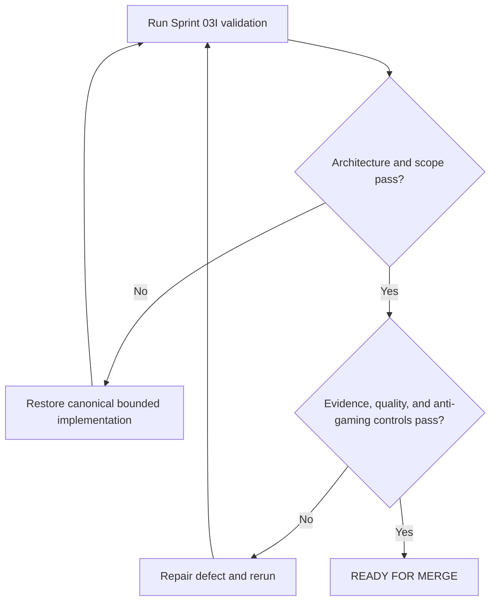

# Dashboard and KPI Implementation Report

## Purpose

Record Sprint 03I implementation, validation, and final approval evidence.

## Scope

This report covers only `15-dashboards/`, `16-kpis/`, and required navigation,
dependency-registry, KPI-registry, and changelog integration.

## Governance Status

The Master Architecture, AI Execution Rules, changelog, and implementation
reports for Sprints 03A through 03H were read and preserved as immutable history.

## Theory

Dashboards are derived decision views. KPIs are governed measurement
definitions. Neither may silently own source data, invent missing observations,
or substitute a proxy for an objective.

## Framework

| Measure | Result |
|---|---:|
| Canonical documents | 18 |
| Words | 12,092 |
| Documents with tables | 18 |
| Mermaid diagrams | 18 |
| Decision trees | 18 |
| Cross-reference links | 132 |

## Workflow

Mandatory inputs were read, prompt concepts were mapped into canonical files,
content and registry policies were implemented, authorized navigation was
updated, and the complete validation gate was executed.

## Implementation

### Files Implemented

Dashboard System: `README.md`, `command-center.md`, `today.md`,
`this-week.md`, `campaign-status.md`, `gate-dashboard.md`,
`placement-dashboard.md`, `project-dashboard.md`, `learning-dashboard.md`,
`health-capacity-dashboard.md`, and `risk-dashboard.md`.

KPI System: `README.md`, `measurement-model.md`, `leading-indicators.md`,
`lagging-indicators.md`, `guardrail-metrics.md`, `metric-dictionary.md`, and
`anti-gaming-rules.md`.

### Canonical Filename Verification

Expected and actual filename sets match exactly. No daily, weekly, monthly,
research, finance, recovery, or executive-summary alias was created.

### Prompt-to-Architecture Mapping

| Requested view or function | Canonical implementation |
|---|---|
| Daily dashboard | `today.md` |
| Weekly dashboard | `this-week.md` |
| Monthly and executive summary | `campaign-status.md`, `command-center.md` |
| Research, finance, and recovery visibility | Aggregated by `campaign-status.md` and `risk-dashboard.md` |
| Dashboard data and refresh | Shared contract in `README.md` and every view |
| Execution, learning, project, research, health, finance, recovery metrics | Classes in `measurement-model.md` |
| Thresholds, alerts, evidence, and trends | `metric-dictionary.md` and shared measurement workflow |

No operational KPI was invented. The KPI registry is active but intentionally
contains no metric items until an authorized definition provides source,
formula, unit, quality rules, configurable bands, actions, owner, and review.

## Decision Tree

## Failure Modes

- Treating a dashboard as a data-entry source.
- Inventing targets, observations, benchmarks, or organizational metrics.
- Converting missing data into a favorable or unfavorable status.
- Rewarding volume while ignoring quality, privacy, uncertainty, or guardrails.
- Implementing Appendices.

## Recovery

Suppress invalid status, restore the canonical source, version the metric
definition, correct configuration, review incentives, rebuild the derived view,
and rerun validation.

## Examples

A dashboard reports `insufficient-data` when evidence coverage is inadequate.
A candidate metric is rejected when it does not change a named decision.

## Tables

Every implemented document contains evidence-classification and framework
tables. This report includes metrics, mappings, health, drift, and approval.

## Mermaid Diagrams

Every implemented document contains one evidence-to-status decision flow.
Mermaid fences and decision branches were structurally validated.

## Cross References

- [Master Architecture](../MASTER_ARCHITECTURE.md)
- [AI Execution Rules](../governance/AI_EXECUTION_RULES.md)
- [Operation Renaissance](README.md)
- [Dashboard System](15-dashboards/README.md)
- [KPI System](16-kpis/README.md)
- [KPI Registry](../data/registries/kpi-registry.yml)
- [Dependency Registry](../data/registries/dependency-registry.yml)
- [Source Register](../references/source-register.yml)
- [Changelog](../CHANGELOG.md)

## References

- `SRC-NASA-SE-2016`
- `SRC-ISO-9001-2015`
- Master Architecture sections 10.10, 19, 20, and 21.

## Further Reading

Review each canonical source protocol, current configuration, privacy policy,
metric definition, and decision record before operational use.

## Repository Health

| Check | Result |
|---|---|
| Architecture integrity | PASS |
| Canonical naming | PASS |
| YAML front matter structure | PASS |
| Required Markdown sections | PASS |
| Evidence labels | PASS |
| Mermaid fence integrity | PASS |
| Internal relative links | PASS |
| README navigation | PASS |
| Dependency paths and IDs | PASS |
| Source identifiers | PASS |
| KPI registry policy | PASS |
| Placeholder scan | PASS |
| Git whitespace | PASS |

## Technical Debt

Known limitations are non-blocking: metric items and observations are
intentionally absent; thresholds require configuration and review; dashboards
are specifications rather than generated renders; Mermaid validation is
structural. Automated rendering, schema enforcement, freshness checks, and
synthetic dry runs are deferred to separately authorized tooling work.

## Prompt Drift Check

| Constraint | Result |
|---|---|
| Master Architecture unchanged | PASS |
| AI Execution Rules followed | PASS |
| Previous sprint content preserved | PASS |
| Dashboard and KPI Systems only | PASS |
| Non-canonical concepts mapped without aliases | PASS |
| Evidence, best practice, and opinion separated | PASS |
| No fabricated KPI, target, benchmark, or outcome | PASS |
| Appendices not implemented | PASS |

## Architecture Compliance

PASS. Canonical structure, ownership, source-of-truth rules, and dashboard status
vocabulary were preserved. No ADR was required.

## Scope Compliance

PASS. Changes are limited to modules 15 and 16 and explicitly required
integration surfaces.

## Remaining Work

`17-appendices/` remains unimplemented. Operational configuration, metric
approval, observations, and generated views require separate authorization.

## Next Sprint

Await explicit authorization. This report does not authorize Appendices or
automation outside the canonical Sprint 03I scope.

## Next Steps

Review the bounded diff and merge only while every recorded gate remains passing.

## Final Approval Gate

| Decision | Reason | Risk level | Confidence | Recommendation |
|---|---|---|---|---|
| **READY FOR MERGE** | Architecture, scope, evidence, anti-gaming, registry, navigation, and link controls pass | Low; operational metrics remain deliberately unconfigured | High | Merge the frameworks, then approve metric definitions separately before collecting observations |

