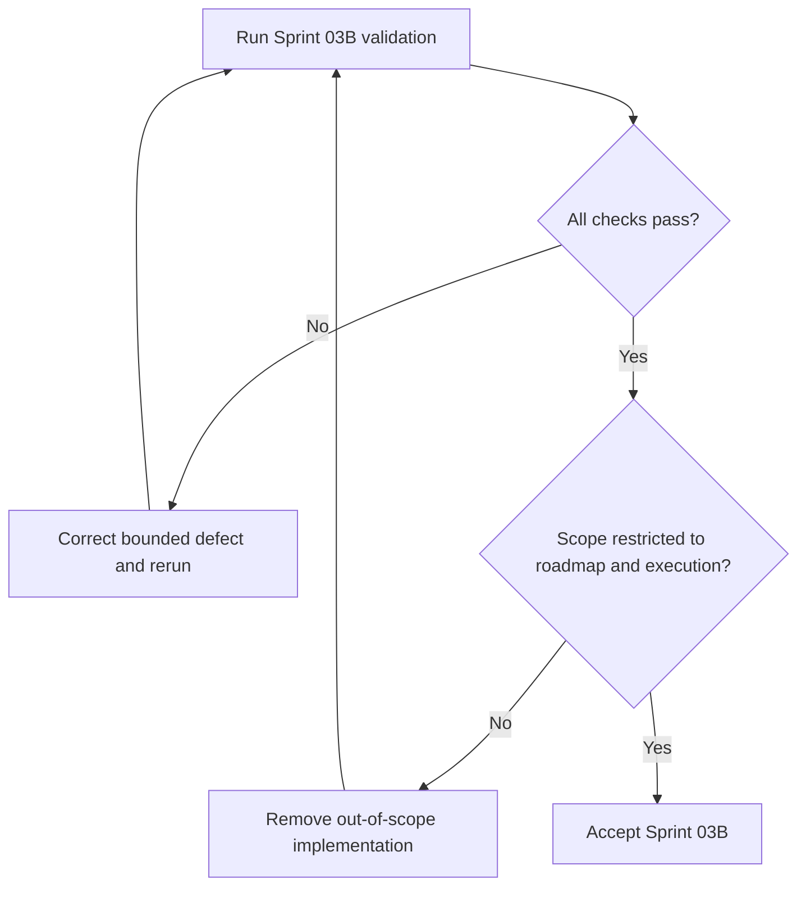

# Execution System Implementation Report

## Purpose

Record the implementation and verification outcome for Sprint 03B.

## Scope

The sprint implemented only `02-roadmap/`, `03-execution-system/`, their
dependency records, cross-references, and the supporting source entries.

## Theory

The report is the verification artifact connecting the bounded implementation
scope to objective acceptance evidence.

## Framework

| Measure | Result |
|---|---:|
| Content documents implemented | 21 |
| Words before this report | 8,083 |
| Mermaid diagrams | 22 |
| Decision-tree sections | 21 |
| Documents containing tables | 21 |
| Markdown cross-reference links | 84 |

## Workflow

The architecture and Sprint 03A foundation were read first. Canonical files were
implemented, dependencies and sources were registered, validation was executed,
and this report was generated after all checks passed.

## Files Implemented

### Roadmap

- `README.md`
- `184-day-roadmap.md`
- `phase-0-mobilize.md` through `phase-5-consolidate.md`
- `milestones.md`
- `dependency-map.md`
- `capacity-model.md`

### Execution system

- `README.md`
- `daily-system.md`
- `weekly-system.md`
- `monthly-system.md`
- `semester-integration.md`
- `timeboxing-protocol.md`
- `work-in-progress-limits.md`
- `prioritization-protocol.md`
- `interruption-protocol.md`
- `shutdown-protocol.md`

## Word Count

The 21 implementation documents contain 8,083 words before this report.

## Diagrams

Twenty-two Mermaid diagrams are present: one decision flow per document and one
additional end-to-end campaign dependency graph.

## Decision Trees

All 21 documents contain an explicit decision-tree section. Specialized decision
rules appear immediately below each diagram.

## Tables

All 21 documents contain a normative framework table. Phase tables cover purpose,
outcomes, deliverables, KPIs, entry and exit criteria, risks, and dependencies.

## Validation Results

| Check | Result |
|---|---|
| Required files present | PASS |
| YAML front matter | PASS |
| Required headings | PASS |
| Tables present in every document | PASS |
| Mermaid present in every document | PASS |
| Decision trees present | PASS |
| Unfinished-content markers absent | PASS |
| Internal relative links | PASS |
| Registry paths | PASS |
| Source IDs | PASS |
| Git whitespace | PASS |
| Scope boundary | PASS |

## Cross References

The implementation contains 84 Markdown links. All resolve to canonical relative
paths within the repository.

- [Roadmap](02-roadmap/README.md)
- [Execution System](03-execution-system/README.md)
- [Foundation Report](FOUNDATION_IMPLEMENTATION_REPORT.md)
- [Dependency Registry](../data/registries/dependency-registry.yml)

## Decision Framework

Accept Sprint 03B only when every validation row passes and no downstream system
has been implemented. Reopen it only for execution-system defects or approved
architecture changes.

## Decision Tree

## Failure Modes

- Hard-coding an examination date or academic calendar.
- Treating a phase date as automatic gate passage.
- Adding study, project, health, placement, or KPI content.
- Modifying Sprint 03A foundation content.

## Recovery

Restore canonical Sprint 03B files, revert out-of-scope content, rerun validation,
and update this report with the corrected evidence.

## Examples

Defining a future study system as a dependency is in scope. Implementing its
protocols is not.

## Remaining Work

Study, GATE, placement, project, research, health, resilience, finance, review,
recovery, dashboard, KPI, and appendix systems remain unimplemented by design.

## References

- `SRC-NASA-SE-2016`
- `SRC-LITTLE-1961`
- `SRC-RUBINSTEIN-2001`
- [Source register](../references/source-register.yml)

## Next Sprint

Proceed only under the next explicitly authorized Project Olympus implementation
prompt.

## Next Steps

Review the Sprint 03B diff and preserve this report as its verification record.

## Mermaid Diagrams

The implemented documents contain the required decision and dependency diagrams;
this report references their validated count rather than duplicating them.

## Acceptance Criteria

- [x] Roadmap and execution-system files are fully implemented.
- [x] Configuration uses relative days and avoids fabricated calendars.
- [x] Required metrics and validation outcomes are recorded.
