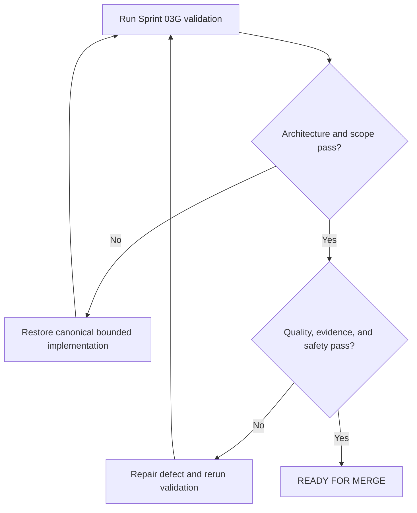

# Finance and Review Implementation Report

## Purpose

Record Sprint 03G implementation, repository health, and approval evidence.

## Scope

This report covers only `12-finance-system/`, `13-review-system/`, and required
navigation, dependency, source, and changelog integration.

## Governance Status

The Master Architecture, AI Execution Rules, changelog, and reports for Sprints
03A through 03F were read completely and preserved as immutable history.

## Theory

Finance controls convert verified records into bounded decisions. Review controls
convert execution evidence into corrective action and continuous improvement.

## Framework

| Measure | Result |
|---|---:|
| Canonical module documents | 16 |
| Words | 9,407 |
| Documents with tables | 16 |
| Mermaid diagrams | 16 |
| Decision trees | 16 |
| Cross-reference links | 100 |

## Workflow

Mandatory artifacts were read, canonical filename sets were verified, module
documents were implemented, registries and navigation were updated, and
validation was executed before approval.

## Implementation

### Files Implemented

Finance System: `README.md`, `scope-and-disclaimer.md`,
`cash-flow-basics.md`, `emergency-buffer.md`, `debt-and-credit.md`,
`insurance-basics.md`, `investing-foundations.md`, and `fraud-and-risk.md`.

Review System: `README.md`, `daily-close.md`, `weekly-review.md`,
`monthly-review.md`, `phase-gate-review.md`, `mid-campaign-review.md`,
`final-review.md`, and `after-action-review.md`.

### Canonical Filename Verification

The architecture-defined seven files in each module and the established
directory README are implemented. Expected and actual sets match. No alias,
parallel structure, alternative filename, country, currency, institution,
employer, or product-specific artifact was added.

### Evidence Policy

Every module document distinguishes Evidence, Best Practice, and Opinion.
Financial claims are grounded in registered authoritative sources and framed as
general literacy. No personalized recommendation, security selection, tax or
legal advice, insurance instruction, forecast, guarantee, or fabricated
regulation is provided.

## Decision Tree

## Failure Modes

- Presenting general financial literacy as individualized advice.
- Hardcoding local law, currency, tax, credit, or insurance rules.
- Advancing a campaign phase without acceptance evidence.
- Implementing Recovery, Dashboards, KPIs, or Appendices.

## Recovery

Remove unsupported or out-of-scope material, restore canonical dependencies,
correct links or evidence labels, and rerun the entire gate.

## Examples

A cash-flow review may record opportunity cost and adjust a synthetic category;
it does not prescribe a personal allocation. A phase review may select advance,
remediate, accept risk, or stop only from documented evidence.

## Tables

All 16 documents contain structured framework and evidence-classification
tables. This report adds metric, health, drift, and approval tables.

## Mermaid Diagrams

All 16 documents contain one bounded decision flow. Fence structure and required
decision branches were validated.

## Cross References

- [Master Architecture](../MASTER_ARCHITECTURE.md)
- [AI Execution Rules](../governance/AI_EXECUTION_RULES.md)
- [Operation Renaissance](README.md)
- [Finance System](12-finance-system/README.md)
- [Review System](13-review-system/README.md)
- [Dependency Registry](../data/registries/dependency-registry.yml)
- [Source Register](../references/source-register.yml)
- [Changelog](../CHANGELOG.md)

## References

- `SRC-OECD-PISA-FIN-2022`
- `SRC-INVESTOR-RISK`
- `SRC-FTC-CONSUMER`
- `SRC-ISO-9001-2015`

## Further Reading

Use current official and qualified jurisdiction-appropriate material before any
regulated, contractual, tax, legal, insurance, credit, or investment decision.

## Repository Health

| Check | Result |
|---|---|
| Architecture integrity | PASS |
| Canonical naming | PASS |
| YAML front matter structure | PASS |
| Required Markdown sections | PASS |
| Mermaid fence integrity | PASS |
| Relative links | PASS |
| README navigation | PASS |
| Dependency paths and IDs | PASS |
| Source identifiers | PASS |
| Placeholder scan | PASS |
| Git whitespace | PASS |

## Technical Debt

Known limitations are non-blocking: external financial rules and terms are
deliberately not embedded, mutable sources require scheduled review, and Mermaid
validation is structural pending the authorized documentation toolchain.
Automated rendering and schema-backed review-record instances are deferred.
Future configuration adapters should be authorized and qualified before use.

## Prompt Drift Check

| Constraint | Result |
|---|---|
| Master Architecture unchanged | PASS |
| AI Execution Rules followed | PASS |
| Previous sprint content preserved | PASS |
| Finance and Review only | PASS |
| Evidence, best practice, and opinion separated | PASS |
| No personalized or guaranteed financial advice | PASS |
| No Recovery, Dashboards, KPIs, or Appendices | PASS |

## Architecture Compliance

PASS. Canonical locations and ownership were preserved; no ADR was necessary.

## Scope Compliance

PASS. Changes are limited to modules 12 and 13 and explicitly required
integration surfaces.

## Remaining Work

`14-recovery-system/` through `17-appendices/` remain unimplemented.

## Next Sprint

Await explicit authorization. This report does not authorize Recovery,
Dashboards, KPIs, or Appendices.

## Next Steps

Review the bounded diff and merge only while every recorded gate remains passing.

## Final Approval Gate

| Decision | Reason | Risk level | Confidence | Recommendation |
|---|---|---|---|---|
| **READY FOR MERGE** | Architecture, scope, content, evidence, registry, navigation, and link controls pass | Low repository risk; contextual financial use remains jurisdiction-dependent | High | Merge after maintainer review and require qualified advice for regulated or individualized decisions |

