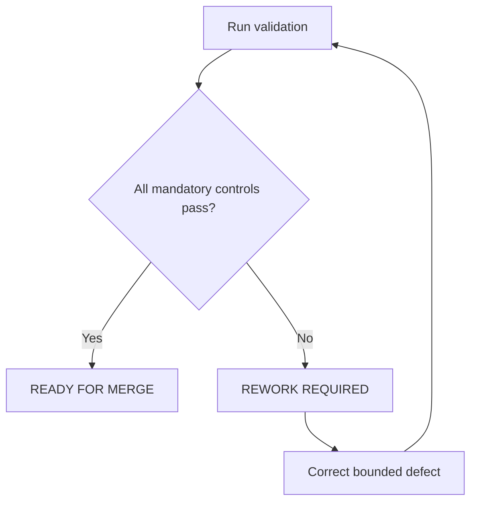

# Health and Resilience Implementation Report

## Purpose

Record Sprint 03F implementation evidence and the final approval gate.

## Scope

This report covers only `10-health-system/`, `11-resilience-system/`, and the
required navigation, dependency, source, and changelog updates.

## Theory

Implementation evidence is separated from operational guidance so architecture,
scope, quality, and safety decisions remain auditable.

## Scientific Basis

The implemented guidance distinguishes general public-health evidence from
configurable practice and does not provide diagnosis, treatment, prescriptions,
supplement plans, or individualized medical advice.

## Framework

| Control | Result | Evidence |
|---|---|---|
| Governance | PASS | Permanent execution rules already existed and were preserved |
| Architecture | PASS | Canonical directories and filenames used |
| Scope | PASS | Only modules 10 and 11 implemented |
| Safety | PASS | Professional escalation boundaries included |
| Content | PASS | Required sections present in every module document |
| Links | PASS | Internal relative targets resolve |

## Workflow

The sprint read mandatory governance and implementation evidence, verified the
canonical tree, implemented the two bounded modules, updated authorized
registries and navigation, and executed validation.

## Implementation

### Governance Status

`governance/AI_EXECUTION_RULES.md` existed before implementation and was read.
No regeneration or modification was required.

### Files Implemented

| Module | Canonical files | Status |
|---|---:|---|
| Health System | 8 | Complete |
| Resilience System | 7 | Complete |
| Total | 15 | Complete |

### Canonical Filename Verification

Health: `README.md`, `scope-and-safety.md`, `sleep-protocol.md`,
`physical-activity.md`, `nutrition-basics.md`, `ergonomics.md`,
`fatigue-monitoring.md`, and `escalation-boundaries.md`.

Resilience: `README.md`, `scope-and-safety.md`, `stress-observation.md`,
`emotional-regulation-toolkit.md`, `support-network.md`,
`setback-review.md`, and `professional-help-boundaries.md`.

Expected and actual filename sets match. No alternative or additional module
files were introduced.

### Implementation Metrics

| Metric | Result |
|---|---:|
| Module documents | 15 |
| Word count | 6,840 |
| Documents with tables | 15 |
| Mermaid diagrams | 15 |
| Decision trees | 15 |
| Documents with cross references | 15 |

### Repository Health

| Check | Result |
|---|---|
| YAML front matter | PASS |
| Required headings | PASS |
| Markdown structure | PASS |
| Mermaid fence balance | PASS |
| Relative links | PASS |
| Dependency paths | PASS |
| Source identifiers | PASS |
| Placeholder scan | PASS |

## Decision Tree

## Failure Modes

- Introducing clinical claims or individualized plans.
- Implementing modules outside the authorized boundary.
- Renaming canonical artifacts.
- Leaving unresolved links or unregistered dependencies.

## Recovery

If a validation control fails, limit correction to the affected Sprint 03F
artifact or authorized registry surface, rerun all checks, and retain
`REWORK REQUIRED` until every mandatory control passes.

## Examples

The sleep protocol records general observations and routes persistent concerns
to qualified professionals; it does not diagnose a sleep disorder. The
professional-help boundary routes urgent safety concerns to appropriate local
services without inventing universal contact details.

## Tables

The Framework, Files Implemented, Implementation Metrics, Repository Health,
Prompt Drift Check, and approval tables contain the sprint evidence.

## Mermaid Diagrams

One final-gate flowchart appears in this report. Each of the 15 module documents
contains a bounded operational decision diagram.

## Cross References

- [Master Architecture](../MASTER_ARCHITECTURE.md)
- [AI Execution Rules](../governance/AI_EXECUTION_RULES.md)
- [Operation Renaissance](README.md)
- [Health System](10-health-system/README.md)
- [Resilience System](11-resilience-system/README.md)
- [Dependency Registry](../data/registries/dependency-registry.yml)
- [Source Register](../references/source-register.yml)
- [Changelog](../CHANGELOG.md)

## References

- `SRC-WHO-ACTIVITY-2020`
- `SRC-WHO-DIET-2026`
- `SRC-CDC-SLEEP`
- `SRC-WHO-STRESS-2020`

## Further Reading

Use only the registered authoritative sources and locally verified professional
or emergency pathways relevant to the reader's jurisdiction.

## Technical Debt

Known limitations are non-blocking: Mermaid validation is structural rather than
renderer-based; local emergency, clinical, dietary, accessibility, and workplace
requirements are intentionally not embedded. A future authorized documentation
toolchain may add renderer validation. Future modules remain deferred.

## Prompt Drift Check

| Constraint | Result |
|---|---|
| No architecture redesign | PASS |
| No canonical rename | PASS |
| No clinical diagnosis or treatment | PASS |
| No individualized medical plan | PASS |
| No Finance, Review, Recovery, dashboards, KPIs, or appendices | PASS |
| Authorized registry and navigation updates only | PASS |

## Architecture Compliance

PASS. The immutable architecture was preserved. No ADR was required.

## Scope Compliance

PASS. Only the canonical Health and Resilience systems and required integration
surfaces were changed.

## Remaining Work

Modules `12-finance-system/` through `17-appendices/` remain outside this sprint
and unimplemented.

## Next Sprint

Await explicit authorization for the next canonical sprint. This report does not
authorize Finance or any later module.

## Next Steps

Review the final gate and merge only while all recorded validation results
remain passing.

## Final Approval Gate

| Decision | Reason | Risk | Confidence | Recommendation |
|---|---|---|---|---|
| **READY FOR MERGE** | All mandatory architecture, scope, content, safety, registry, and link checks pass | Low; contextual local requirements remain intentionally external | High | Merge the bounded Sprint 03F changes |

