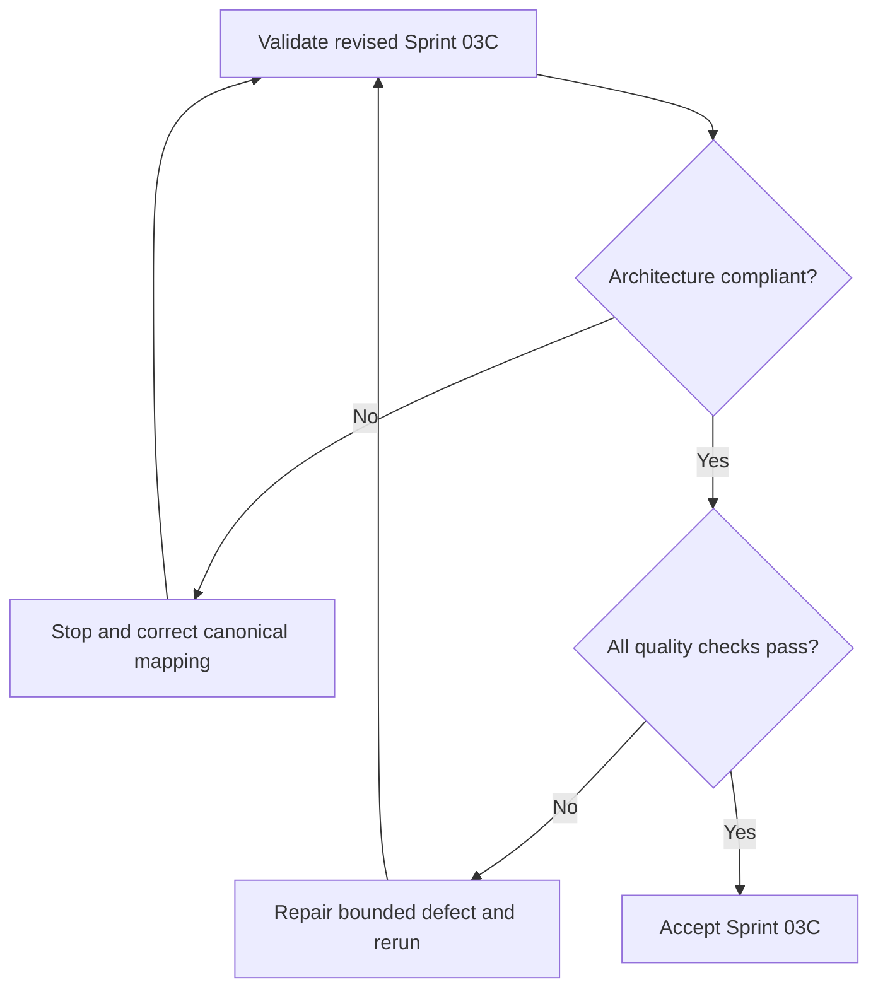

# Learning and GATE Implementation Report

## Purpose

Record implementation and verification evidence for revised Sprint 03C.

## Scope

The sprint implemented only the canonical files in `04-study-system/` and
`05-gate-system/`, plus required governance, navigation, registry, reference, and
report maintenance.

## Governance Initialization Status

`governance/AI_EXECUTION_RULES.md` was absent and was created before module
implementation. It is registered as `GOV-AI-EXECUTION-RULES` in the content
registry and is now a permanent approved governance artifact.

## Theory

The report verifies that requested learning and examination concepts were mapped
into the immutable canonical hierarchy without aliases or parallel structures.

## Scientific Basis

Registered evidence covers retrieval practice, distributed practice,
interleaving, deliberate practice, active learning in STEM, task switching, and
systems engineering. Claims remain bounded by the cited study contexts.

## Framework

| Measure | Result |
|---|---:|
| Canonical content files implemented | 22 |
| Words before this report | 9,900 |
| Documents containing tables | 22 |
| Mermaid diagrams | 22 |
| Decision-tree sections | 22 |
| Markdown cross-reference links | 88 |

## Workflow

Mandatory artifacts were read in order. Governance was initialized and
registered. Canonical files were implemented, registries and navigation were
updated, and validation preceded this report.

## Implementation

### Files implemented

Study System:

- `README.md`
- `curriculum-integration.md`
- `learning-cycle.md`
- `active-recall.md`
- `spaced-practice.md`
- `interleaving.md`
- `problem-solving.md`
- `error-log-protocol.md`
- `note-making.md`
- `concept-mastery-rubric.md`
- `assessment-protocol.md`

GATE System:

- `README.md`
- `syllabus-map.md`
- `subject-sequencing.md`
- `diagnostic-tests.md`
- `concept-cycle.md`
- `problem-practice-cycle.md`
- `previous-year-questions.md`
- `mock-test-system.md`
- `revision-system.md`
- `error-taxonomy.md`
- `score-analysis.md`

### Prompt-to-architecture mapping

| Revised prompt concept | Canonical implementation |
|---|---|
| Learning science, retrieval practice, deep understanding, consolidation | `learning-cycle.md`, `active-recall.md`, `concept-mastery-rubric.md` |
| Spaced repetition | `spaced-practice.md` |
| Mistake log | `error-log-protocol.md` |
| Note-taking and knowledge graph | `note-making.md`, `curriculum-integration.md` |
| Study checklists and metrics | `assessment-protocol.md`, `concept-mastery-rubric.md` |
| GATE execution, resources, adaptive planning, decision trees | Distributed across canonical GATE files; adaptive decisions terminate in `score-analysis.md` |
| PYQ and mock frameworks | `previous-year-questions.md`, `mock-test-system.md` |
| Knowledge dashboard | Not created because dashboards are outside scope; evidence analysis is implemented in `score-analysis.md` |

## Canonical Filename Verification

All 22 filenames match the Master Architecture. No alias, underscore variant,
alternative filename, or parallel directory was created.

## Word Count

The 22 implemented content documents contain 9,900 words before this report.

## Content Tables

Every implemented content document includes a normative framework table.

## Content Mermaid Diagrams

Every implemented content document includes one Mermaid evidence-to-decision
flow, for 22 diagrams.

## Content Decision Trees

Every implemented content document contains an explicit decision-tree section.

## Cross References

The content documents contain 88 Markdown links. All internal relative links
resolve to canonical repository paths.

## Validation Results

| Check | Result |
|---|---|
| Governance file exists and is registered | PASS |
| Required canonical files exist | PASS |
| Canonical names match architecture | PASS |
| Required headings | PASS |
| Unfinished-content markers absent | PASS |
| Markdown tables present | PASS |
| Mermaid fences balanced | PASS |
| Internal relative links | PASS |
| Registered source IDs resolve | PASS |
| Dependency-registry paths resolve | PASS |
| Mutable examination facts externalized | PASS |
| Git whitespace | PASS |

## Architecture Compliance

The Master Architecture remained unchanged. Prompt concepts were adapted into
canonical files as required by the revised architecture contract. ADR-002 remains
a historical proposed record of the superseded prompt conflict; it did not
authorize or alter this implementation.

## Scope Compliance

No placement, project, research, communication, health, finance, recovery,
dashboard, KPI, or appendix system was implemented. Performance measures are
defined only inside the canonical GATE analysis framework and are not registered
as Project Olympus KPIs.

## Decision Trees

Accept only when architecture, naming, scope, links, references, and diagrams all
pass.

## Failure Modes

- Introducing prompt-derived aliases.
- Treating historical examination data as future rules.
- Claiming mastery from confidence or activity volume.
- Implementing a dashboard or KPI subsystem during this sprint.

## Recovery

Restore canonical files, remove any parallel structure, verify official mutable
inputs, rerun validation, and update this report.

## Examples

The requested “spaced repetition” concept is implemented in canonical
`spaced-practice.md`; no `spaced-repetition.md` alias was created.

## Remaining Work

Placement, projects, research, communication, health, resilience, finance,
review, recovery, dashboards, KPIs, and appendices remain for future sprints.

## Tables

The inventory, mapping, and validation tables above are the report’s canonical
structured evidence.

## Mermaid Diagrams

The report decision tree records acceptance control; the 22 module diagrams are
validated in their canonical files.

## References

- [Source register](../references/source-register.yml)
- [AI Execution Rules](../governance/AI_EXECUTION_RULES.md)
- [Master Architecture](../MASTER_ARCHITECTURE.md)

## Next Sprint

Proceed only under the next explicitly authorized implementation prompt.

## Next Steps

Review the revised Sprint 03C diff and preserve this report as its verification
record.

## Acceptance Criteria

- [x] Governance initialized and registered.
- [x] Canonical Study and GATE files implemented.
- [x] Architecture, naming, scope, links, diagrams, and references validate.
