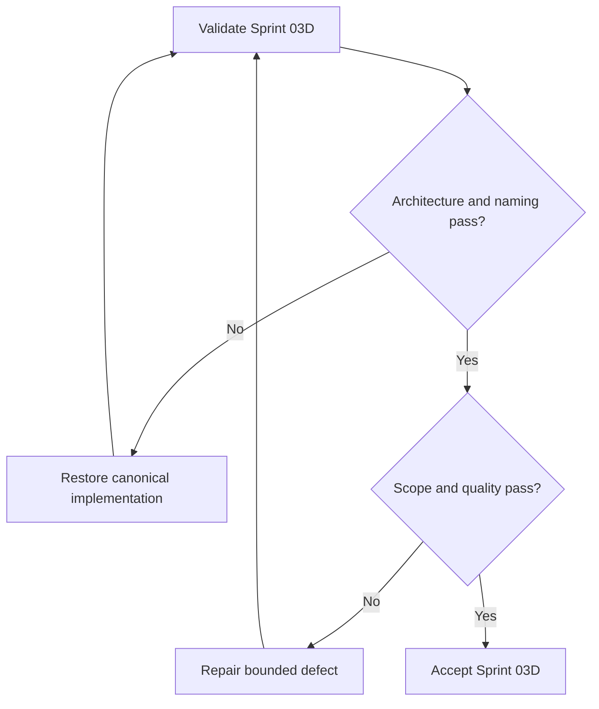

# Placement and Project Implementation Report

## Purpose

Record implementation and validation evidence for Sprint 03D.

## Scope

The sprint implemented only canonical files in `06-placement-system/` and
`07-project-system/`, with required navigation, dependency, and source-registry
maintenance.

## Theory

Placement readiness is modeled as verified role-to-evidence alignment. Engineering
projects are modeled as requirements-to-verification lifecycles. External hiring
decisions remain uncontrollable outcomes.

## Framework

| Measure | Result |
|---|---:|
| Canonical files implemented | 21 |
| Words before this report | 8,093 |
| Documents containing tables | 21 |
| Mermaid diagrams | 21 |
| Decision-tree sections | 21 |
| Markdown cross-reference links | 84 |

## Workflow

Mandatory artifacts were read in order. Canonical files were implemented,
sources and dependencies registered, navigation updated, and acceptance checks
run before report generation.

## Implementation

### Placement System

- `README.md`
- `role-targeting.md`
- `competency-matrix.md`
- `resume-system.md`
- `application-pipeline.md`
- `aptitude-plan.md`
- `coding-plan.md`
- `core-ece-interviews.md`
- `behavioral-interviews.md`
- `mock-interviews.md`
- `offer-evaluation.md`

### Engineering Project System

- `README.md`
- `portfolio-strategy.md`
- `project-selection.md`
- `project-lifecycle.md`
- `scope-control.md`
- `requirements-and-tests.md`
- `engineering-notebook.md`
- `documentation-and-demo.md`
- `review-gates.md`
- `postmortem.md`

## Files Implemented

All 21 files listed above were fully implemented in their existing canonical
locations. No alias or alternate filename was introduced.

## Word Count

The canonical content files contain 8,093 words before this report.

## Diagrams

Every content document contains one Mermaid control-flow diagram, for 21
diagrams.

## Decision Trees

Every content document contains an explicit evidence-and-constraints decision
tree.

## Content Tables

Every content document contains a normative framework table.

## Cross References

The 21 documents contain 84 Markdown links. All internal relative links resolve.

## Architecture Compliance

`MASTER_ARCHITECTURE.md` was not modified. Canonical names and directories were
preserved. Placement and project concepts were distributed only across their
architecture-defined files.

## Validation Results

| Check | Result |
|---|---|
| Mandatory artifacts read | PASS |
| Canonical files present | PASS |
| Canonical filename set | PASS |
| Required headings | PASS |
| Unfinished-content markers absent | PASS |
| Markdown tables | PASS |
| Mermaid fence balance | PASS |
| Internal relative links | PASS |
| Source IDs registered | PASS |
| Dependency paths resolve | PASS |
| Hiring facts remain configurable | PASS |
| Git whitespace | PASS |

## Decision Tree

Accept only when every validation row passes.

## Failure Modes

- Introducing company-specific assumptions into reusable frameworks.
- Treating a portfolio demo as verification of every requirement.
- Claiming team work without clear contribution.
- Implementing future communication, research, health, finance, or dashboard
  systems.

## Recovery

Remove out-of-scope or fabricated material, restore canonical links and evidence,
rerun validation, and update this report.

## Examples

The resume system links to canonical project verification evidence; it does not
duplicate or embellish that evidence.

## Tables

The inventory, metric, and validation tables above are the report’s structured
evidence.

## Mermaid Diagrams

The report decision tree controls acceptance; the 21 module diagrams remain in
their canonical files.

## References

- [Source register](../references/source-register.yml)
- `SRC-NASA-SE-2016`
- `SRC-ISO-29148-2018`
- `SRC-CAMPION-1997`
- `SRC-GITHUB-FLOW`

## Remaining Work

Research, communication, health, resilience, finance, review, recovery,
dashboards, KPIs, and appendices remain unimplemented by design.

## Next Sprint

Proceed only under the next explicitly authorized implementation prompt.

## Next Steps

Review the Sprint 03D diff and preserve this report as its verification record.

## Acceptance Criteria

- [x] Placement and Project systems are fully implemented.
- [x] Canonical filenames, scope, references, links, and diagrams validate.
