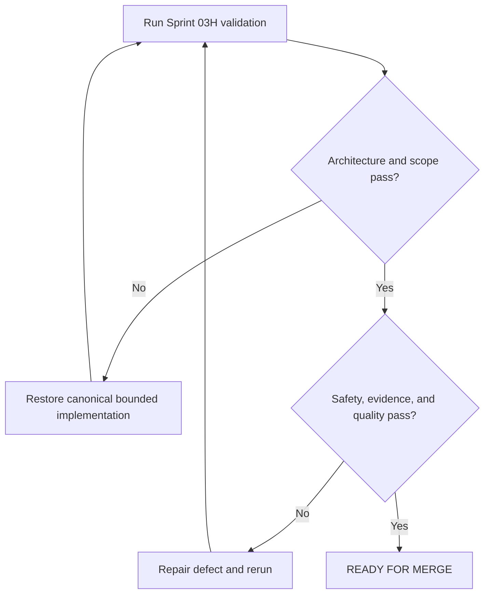

# Recovery System Implementation Report

## Purpose

Record Sprint 03H implementation, validation, and final approval evidence.

## Scope

This report covers only `14-recovery-system/` and required navigation,
dependency-registry, and changelog integration.

## Governance Status

The Master Architecture, AI Execution Rules, changelog, and implementation
reports for Sprints 03A through 03G were read and preserved as immutable history.

## Theory

Recovery is implemented as a safety-first systems-engineering loop: detect,
contain, classify, analyze, rebaseline, restart, verify, and learn.

## Framework

| Measure | Result |
|---|---:|
| Canonical documents | 9 |
| Words | 6,407 |
| Documents with tables | 9 |
| Mermaid diagrams | 9 |
| Decision trees | 9 |
| Cross-reference links | 57 |

## Workflow

Mandatory inputs were read, prompt concepts were mapped into canonical files,
documents were implemented, the dependency registry and navigation were updated,
and the complete validation gate was executed.

## Implementation

### Files Implemented

- `README.md`
- `failure-classification.md`
- `missed-day-recovery.md`
- `missed-week-recovery.md`
- `illness-and-emergency.md`
- `overload-recovery.md`
- `academic-crisis.md`
- `project-failure.md`
- `restart-protocol.md`

### Canonical Filename Verification

The eight architecture-defined protocols and established directory README are
implemented. Expected and actual filename sets match. No alias, alternate
protocol, or parallel recovery structure was created.

### Prompt-to-Architecture Mapping

| Requested concept | Canonical implementation |
|---|---|
| Poor mock and placement rejection | `failure-classification.md` |
| Semester setback | `academic-crisis.md` |
| Burnout boundary | `overload-recovery.md`, `illness-and-emergency.md` |
| Root cause and failure review | `failure-classification.md`, `project-failure.md` |
| Adaptive replanning and risk reassessment | Shared recovery framework |
| Confidence and momentum restoration | `restart-protocol.md` through verified actions |
| Execution restart checklist | `restart-protocol.md` framework and acceptance controls |

## Decision Tree

## Failure Modes

- Treating recovery as motivation or automatic catch-up.
- Promising recovery speed, examination success, or placement outcomes.
- Diagnosing health conditions or replacing qualified support.
- Implementing Dashboards, KPIs, or Appendices.

## Recovery

Remove unsupported or out-of-scope content, restore canonical names and links,
correct evidence labels, and rerun every validation control.

## Examples

A missed week triggers capacity rebaselining and scope removal, not workload
compression. A project failure preserves evidence and tests corrective action.

## Tables

Every module document contains evidence-classification and recovery-framework
tables. This report includes metrics, mapping, health, drift, and approval tables.

## Mermaid Diagrams

Every module document contains one safety-first decision flow. Mermaid fences,
decision branches, and prose summaries were structurally validated.

## Cross References

- [Master Architecture](../MASTER_ARCHITECTURE.md)
- [AI Execution Rules](../governance/AI_EXECUTION_RULES.md)
- [Operation Renaissance](README.md)
- [Recovery System](14-recovery-system/README.md)
- [Review System](13-review-system/README.md)
- [Health System](10-health-system/README.md)
- [Dependency Registry](../data/registries/dependency-registry.yml)
- [Source Register](../references/source-register.yml)
- [Changelog](../CHANGELOG.md)

## References

- `SRC-NASA-SE-2016`
- `SRC-ISO-9001-2015`
- `SRC-WHO-STRESS-2020`

## Further Reading

Use current authorized institutional policies and qualified local health,
mental-health, emergency, or support resources whenever those boundaries apply.

## Repository Health

| Check | Result |
|---|---|
| Architecture integrity | PASS |
| Naming integrity | PASS |
| YAML front matter structure | PASS |
| Required Markdown sections | PASS |
| Evidence labels | PASS |
| Mermaid fence integrity | PASS |
| Internal relative links | PASS |
| README navigation | PASS |
| Dependency paths and IDs | PASS |
| Source identifiers | PASS |
| Placeholder scan | PASS |
| Git whitespace | PASS |

## Technical Debt

Known limitations are non-blocking: recovery timing cannot be generalized;
institutional and professional pathways remain external and mutable; Mermaid
validation is structural pending the documentation toolchain. Automated recovery
record schemas and derived views are deferred. Future improvements should test
usability with synthetic disruption scenarios under separately authorized work.

## Prompt Drift Check

| Constraint | Result |
|---|---|
| Master Architecture unchanged | PASS |
| AI Execution Rules followed | PASS |
| Previous sprint content preserved | PASS |
| Recovery System only | PASS |
| Evidence, best practice, and opinion separated | PASS |
| No fabricated psychological, medical, or organizational claims | PASS |
| No success or recovery guarantee | PASS |
| No Dashboards, KPIs, or Appendices | PASS |

## Architecture Compliance

PASS. Canonical structure and ownership were preserved. No ADR was required.

## Scope Compliance

PASS. Changes are limited to the Recovery System and explicitly required
integration surfaces.

## Remaining Work

`15-dashboards/`, `16-kpis/`, and `17-appendices/` remain unimplemented.

## Next Sprint

Await explicit authorization. This report does not authorize Dashboards, KPIs,
or Appendices.

## Next Steps

Review the bounded diff and merge only while every recorded gate remains passing.

## Final Approval Gate

| Decision | Reason | Risk level | Confidence | Recommendation |
|---|---|---|---|---|
| **READY FOR MERGE** | Architecture, scope, safety, evidence, naming, registry, navigation, and link controls pass | Low repository risk; real disruptions remain context-dependent | High | Merge after maintainer review; use authorized professional or institutional support where applicable |

