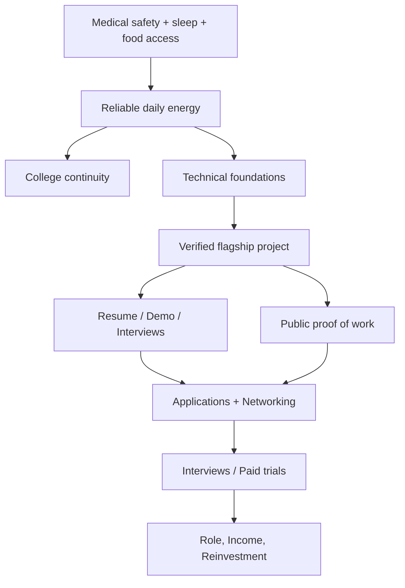

# The 184-Day Renaissance Execution Manual

**Owner:** Rounak  
**Mission window:** 1 August 2026 to 31 January 2027 (184 days, inclusive)  
**Version:** Consolidated, red-teamed, execution-first  
**Operating principle:** Build evidence, health, employability, and income in that order.

> **Definition of “God Mode”:** calm execution under pressure; reliable sleep, nutrition, training, focused work, honest measurement, rapid recovery, and the ability to choose the next highest-value action. It does **not** mean working at any biological or ethical cost.

---

## 1. Executive Decision

The scattered source contains useful ideas, but it repeatedly expands one six-month mission into a 30-volume life plan. It also assigns confident probabilities to uncertain outcomes, schedules 10 or more productive hours every day, and tries to develop too many unrelated skills at once. That system would create guilt, fragmentation, and burnout.

The corrected mission is:

> **By Day 184, become visibly healthier, technically credible, interview-ready for a focused role family, and able to demonstrate a repeatable pipeline for applications, networking, and paid work.**

The primary career lane is **digital design/RTL + Python automation**, with enough DSA and CS fundamentals for entry-level interviews. AI is used as a tool and project layer, not treated as another field to “master.” The flagship deliverable is a **verified RISC-V/RTL project with Python-based testing or automation**, documented well enough to support applications, interviews, and technical content.

The immediate target is not a guaranteed ₹45 LPA offer. It is:

- a credible placement or paid technical role;
- one strong, verified portfolio project;
- an interview-ready foundation;
- first earned technical income or strong evidence of market contact;
- a healthy upward weight trend under appropriate medical guidance;
- a system that can continue after Day 184.

This creates the highest-probability path toward the original long-term ambitions.

---

## 2. Baseline and Constraints

### 2.1 Known baseline

- **Age:** 21.
- **Education:** final-year B.Tech ECE, IIIT Manipur.
- **CGPA:** 7.56.
- **Physical baseline:** 176 cm, approximately 50 kg.
- **Equipment:** HP Omen laptop, RTX 4060, 16 GB RAM, 512 GB SSD.
- **Connectivity:** reliable internet.
- **Capital and professional network:** described as near zero.
- **Location:** Manipur until approximately the end of November, with possible relocation afterward.
- **Mental state:** low motivation and willpower, paired with extreme expectations.

### 2.2 Important uncertainty

Before Day 1, record the actual:

- college timetable, attendance requirement, examination dates, and major-project requirements;
- current programming, Verilog, mathematics, and English baselines;
- monthly food access and unavoidable expenses;
- medical history, current symptoms, medications, and exercise history;
- resume, GitHub, LinkedIn, and prior project status.

Until these are measured, numerical outcome percentages are planning estimates—not promises.

### 2.3 Safety boundary

At 50 kg and 176 cm, the reported BMI is approximately 16.1. This deserves professional medical attention, especially before aggressive calorie changes or intense training. Seek a qualified clinician or government health service early. Urgent symptoms such as fainting, chest pain, severe weakness, persistent vomiting/diarrhoea, or rapid unexplained weight loss require prompt medical care.

The plan never uses:

- sleep deprivation;
- extreme bulking, dehydration, or unverified supplements;
- training through injury or illness;
- stimulants or substances as productivity tools;
- “coldness” as emotional suppression;
- fabricated experience, research, testimonials, or credentials.

---

## 3. All 31 Stated Goals Evaluation

1. Increase body weight from 50 kg to 65 kg while building agile strength and basic MMA competence.
2. Secure a ₹45 LPA or higher software or hardware role.
3. Achieve ranks under 250 in GATE ECE, GATE EIE, and IIT JAM.
4. Achieve a rank under 250 in UPSC ESE.
5. Publish daily AI/transformation content across Instagram, X/Twitter, LinkedIn, and YouTube.
6. Secure paid internships worth ₹50,000 per month in both CSE and ECE.
7. Master FPGA, VLSI, SoC, ARM, EDA, and GPU architecture.
8. Master DSA, software development, DevOps, ML, MLOps, forward-deployed engineering, and SAP.
9. Complete 200+ LeetCode problems, reach Codeforces 1200+, and complete 100+ HDLBits problems.
10. Build excellent hardware, software, and AI portfolio projects.
11. Secure an international remote internship and build freelance income.
12. Crack the 2027 PGEE, PGCIL, ISRO, BARC, and DRDO examinations.
13. Become emotionally intelligent, mentally resilient, and calmly effective.
14. Increase chess rating from approximately 200 to 1100+.
15. Reach Japanese JLPT N5 and N4.
16. Reach CEFR C2 English.
17. Learn Blender and open-source video editing.
18. Learn motion graphics.
19. Develop advanced problem-solving ability.
20. Develop storytelling ability.
21. Learn cinematography.
22. Develop advanced mathematics and sudoku ability.
23. Improve creative, rational, practical, logical, and executive thinking.
24. Improve communication, negotiation, ethical influence, and strategic persuasion.
25. Build ₹2 lakh per month of passive income.
26. Learn comprehensive generative AI and automation.
27. Publish three research papers.
28. Create a viable path to affordable higher study or transfer abroad.
29. Write an anonymised book about a broken relationship.
30. Read eight specified books, including *Meditations*, *Psycho-Cybernetics*, Kafka, Dostoevsky, Jung, and Freud.
31. Improve living standards dramatically and reinvest earnings into dental care/braces, a phone, gadgets, appearance, and quality of life.

---

## 4. Practical Achievability

### 4.1 How the percentages work

The percentage is the estimated share of the **originally stated target** that can be completed in 184 days from the reported baseline. It is not the probability that fate delivers the outcome. External outcomes—offers, income, rankings, admissions, paper acceptance, and audience growth—cannot be guaranteed by effort alone.

| # | Original goal | Practical Day-184 outcome | Achievable share | Decision |
|---:|---|---|---:|---|
| 1 | 50 kg to 65 kg, agile strength, MMA | Establish medical baseline; sustain an upward weight trend; build beginner strength and mobility. A clinician should determine the appropriate weight-gain rate. | 45% | Active, health-led |
| 2 | ₹45 LPA+ placement | Become credible for entry-level RTL/verification/embedded or software roles; build a real application and interview pipeline. Compensation is market-dependent. | 20% | Treat ₹45 LPA as multi-year |
| 3 | Three exam ranks under 250 | Build foundations in engineering mathematics, networks, digital, and aptitude; take diagnostic tests. | 15% | One exam track only after Day 184 |
| 4 | UPSC ESE under 250 | Understand syllabus and establish foundations; not a primary six-month deliverable. | 5% | Defer |
| 5 | Daily content on four platforms | Publish one useful technical artifact weekly; repurpose it to at most two platforms. | 35% | Reduce frequency and channels |
| 6 | ₹50K/month internships in CSE and ECE | Apply to one coherent hybrid role family; secure interviews or one paid role if market response permits. | 30% | One internship/role, not two |
| 7 | Master six hardware domains | Reach working beginner/intermediate competence in digital design, Verilog/SystemVerilog, simulation, and basic computer architecture. | 25% | Narrow to RTL/verification |
| 8 | Master seven CS domains | Build Python, Git/Linux, DSA patterns, testing, and basic backend competence. | 20% | Defer DevOps/MLOps/SAP depth |
| 9 | LC 200+, CF 1200+, HDLBits 100+ | Complete 100–150 quality DSA problems with review and 60–100 HDLBits exercises; rating is optional. | 70% | Active, quality over count |
| 10 | Excellent cross-domain portfolio | Ship one flagship project and one small market-facing automation tool. | 75% | Core deliverable |
| 11 | International remote internship and freelancing | Build profiles, outreach, proposals, and complete one small paid pilot if acquired. | 35% | Active experiment |
| 12 | Crack five 2027 exams | Create a shared-foundation plan and choose one primary exam after diagnostics. | 10% | Defer exam-specific depth |
| 13 | Emotional intelligence and resilience | Establish journaling, recovery, social support, and response protocols; seek professional support when needed. | 65% | Active |
| 14 | Chess 200 to 1100+ | Not strategically relevant to the 184-day mission. | 10% | Park |
| 15 | JLPT N5 and N4 | Learn kana and a small survival vocabulary only if core KPIs are green for six weeks. | 10% | Park |
| 16 | English C2 | Improve technical speaking and writing toward a functional B2/C1 level; formal level requires testing. | 40% | Integrate into project work |
| 17 | Blender and video editing | Learn only the editing needed for clear project demos. | 30% | Minimal dose |
| 18 | Motion graphics | Use templates; no dedicated study. | 5% | Defer |
| 19 | Advanced problem solving | Improve through debugging, DSA, digital design, and weekly retrospectives. | 55% | Integrated |
| 20 | Storytelling | Learn a simple problem-action-result demo structure and apply weekly. | 45% | Integrated |
| 21 | Cinematography | Learn basic framing, light, audio, and screen capture for demos. | 15% | Minimal dose |
| 22 | Advanced mathematics and sudoku | Strengthen engineering mathematics; sudoku is parked. | 25% | Maths integrated, sudoku deferred |
| 23 | Creative/rational/executive thinking | Use written decisions, hypotheses, postmortems, and project design reviews. | 55% | Integrated |
| 24 | Communication, negotiation, influence | Build interview stories, outreach skill, professional writing, and basic negotiation scripts. | 45% | Active |
| 25 | ₹2 lakh/month passive income | Validate one small paid service; passive-income scale is a later-stage business outcome. | 5% | Replace with first revenue |
| 26 | Complete GenAI and automation | Build practical competence with APIs, structured outputs, retrieval basics, evaluation, and workflow automation. | 35% | Focused subset |
| 27 | Publish three research papers | Produce a literature map or technical report; only pursue a paper with a legitimate mentor and contribution. | 10% | Defer publication target |
| 28 | Affordable abroad path/transfer | Build a shortlist, cost/funding matrix, eligibility gaps, and deadline calendar. | 45% | Research sprint late in plan |
| 29 | Write relationship book | Keep private notes and a one-page ethical outline; protect privacy and mental health. | 10% | Park |
| 30 | Read eight books deeply | Read two useful books or selected chapters with applied notes. | 25% | Wind-down only |
| 31 | Improve living standards 100x | Earn first revenue, build an emergency buffer, obtain necessary care, and use a written reinvestment order. | 20% | Active but income-dependent |

### Portfolio-wide estimate

- **Literal completion of the original wish list:** approximately 20–25%.
- **Meaningful progress across all 31 goals:** approximately 30–40%.
- **Completion of the deliberately narrowed 184-day mission:** approximately 70% at consistent execution, with substantial uncertainty around offers and income.

These figures should be recalculated at Days 14, 42, 92, and 142 using real evidence. Any plan claiming a guaranteed 60% of the original list is manipulating the scoring system.

---

## 5. Priority Architecture

### Tier 0: protect the engine

1. Medical review, nutrition access, sleep, and safe strength training.
2. College completion, attendance, examinations, and degree requirements.
3. Stable workspace, internet backup, and essential-expense control.

### Tier 1: create employability evidence

4. Verilog/SystemVerilog, digital design, verification, and computer architecture.
5. Flagship RISC-V/RTL project with Python-based verification or automation.
6. DSA patterns, Python, Git/Linux, debugging, and testing.
7. Resume, GitHub, project demo, interview stories, and targeted applications.

### Tier 2: create opportunity flow

8. Technical English through explanations, documentation, and mock interviews.
9. Networking and applications.
10. A small AI/Python automation service experiment.
11. One high-quality technical post or demo per week.

### Tier 3: foundations only

12. GATE-shared subjects, higher-study research, personal finance.

### Park until after Day 184

Japanese certification, chess rating, sudoku, book writing, motion graphics, cinematography depth, SAP, broad MLOps/DevOps, multiple exam campaigns, multiple papers, and a passive-income business.

---

## 6. Critical Path and Dependencies



The critical path is **health → focused learning → verified artifact → market exposure → feedback → iteration**. Audience size, certificates, and raw problem counts are secondary.

---

## 7. The 184-Day Plan

### Phase 0 — Pre-flight: 29–31 July

**Purpose:** remove ambiguity before the clock starts.

- Book or locate an affordable qualified medical consultation.
- Record seven-day baseline inputs: sleep, meals, body weight using consistent measurement conditions, energy, and symptoms.
- Capture college calendar and attendance/exam constraints.
- Take three 60-minute diagnostics:
  - Python/DSA;
  - digital logic/Verilog;
  - English technical explanation.
- Back up important files and create one project workspace.
- Create a one-page dashboard; do not build a complex Notion system.
- Draft a one-page resume baseline.
- Choose the flagship project scope and its “minimum shippable version.”

**Exit gate:** calendar known, health action initiated, baseline measured, scope fixed.

### Phase 1 — Stabilise and prove consistency: Days 1–14

**Objectives**

- Follow clinician-informed nutrition and training guidance.
- Average at least 7.5 hours in bed and establish a consistent sleep window.
- Complete 20–30 focused hours across two weeks, not 100 heroic hours.
- Refresh combinational/sequential logic and basic Verilog.
- Complete 10–15 reviewed DSA problems.
- Set up Git, simulator, waveform viewer, Python environment, and tests.
- Build and verify two small RTL modules: ALU and register file or UART.
- Publish no more than one setup/progress note.
- Send five low-pressure informational messages, not job requests.

**Exit gate**

- 10 of 14 days meet the minimum operating day.
- No worsening health signal.
- Two verified RTL modules in GitHub with tests and clear README.
- Baseline resume and LinkedIn completed.

### Phase 2 — Foundation and first artifact: Days 15–42

**Technical focus**

- Digital logic, finite-state machines, timing concepts, synthesizable RTL.
- SystemVerilog testbench basics, assertions where practical.
- Python scripting, Git workflow, Linux command line.
- DSA: arrays, strings, hashing, two pointers, stacks, queues, binary search.

**Project**

- Implement a small single-cycle RISC-V subset or another tightly scoped CPU core.
- Define requirements before implementation.
- Add automated tests and waveforms.
- Maintain an engineering log: requirement, hypothesis, test, result, decision.

**Career**

- Create a target list of 40 companies/teams across RTL design, verification, FPGA, embedded, EDA, and hybrid automation.
- Conduct 8–12 informational conversations or useful exchanges.
- Apply only after the first coherent project milestone exists.

**Exit gate**

- Core executes a minimal instruction set in simulation.
- 30–40 quality DSA problems completed, including scheduled reviews.
- 30+ HDLBits exercises or equivalent.
- Resume v1 and 90-second project explanation ready.

### Phase 3 — Flagship build and market test: Days 43–92

**Technical focus**

- RISC-V datapath/control, memory interface, hazards only if scope permits.
- Verification plan, regression tests, linting, synthesis report.
- Python automation for test-vector generation, result checking, or report generation.
- DSA: linked lists, trees, heaps, recursion/backtracking, basic graphs.
- CS interview foundations: OS processes/threads, memory, networks, DB basics.

**Project definition**

The flagship should demonstrate:

- written requirements and architecture;
- synthesizable RTL;
- automated verification;
- reproducible setup;
- meaningful tests and failure cases;
- resource/timing or synthesis evidence;
- a concise demo;
- limitations and next steps.

Do **not** add an “AI accelerator” merely as a label. Add a custom instruction, small MAC unit, or automation layer only after the base core and verification pass.

**Market experiment**

- Offer one narrow service: Python automation, data cleanup/reporting, simple API integration, test automation, or technical documentation.
- Produce one sample deliverable.
- Send 10 high-quality proposals or direct messages per week for four weeks.
- Track reply, call, trial, and conversion rates.

**Exit gate**

- Flagship MVP passes its verification plan.
- 60–80 quality DSA problems total.
- At least 40 targeted market contacts and 20 applications.
- At least two mock interviews.
- First paid pilot **or** documented evidence explaining why the offer/channel needs to change.

### Phase 4 — Package, interview, and iterate: Days 93–142

**Technical focus**

- Close verification gaps; improve code quality and documentation.
- Add synthesis evidence or low-cost board deployment only if funding and hardware permit.
- DSA: graphs, dynamic programming foundations, mixed timed sets.
- RTL/verification interview drills and debugging.

**Career system**

- Expand target list to 100 organisations.
- Weekly target: 10–15 tailored applications, five thoughtful outreaches, two follow-ups.
- Run one mock interview per week.
- Build six STAR stories: project failure, debugging, teamwork, conflict, initiative, and learning.
- Use application outcomes to reallocate learning time.

**Content**

- One project artifact per week: diagram, test insight, waveform explanation, benchmark, or demo.
- Repurpose one source artifact into LinkedIn plus one optional short video. No four-platform daily treadmill.

**Exit gate**

- Flagship v1 released.
- Resume and portfolio pass review by at least two credible people.
- 100–120 DSA problems total with a review queue.
- Four or more mock interviews completed.
- Application pipeline produces screens/interviews, or positioning is changed using evidence.

### Phase 5 — Conversion and handoff: Days 143–184

**Objectives**

- Prioritise live interviews, placement drives, paid trials, and examinations.
- Maintain project and health; stop adding features.
- Complete 120–150 DSA problems only if retention remains strong.
- Complete 60–100 HDLBits/equivalent exercises.
- Prepare role-specific interview sheets.
- Create a higher-study funding/deadline shortlist in one bounded weekend sprint.
- Produce a Day-184 evidence pack and next 12-month plan.

**Final evidence pack**

- one-page resume;
- flagship repository and release;
- architecture diagram;
- verification plan and results;
- 3–5 minute demo;
- one small automation sample;
- application tracker;
- interview question/error log;
- health and habit trend summary;
- financial record and reinvestment plan;
- 12-month continuation roadmap.

---

## 8. Weekly Execution System

### 8.1 Capacity budget

Start with **25 focused hours per week outside compulsory college work**. Increase to 30 only after two stable weeks with adequate sleep, acceptable health, and no academic slippage.

Default weekly allocation:

| Workstream | Hours | Purpose |
|---|---:|---|
| Flagship project and RTL/verification | 10 | Primary evidence |
| DSA, Python, CS fundamentals | 6 | Interview readiness |
| Career actions and mock interviews | 4 | Market exposure |
| Technical English/content | 2 | Communication and proof |
| Exam-shared mathematics/networks | 2 | Long-term foundation |
| Weekly review | 1 | Control loop |

Exercise, meals, sleep, medical care, and college are not “optional productivity blocks.”

### 8.2 Weekly cadence

**Monday–Friday**

- One 90-minute primary block.
- One 60–90-minute secondary block.
- One 20–30-minute maintenance block.

**Saturday**

- 2–3 hour integration/build block.
- Application and networking sprint.
- Mock interview or timed diagnostic.

**Sunday**

- Recovery, meal/logistics preparation, light review.
- 45-minute weekly control meeting with yourself.
- Publish the week’s single best artifact.
- No attempt to “repay” missed hours.

### 8.3 Weekly control meeting

Answer:

1. What evidence shipped?
2. What did the market respond to?
3. What broke?
4. What did I learn that changes the plan?
5. What is the single constraint next week?
6. What will I stop doing?

Then choose exactly:

- one health outcome;
- one technical outcome;
- one career outcome;
- one maintenance outcome.

---

## 9. Daily Operating System

The source’s hour-by-hour schedule assumes the absence of college, commuting, fatigue, illness, and administrative load. Use anchors instead.

### 9.1 Standard day

1. **Wake/sleep anchor:** keep a consistent sleep window that provides 7.5–9 hours in bed.
2. **Health anchor:** meals, prescribed care, daylight, and safe movement/training.
3. **Primary block (90 minutes):** flagship project or the week’s main technical bottleneck.
4. **Secondary block (60–90 minutes):** DSA/CS or verification.
5. **Maintenance block (20–30 minutes):** English explanation, Anki review, application follow-up, or exam maths.
6. **Shutdown (10 minutes):** record evidence, choose tomorrow’s first task, close work.

### 9.2 Minimum viable day

Use this during exams, travel, illness recovery, or low-function days:

- protect sleep and meals;
- 25 minutes on the primary technical task;
- 10 minutes of retrieval/review;
- one career action;
- five-minute shutdown note.

This prevents a zero-day without pretending that illness or overload is a discipline failure.

### 9.3 High-capacity day

Add one extra 60–90 minute build block only when:

- sleep was adequate;
- no concerning symptom is present;
- college work is under control;
- yesterday’s work quality remained high.

Never add capacity by taking it from sleep.

---

## 10. Learning and Verification Protocol

For every technical topic:

1. **Define:** write the exact capability to demonstrate.
2. **Attempt:** solve or build before watching a full tutorial.
3. **Inspect:** identify the smallest knowledge gap.
4. **Learn:** use one primary resource.
5. **Retrieve:** close the resource and explain from memory.
6. **Apply:** implement or solve a new example.
7. **Test:** automate where possible.
8. **Review:** revisit after 1, 3, 7, 14, and 30 days.
9. **Teach:** explain in English using a diagram or README.

### Completion standard

A topic is not “learned” because a video was watched. It counts only when at least one exists:

- correct solution without aid;
- passing implementation and tests;
- accurate explanation from memory;
- transfer to a different problem;
- successful interview-style answer.

### AI use policy

Use AI for:

- Socratic hints;
- boilerplate after architecture is understood;
- test ideas and edge cases;
- explanation comparison;
- resume wording and mock interviews;
- formatting notes into flashcards.

Do not use AI to:

- submit code you cannot explain;
- fabricate measurements, citations, experience, or research;
- replace primary documentation;
- silently solve every practice problem;
- make medical, legal, or financial decisions without qualified review.

---

## 11. Flagship Project Specification

### Recommended project

**A verified RISC-V RV32I-subset processor with Python-assisted verification and an optional accelerator/custom-instruction extension.**

### Minimum shippable version

- clear supported-instruction list;
- modular datapath and control;
- register file, ALU, program counter, instruction decode, and memory model;
- testbench with directed tests;
- automated regression command;
- reference-model comparison or structured result checking;
- waveforms for important cases;
- synthesis/lint report where tools permit;
- README with setup, architecture, results, limitations, and reproducibility.

### Stretch sequence

Only after the minimum version passes:

1. add basic pipelining;
2. handle hazards and forwarding;
3. add a small MAC/custom instruction;
4. compare baseline and extension;
5. deploy to low-cost FPGA if affordable;
6. create a technical report.

### Scope-kill rules

Remove the extension if the base core is not stable by Day 70.  
Remove hardware deployment if it delays documentation or interviews.  
Remove “AI” branding if there is no real AI-related workload, method, or evaluation.  
One verified project beats five unfinished repositories.

---

## 12. Placement and Income Engine

### 12.1 Role family

Primary:

- RTL design intern/graduate;
- design verification intern/graduate;
- FPGA engineer;
- embedded/digital design roles;
- EDA or hardware-automation roles.

Secondary:

- Python automation;
- junior backend/test automation;
- technical support/solutions engineering where the project is relevant.

Do not apply as if each role requires a separate identity. Present one coherent story:

> “ECE graduate who builds and verifies digital systems and uses Python automation to improve engineering workflows.”

### 12.2 Funnel metrics

Track weekly:

- targets researched;
- tailored applications;
- useful outreach messages;
- replies;
- referrals;
- screening calls;
- technical interviews;
- offers/paid trials;
- rejection reasons.

Interpretation after at least 30 targeted applications:

- **No replies:** resume, targeting, or proof problem.
- **Replies but no screens:** positioning or eligibility problem.
- **Screens but no technical pass:** skill/interview problem.
- **Technical pass but no offer:** communication, fit, competition, or compensation problem.

### 12.3 First-income strategy

Sell a narrow result, not “AI expertise.” Examples:

- automate a recurring spreadsheet/report workflow;
- clean and transform a dataset;
- build a small API integration;
- create regression/test automation;
- improve technical documentation;
- build a simple, privacy-conscious internal search prototype.

Process:

1. choose one customer type;
2. identify one costly repetitive problem;
3. build a safe sample with dummy data;
4. state fixed scope, delivery time, price, and exclusions;
5. contact prospects;
6. deliver a small paid pilot;
7. request permission before using results as a case study;
8. keep records and invoices.

Income is an outcome metric. Proposals, conversations, samples, and delivery quality are controllable metrics.

---

## 13. Communication, Content, and English

Use one weekly source artifact:

- architecture decision;
- bug and diagnosis;
- waveform explanation;
- verification technique;
- performance comparison;
- lesson from an interview or project milestone.

Convert it into:

1. a README/project-log entry;
2. one LinkedIn post;
3. optionally, one 60–180 second video.

English practice is embedded:

- explain one technical concept aloud for five minutes;
- transcribe or review the explanation;
- correct one recurring grammar/pronunciation issue;
- repeat the explanation more clearly.

Target “clear and credible technical English,” not an unverified C2 label.

---

## 14. Health and Recovery Operating Rules

This section is intentionally non-prescriptive because the baseline is clinically concerning and individual medical advice is required.

- Obtain qualified assessment early.
- Follow a sustainable nutrition plan based on accessible food and professional guidance.
- Measure weight under consistent conditions and focus on the multi-week trend.
- Use beginner resistance training with gradual progression and proper technique.
- MMA is limited to low-risk fundamentals, footwork, mobility, and coached practice when available.
- Stop and seek care for concerning symptoms or a persistent failure to gain weight despite a consistent plan.
- Preserve social contact and emotional recovery.
- “Cold and effective” is replaced with **regulated and effective**: notice emotion, name it, choose behaviour, review afterward.

### Mental reset protocol

When overwhelmed:

1. stop the current task;
2. eat, hydrate, and rest if needed;
3. write the next physical action in one sentence;
4. work for ten minutes;
5. if function remains impaired for several days or distress is severe, contact a qualified mental-health professional or trusted person.

---

## 15. Financial Reinvestment Order

Every rupee does not need to be instantly “reinvested.” First preserve continuity.

1. Essential food, housing, transport, medicine, and connectivity.
2. Small emergency buffer.
3. Medical/dental needs assessed by qualified professionals.
4. Tools directly required for paid work or the flagship project.
5. Interview/application travel and documentation.
6. Education with a clear, near-term use case.
7. Appearance and quality-of-life upgrades.
8. Discretionary gadgets.

Do not buy an FPGA board until the simulation project is sufficiently advanced to use it. Do not buy courses while equivalent primary resources remain unused.

---

## 16. Adaptive Execution Engine

Run every Sunday:

```text
INPUTS
  health_signal
  sleep_average
  college_status
  focused_hours
  project_milestone_status
  review_accuracy
  applications_and_replies
  paid_work_pipeline

IF urgent or worsening health signal:
    pause intensity
    obtain qualified care
    retain only minimum viable academic/career tasks

ELSE IF sleep average < 7.5 hours:
    remove evening work
    reduce weekly capacity by 20%
    repair sleep before adding tasks

IF college attendance/exams/project are at risk:
    protect degree requirements
    merge college project with flagship where permitted
    suspend content and exam extras

IF project milestone is late for 2 consecutive weeks:
    cut features
    increase project share by 3 hours
    stop new courses

IF review accuracy < 70%:
    reduce new problem volume
    schedule error-log review and spaced retrieval

IF 30 targeted applications produce no replies:
    audit resume, proof, and targeting with a credible reviewer
    do not merely increase application volume

IF screens occur but technical interviews fail:
    allocate 3 hours from content/exam work to mocks and weak topics

IF outreach produces no paid conversations after 40 qualified contacts:
    change offer or customer segment
    do not build a larger product

IF all core KPIs are green for 2 weeks:
    increase capacity by no more than 10%
    add only one stretch objective
```

### Traffic-light rules

**Green:** health stable, sleep ≥7.5 hours, college safe, 80% weekly outcomes completed.  
**Yellow:** one core area misses target for one week. Cut extras and repair it.  
**Red:** health concern, repeated sleep failure, academic danger, or two-week collapse. Use minimum viable days and seek appropriate support.

---

## 17. Fallback Mechanisms

| Failure mode | Trigger | Immediate response | Recovery route |
|---|---|---|---|
| Health worsens | Concerning symptom or persistent decline | Stop intense training/work; seek qualified care | Resume with clinician-guided load |
| Cannot gain weight | Trend does not improve despite consistent plan | Review intake accuracy and obtain medical evaluation | Adjust plan professionally |
| College overload | Exam/attendance risk | Suspend content, freelancing, and exam extras | Minimum viable project/DSA maintenance |
| Flagship project slips | Two milestones missed | Freeze features; return to simplest verified core | Ship v0.1 before extension |
| No hardware | Board unaffordable/unavailable | Use open-source simulation, lint, synthesis, and waveforms | Add hardware later |
| Laptop/internet failure | Work interrupted >1 day | Use offline materials, backups, college lab/library, mobile data | Restore only essential environment |
| No application replies | 30 targeted applications, zero reply | Review resume, eligibility, proof, keywords, and target tier | Broaden adjacent roles |
| Interview failures | Two similar failures | Build error taxonomy and mock that exact weakness | Reattempt after evidence of correction |
| No freelance response | 40 qualified contacts, no conversation | Narrow/replace offer and customer profile | Seek internships, tutoring, documentation, QA |
| Emotional crash | Function impaired for several days | Reduce load, contact trusted support/professional | Resume using minimum viable day |
| Relocation disruption | November move consumes capacity | Pre-pack offline tasks and protect sleep/college | One-week maintenance mode |
| Financial emergency | Essential expense exceeds cash | Stop purchases and paid tools | Use free resources and prioritise survival |
| Plan obsession | Dashboard/planning exceeds 60 min/week | Delete metrics and tools | Return to four weekly outcomes |

---

## 18. KPI Dashboard

Track only measures that change decisions.

### Daily

- sleep duration;
- health/energy signal (1–5);
- primary focused block completed;
- meals/nutrition plan followed;
- one-line evidence shipped;
- tomorrow’s first task.

### Weekly

| Domain | KPI | Healthy interpretation |
|---|---|---|
| Health | clinician plan adherence, sleep average, weight trend, training sessions, symptoms | Trend and safety, not daily fluctuation |
| College | attendance, deadlines, exam readiness | No hidden degree risk |
| Project | tested milestone, regression status, unresolved blocker | Verified evidence |
| DSA/CS | new problems, scheduled reviews, review accuracy | Retention over count |
| Career | applications, outreach, replies, screens, mocks | Funnel conversion |
| Income | qualified contacts, proposals, calls, pilots, cash collected | Pipeline before revenue |
| Communication | one artifact, speaking repetitions | Quality and clarity |

### Day-184 scorecard

Score each as **complete / partial / absent**:

1. Health assessment and sustainable routine.
2. Degree obligations under control.
3. Flagship project released with verification evidence.
4. 120–150 quality DSA problems or equivalent competency evidence.
5. 60–100 HDLBits/equivalent exercises or role-ready RTL competency.
6. Resume, GitHub, demo, and six interview stories.
7. 100+ targeted applications and a documented networking pipeline, adjusted for actual placement calendar.
8. Multiple mock interviews and a resolved error log.
9. One paid pilot, internship, job, or credible market-validation result.
10. A written 12-month continuation plan.

Seven of ten, with health and project evidence included, is a strong mission success. An offer improves the result but is not the only proof that the system worked.

---

## 19. The Correct Agent Team

No single AI agent should pretend to be a doctor, hiring manager, technical mentor, therapist, and financial adviser. Use one coordinating agent and specialised reviewers.

### Primary agent: Execution Architect / Program Manager

This is the best agent to turn this manual into weekly execution. It should:

- maintain the backlog and critical path;
- convert phase goals into weekly outcomes;
- review KPI evidence;
- detect overload and scope creep;
- run the adaptive rules;
- produce a one-page weekly brief;
- never add a goal without removing or reducing another.

**Recommended instruction**

> You are my Project Olympus Execution Architect. Use the attached execution manual as the governing document. Each Sunday, inspect my actual KPI evidence, identify the single bottleneck, and produce exactly four outcomes for the next week: health, technical, career, and maintenance. Respect college constraints and the safety rules. Do not redesign the entire system, inflate probabilities, or add new learning tracks. Show what to stop, the calendar budget, acceptance criteria, and the fallback if the week breaks.

### Specialist agent: RTL/Verification Technical Lead

Use for architecture reviews, test plans, RTL critique, debugging strategy, and interview drills. It must demand reproducible evidence and should not write unexplained solutions.

### Specialist agent: Career Pipeline Analyst

Use for role clustering, resume/job-description matching, application-funnel analysis, interview postmortems, and outreach drafts. It should work from current job listings when explicitly asked to research them.

### Specialist agent: Research and Opportunity Scout

Use monthly—not daily—to search current internships, exam dates, scholarships, competitions, and funding. Because these facts change, this agent must browse and cite current primary sources.

### Human professionals

- Qualified clinician/dietitian: medical evaluation and safe nutrition/training boundaries.
- Strength coach or physiotherapist where accessible: technique and injury prevention.
- Faculty/project mentor: academic alignment and technical legitimacy.
- Trusted senior/alumnus: resume and hiring-market calibration.
- Mental-health professional: persistent distress, loss of function, or crisis.

### Agent selection decision

Start with the **Execution Architect**. Add the **RTL/Verification Technical Lead** after the project requirements are written. Add the **Career Pipeline Analyst** once the first project milestone and resume exist. Use the **Opportunity Scout** once per month. Human medical input comes before aggressive physical execution.

---

## 20. First Seven Days

### Day 1

- Record college calendar and fixed obligations.
- Arrange qualified medical assessment.
- Measure technical baselines.
- Create the one-page dashboard.

### Day 2

- Define flagship requirements and supported instruction subset.
- Install and test the simulator, waveform viewer, Git, and Python tools.
- Draft resume baseline.

### Day 3

- Implement and test a small ALU.
- Solve and review two DSA baseline problems.
- Record a two-minute English explanation.

### Day 4

- Implement and test a register file or control module.
- Create target-role and company categories.
- Send one informational message.

### Day 5

- Integrate modules into the smallest datapath experiment.
- Review DSA errors.
- Improve README from a stranger’s perspective.

### Day 6

- Run regression tests and document failures.
- Complete a 60-minute application/resume audit.
- Perform safe training/mobility according to current guidance.

### Day 7

- Recover.
- Run the weekly control meeting.
- Publish only the best technical artifact if it is genuinely useful.
- Select next week’s four outcomes.

---

## 21. Final Rules

1. Health and the degree are constraints, not negotiable inputs.
2. One finished, verified project outranks five ambitious repositories.
3. Market feedback begins before confidence arrives.
4. Raw hours, problem counts, followers, and plans are not competence.
5. Every new commitment must displace an existing one.
6. A missed week triggers scope reduction, not punishment.
7. Do not make irreversible purchases from projected income.
8. Do not claim skills, research, or results you cannot demonstrate.
9. Use AI to shorten mechanical work, never to counterfeit understanding.
10. Measure trends; do not emotionally react to one day.
11. Protect sleep before increasing intensity.
12. Publish evidence, not motivational declarations.
13. Ask for expert help early when the cost of error is high.
14. The job target is a direction; the weekly deliverable is the unit of control.
15. Sanity is part of “God Mode,” not an obstacle to it.

---

## 22. Day-184 Maximum Achievable Outcome

### Most likely under consistent execution

- a medically safer and more stable health routine with measurable progress;
- one credible, verified RTL/RISC-V project with Python automation;
- functional entry-level RTL/verification and Python/DSA competence;
- a complete resume/GitHub/demo/interview package;
- a live pipeline of applications, conversations, and interviews;
- improved technical English and professional communication;
- first technical income, a paid trial, internship, job, or clear market evidence;
- a focused 12-month route toward higher compensation, exams, research, or higher study.

### Optimistic

- project deployed on affordable hardware;
- strong interview conversion and a solid paid role;
- one or more meaningful open-source contributions;
- repeat freelance work;
- a small but credible technical audience;
- a legitimate faculty-supported research direction.

### Stretch

- unusually strong offer, international opportunity, or rapid client growth.

Stretch outcomes require execution **and** favourable external events. They are not the base plan and must never justify unsafe behaviour.

---

## Closing Directive

You do not need another master plan. You need 26 weekly cycles of evidence:

**stabilise → build → test → explain → expose to the market → learn → adjust.**

The winning identity is not “a person who can tolerate unlimited suffering.” It is **a person who can repeatedly face reality, choose the next high-value action, finish it, recover, and return the next day.**
