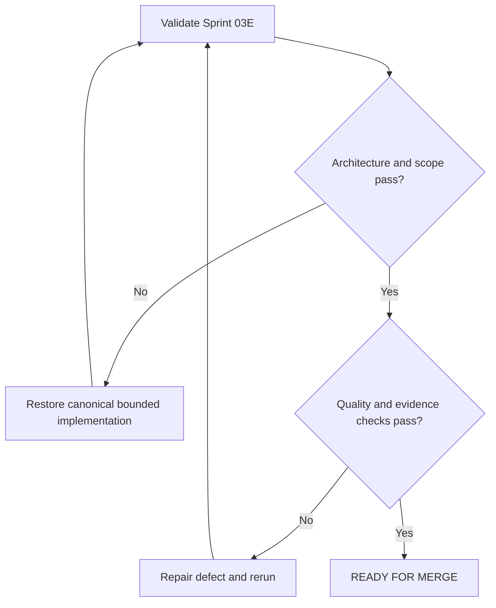

# Research and Communication Implementation Report

## Purpose

Record implementation, validation, repository health, and approval evidence for
revised Sprint 03E.

## Scope

Only the canonical Research and Technical Communication systems were
implemented, with strictly required navigation, changelog, dependency, source,
and report maintenance.

## Governance Status

`MASTER_ARCHITECTURE.md` and `governance/AI_EXECUTION_RULES.md` were read and
remained unchanged. Reports for Sprints 03A through 03D were read as immutable
history.

## Theory

Research converts bounded questions into traceable evidence and qualified claims.
Technical communication converts that evidence into audience-appropriate
decisions and reusable records.

## Scientific Basis

The implementation registers authoritative and peer-reviewed sources on
reproducibility, FAIR data, systematic-review reporting, requirements
engineering, and systems-engineering verification.

## Framework

| Measure | Result |
|---|---:|
| Canonical content files implemented | 16 |
| Words before this report | 7,863 |
| Documents containing tables | 16 |
| Mermaid diagrams | 16 |
| Decision-tree sections | 16 |
| Markdown cross-reference links | 64 |

## Workflow

Mandatory artifacts were read; the revised prompt was checked against ADR-003;
canonical files were implemented; sources and dependencies were registered;
navigation and changelog were updated; acceptance checks preceded this report.

## Implementation

### Research System

- `README.md`
- `research-readiness.md`
- `literature-search.md`
- `paper-reading.md`
- `question-formulation.md`
- `experiment-design.md`
- `reproducibility.md`
- `research-notebook.md`
- `advisor-communication.md`

### Technical Communication System

- `README.md`
- `technical-writing.md`
- `speaking-practice.md`
- `design-review.md`
- `presentation-practice.md`
- `professional-correspondence.md`
- `communication-rubric.md`

## Files Implemented

All 16 established files were implemented in their canonical locations. No alias,
parallel directory, publication venue, institution, professor, funder, or
country-specific file was added.

## Canonical Filename Verification

The implemented filename sets exactly match the established scaffold and Master
Architecture contract. No canonical file was renamed.

## Word Count

The 16 content documents contain 7,863 words before this report.

## Content Tables

Every content document contains one normative framework table.

## Content Mermaid Diagrams

Every content document contains one Mermaid evidence-and-decision flow.

## Decision Trees

Every content document contains an explicit decision-tree section.

## Content Cross References

The content documents contain 64 Markdown links. All internal relative links
resolve.

## Validation Results

| Check | Result |
|---|---|
| Mandatory artifacts read | PASS |
| Canonical filenames | PASS |
| Required sections | PASS |
| Evidence/best-practice/opinion labels | PASS |
| Unfinished-content markers absent | PASS |
| Markdown tables | PASS |
| Mermaid fence balance | PASS |
| Internal links | PASS |
| Source IDs registered | PASS |
| Dependency paths resolve | PASS |
| README navigation | PASS |
| Git whitespace | PASS |
| Fabricated external policies or processes | PASS — none |

## Repository Health

Affected Markdown files have valid front matter and resolved relative links.
Registry paths exist, source IDs resolve, Mermaid fences are balanced, and no
temporary generation artifact remains.

## Technical Debt

### Known limitations

- Mermaid is structurally checked; rendering awaits the future documentation
  build implementation.
- Domain-specific statistical, ethics, safety, and data-retention review remains
  external and must be qualified for each project.

### Deferred improvements

- Automated schema validation, link checking, citation checking, and Mermaid
  compilation remain assigned to architecture-defined tooling work.
- Templates may later instantiate these systems without duplicating their rules.

### Future recommendations

- Add domain-specific profiles only through configuration or an approved
  architecture change.
- Conduct independent usability review with representative research artifacts.

### Non-blocking issues

- ADR-003 remains a proposed historical record. The revised prompt resolved its
  blocker without approving a new specification subsystem.

## Prompt Drift Check

| Reference | Drift found | Disposition |
|---|---|---|
| Master Architecture | None | Canonical hierarchy preserved |
| AI Execution Rules | None | Scope and validation controls followed |
| Prior sprint reports | None | Only navigation and registries changed |
| Revised Prompt 03E | None | Specification subsystem removed; bounded files implemented |

## Architecture Compliance

The Master Architecture was not modified. No new module directory, alias,
alternate filename, or parallel structure was created.

## Scope Compliance

No Health, Resilience, Finance, Review, Recovery, Dashboard, KPI, or Appendix
system was implemented.

## Decision Tree

## Failure Modes

- Applying venue-specific rules as universal policy.
- Sharing restricted research data.
- Treating communication polish as evidence quality.
- Duplicating project facts inside reports or presentations.

## Recovery

Freeze affected claims, restore provenance and canonical links, obtain applicable
review, narrow scope, and rerun validation.

## Examples

The publication pipeline is represented as a configurable workflow inside
research outreach; no journal or conference requirements are hardcoded.

## Tables

The inventory, validation, debt, and drift tables above are the report’s
structured evidence.

## Mermaid Diagrams

The report’s decision tree controls final approval; module diagrams remain in
their canonical files.

## Cross References

- [Research System](08-research-system/README.md)
- [Communication System](09-communication-system/README.md)
- [Changelog](../CHANGELOG.md)
- [ADR-003](../governance/decisions/ADR-003-specification-management-structure.md)

## References

- [Source register](../references/source-register.yml)
- `SRC-NASEM-2019`
- `SRC-FAIR-2016`
- `SRC-PRISMA-2020`

## Further Reading

Consult current domain, institutional, publisher, conference, ethics, safety, and
data-governance requirements before applying these general systems.

## Remaining Work

Health, resilience, finance, review, recovery, dashboards, KPIs, and appendices
remain unimplemented by design.

## Known Risks

Misapplication of generic research guidance to regulated, hazardous, sensitive,
or human-subject work remains the principal risk. Qualified local review is
mandatory where applicable.

## Next Sprint

Proceed only under the next explicitly authorized implementation prompt.

## Next Steps

Review this sprint’s diff and preserve the report as acceptance evidence.

## Final Approval Gate

- **Decision:** READY FOR MERGE
- **Reason:** Architecture, scope, naming, links, references, and structural
  validation pass.
- **Risk level:** Low for repository integration; context-dependent for research
  use.
- **Confidence:** High in structural compliance; moderate in universal
  applicability because domain rules vary.
- **Recommendation:** Merge after maintainer review and require domain-qualified
  review before operational research use.

## Acceptance Criteria

- [x] Research and Communication systems implemented.
- [x] Architecture, naming, links, sources, navigation, and scope validate.
