# 01 Engineering Mathematics

> **Domain:** 02 Engineering Foundations  
> **Target Audience:** Undergraduate ECE / GATE ECE / Computer Engineering  
> **Prerequisites:** High school calculus, algebra, trigonometry  

---

## 1. Overview & Objectives

Engineering Mathematics forms the bedrock of signal processing, control systems, electromagnetics, probability, and algorithmic complexity. This module provides a complete, rigorous, and problem-oriented curriculum aligned with standard university frameworks and the GATE ECE syllabus.

### Key Objectives
1. **Linear Algebra:** Master vector spaces, matrix operations, eigenvalues, eigenvectors, and SVD.
2. **Calculus:** Evaluate single and multivariable limits, derivatives, integrals, and vector calculus theorems (Green's, Stokes', Divergence).
3. **Differential Equations:** Solve first-order and higher-order linear ODEs, Laplace transform methods, and basic PDEs (Wave, Heat equations).
4. **Complex Analysis:** Understand analytic functions, Cauchy-Riemann equations, Cauchy's integral formula, and residue theory.
5. **Numerical Methods:** Apply iterative solvers for roots, linear systems, numerical integration (Simpson's, Trapezoidal), and ODE integration (Runge-Kutta).

---

## 2. Topic Breakdown & Syllabus

```mermaid
flowchart TD
    MATH["Engineering Mathematics"]
    LA["1. Linear Algebra"]
    CALC["2. Differential & Integral Calculus"]
    VCALC["3. Vector Calculus"]
    ODE["4. Differential Equations"]
    COMP["5. Complex Variables"]
    NUM["6. Numerical Methods"]

    MATH --> LA
    MATH --> CALC
    MATH --> VCALC
    MATH --> ODE
    MATH --> COMP
    MATH --> NUM

    LA --> LA1["Matrices, Determinants, Rank"]
    LA --> LA2["Linear Systems (Ax = b)"]
    LA --> LA3["Eigenvalues & Eigenvectors"]
    LA --> LA4["LU & Singular Value Decomposition"]

    CALC --> C1["Mean Value Theorems"]
    CALC --> C2["Partial Derivatives & Taylor Series"]
    CALC --> C3["Definite & Improper Integrals"]

    VCALC --> V1["Gradient, Divergence, Curl"]
    VCALC --> V2["Line, Surface, Volume Integrals"]
    VCALC --> V3["Green's, Stokes', Gauss Divergence Theorems"]

    ODE --> O1["First Order Linear & Non-Linear ODEs"]
    ODE --> O2["Higher Order Constant Coefficient ODEs"]
    ODE --> O3["Laplace Transform Solution of ODEs"]

    COMP --> CP1["Analytic Functions & Cauchy-Riemann"]
    COMP --> CP2["Cauchy's Integral Theorem & Formula"]
    COMP --> CP3["Residue Theorem & Contour Integration"]

    NUM --> N1["Newton-Raphson & Bisection Methods"]
    NUM --> N2["Trapezoidal & Simpson's Rules"]
    NUM --> N3["Euler & Runge-Kutta 4th Order"]
```



---

## 3. Core Equations & Reference Summary

| Subject Area | Key Concept / Formula | Application |
|--------------|-----------------------|-------------|
| **Eigenvalues** | $\det(A - \lambda I) = 0$ | System stability, modal analysis, SVD |
| **System Solvability** | Rank $(A) = \text{Rank}([A\|b]) = n \implies$ Unique solution | Network nodal analysis, state-space |
| **Taylor Series** | $f(x) = \sum_{n=0}^{\infty} \frac{f^{(n)}(a)}{n!} (x-a)^n$ | Non-linear system linearization |
| **Divergence Theorem** | $\iiint_V (\nabla \cdot \vec{F})\, dV = \oiint_S \vec{F} \cdot d\vec{S}$ | Electromagnetics (Gauss's Law) |
| **Stokes' Theorem** | $\iint_S (\nabla \times \vec{F}) \cdot d\vec{S} = \oint_C \vec{F} \cdot d\vec{r}$ | Electromagnetics (Ampere's & Faraday's Laws) |
| **Residue Theorem** | $\oint_C f(z)\, dz = 2\pi i \sum \text{Res}(f, z_k)$ | Inverse Laplace/Z-transforms, definite integrals |
| **Newton-Raphson** | $x_{n+1} = x_n - \frac{f(x_n)}{f'(x_n)}$ | Power flow, non-linear circuit analysis |

---

## 4. Problem Solving & PYQ Strategy

### Problem Solving Workflow
1. **Identify Class:** Classify the problem (e.g., Matrix Rank vs Eigenvalue bounds, Line Integral vs Divergence Theorem shortcut).
2. **Check Symmetry & Constraints:** Check if boundary conditions or properties (e.g., skew-symmetric matrix eigenvalues are pure imaginary or zero) eliminate options instantly.
3. **Execute Derivation:** Apply analytical steps cleanly without jumping steps.
4. **Verify Boundary Values:** Plug in boundary conditions or check unit consistency.

### High-Yield GATE PYQ Focus Areas
- Matrix rank and rank-nullity theorem applications.
- Eigenvalue properties (Sum = Trace, Product = Determinant).
- Vector calculus integral transformations (using Gauss Divergence to evaluate surface integrals).
- Cauchy Residue Theorem for poles enclosed within a given contour $|z-a| = R$.

---

## 5. Practical Python Implementation

```python
import numpy as np
from scipy import scipy, integrate, linalg

# 1. Eigenvalues and Eigenvectors
A = np.array([[4, 2], [1, 3]])
evals, evecs = linalg.eig(A)
print(f"Eigenvalues: {evals}")

# 2. Definite Integral: integral of sin(x) from 0 to pi
integral, error = integrate.quad(np.sin, 0, np.pi)
print(f"Integral result: {integral} (exact: 2.0)")

# 3. Solving System of Equations: Ax = b
b = np.array([1, 2])
x = linalg.solve(A, b)
print(f"Solution x: {x}")
```

---

## 6. Labs & Assessments

- **Lab Exercise:** `LAB-EF-09` — Probability Distributions & Numerical Matrix Solvers in Python.
- **Assessment:** `ASS-EF-01` — Engineering Mathematics Baseline Diagnostic (25 High-Yield Questions).
- **Practice Problems:** See [`templates/content/lab.md`](../../templates/content/lab.md) for self-study lab logs.

---

## 7. Navigation & Cross-References

- [Parent Directory](../README.md)
- [02 Network Theory](../02-network-theory/README.md)
- [03 Signals and Systems](../03-signals-and-systems/README.md)
- [Knowledge Graph](../../KNOWLEDGE_GRAPH.md)
- [Learning Paths](../../LEARNING_PATHS.md)
- [Glossary](../../references/glossary.md)
