# 02 Network Theory

> **Domain:** 02 Engineering Foundations  
> **Target Audience:** Undergraduate ECE / GATE ECE / Electrical Engineering  
> **Prerequisites:** High school physics (electricity), calculus, linear differential equations  

---

## 1. Overview & Objectives

Network Theory provides the analytical framework for understanding linear and non-linear electrical networks. This module equips learners with systematic methods to analyze AC/DC circuits, transient phenomena, frequency response, and multi-port parameters.

### Key Objectives
1. **Circuit Laws & Methods:** Master Nodal Analysis, Mesh Analysis, KVL, KCL, and Graph Theory (Incidence/Tie-set matrices).
2. **Network Theorems:** Apply Thevenin's, Norton's, Superposition, Maximum Power Transfer, and Reciprocity theorems.
3. **Transient & Steady State:** Analyze first-order (RC, RL) and second-order (RLC) step/impulse responses using Laplace transforms.
4. **AC Sinusoidal Analysis:** Evaluate phasors, complex power, power factor correction, and 3-phase circuits.
5. **Two-Port Networks:** Calculate Z, Y, h, ABCD parameters and inter-conversions.

---

## 2. Topic Breakdown & Syllabus

```mermaid
flowchart TD
    NT["Network Theory"]
    DC["1. Basic Laws & Nodal/Mesh"]
    TH["2. Circuit Theorems"]
    TR["3. Transient & AC Analysis"]
    TP["4. Two-Port Networks"]
    RES["5. Resonance & Filters"]

    NT --> DC
    NT --> TH
    NT --> TR
    NT --> TP
    NT --> RES

    DC --> DC1["KVL, KCL & Dependent Sources"]
    DC --> DC2["Nodal Voltage & Mesh Current Methods"]
    DC --> DC3["Graph Theory: Trees, Cut-sets, Tie-sets"]

    TH --> TH1["Thevenin & Norton Equivalent Circuits"]
    TH --> TH2["Superposition Theorem"]
    TH --> TH3["Maximum Power Transfer Theorem"]
    TH --> TH4["Tellegen's & Reciprocity Theorems"]

    TR --> TR1["First-order RC & RL Transients"]
    TR --> TR2["Second-order RLC Transients"]
    TR --> TR3["Laplace Transform Circuit Analysis"]
    TR --> TR4["Phasors & Complex Power (S = P + jQ)"]

    TP --> TP1["Z & Y Parameters"]
    TP --> TP2["h & ABCD Parameters"]
    TP --> TP3["Cascade, Parallel & Series Connections"]

    RES --> R1["Series & Parallel Resonance (Q-factor)"]
    RES --> R2["Passive Filter Design (LPF, HPF, BPF)"]
```



---

## 3. Core Equations & Reference Summary

| Topic | Equation | Key Application |
|-------|----------|-----------------|
| **Max Power Transfer** | $R_L = R_{th}$ (DC), $Z_L = Z_{th}^*$ (AC) | Matching driver stages to loads |
| **RLC Resonance** | $\omega_0 = \frac{1}{\sqrt{LC}}, \quad Q = \frac{\omega_0 L}{R} = \frac{1}{\omega_0 C R}$ | Filter selectivity, tuning circuits |
| **First-Order Transient** | $v(t) = v(\infty) + [v(0^+) - v(\infty)] e^{-t/\tau}$ | Switching behavior in RC/RL circuits |
| **Complex Power** | $S = P + jQ = V_{rms} I_{rms}^*$ | Power factor correction in power systems |
| **Z-to-Y Transformation** | $[Y] = [Z]^{-1} \implies Y_{11} = \frac{Z_{22}}{\Delta Z}$ | Two-port network parameter conversion |

---

## 4. Problem Solving Strategy

### Thevenin Equivalent Steps
1. **Find $V_{th}$:** Open-circuit the load terminals ($A-B$) and solve for open-circuit voltage $V_{oc}$.
2. **Find $R_{th}$:** Deactivate independent sources (short voltage sources, open current sources). If dependent sources exist, apply a 1V test voltage at $A-B$ and calculate $I_{test} \implies R_{th} = 1/I_{test}$.
3. **Reconnect Load:** $I_L = V_{th} / (R_{th} + R_L)$.

---

## 5. Practical Python Implementation

```python
import numpy as np

# Nodal Analysis for 2-node circuit:
# Node 1: (V1 - V_s)/R1 + V1/R2 + (V1 - V2)/R3 = 0
# Node 2: (V2 - V1)/R3 + V2/R4 = I_s
R1, R2, R3, R4 = 10, 20, 5, 15
Vs, Is = 12, 0.5

G = np.array([
    [1/R1 + 1/R2 + 1/R3, -1/R3],
    [-1/R3, 1/R3 + 1/R4]
])
I = np.array([Vs/R1, Is])

V = np.linalg.solve(G, I)
print(f"Node Voltages V1: {V[0]:.2f} V, V2: {V[1]:.2f} V")
```

---

## 6. Navigation & Cross-References

- [Parent Directory](../README.md)
- [01 Engineering Mathematics](../01-engineering-mathematics/README.md)
- [03 Signals and Systems](../03-signals-and-systems/README.md)
- [05 Analog Circuits](../05-analog-circuits/README.md)
- [Knowledge Graph](../../KNOWLEDGE_GRAPH.md)
- [Learning Paths](../../LEARNING_PATHS.md)
