# 03 Signals and Systems

> **Domain:** 02 Engineering Foundations  
> **Target Audience:** Undergraduate ECE / GATE ECE / Communications  
> **Prerequisites:** Calculus, complex numbers, differential equations  

---

## 1. Overview & Objectives

Signals and Systems establishes the mathematical representation of signals in time and frequency domains and characterises Linear Time-Invariant (LTI) systems via convolution, transfer functions, and transform methods.

### Key Objectives
1. **Signal Classification:** Distinguish continuous/discrete, energy/power, periodic/aperiodic, causal/non-causal signals.
2. **System Properties:** Test for Linearity, Time-Invariance, Causality, Stability (BIBO), and Memory.
3. **LTI & Convolution:** Compute continuous convolution integrals and discrete convolution sums.
4. **Fourier Analysis:** Compute Continuous-Time Fourier Series/Transform (CTFS/CTFT) and Discrete-Time Fourier Transform (DTFT).
5. **s-Domain & z-Domain:** Utilize Laplace Transform and Z-Transform with Region of Convergence (ROC) analysis.

---

## 2. Topic Breakdown & Syllabus

```mermaid
flowchart TD
    SS["Signals & Systems"]
    SIG["1. Signal & System Properties"]
    LTI["2. LTI Systems & Convolution"]
    FT["3. Fourier Series & Transforms"]
    LAP["4. Laplace Transform"]
    ZTR["5. Z-Transform & Sampling"]

    SS --> SIG
    SS --> LTI
    SS --> FT
    SS --> LAP
    SS --> ZTR

    SIG --> SIG1["Energy vs Power Signals"]
    SIG --> SIG2["Linearity, Time-Invariance, Causality, Stability"]

    LTI --> LTI1["Impulse Response h(t) & h[n]"]
    LTI --> LTI2["Continuous Convolution Integral"]
    LTI --> LTI3["Discrete Convolution Sum"]

    FT --> FT1["Continuous Time Fourier Series (CTFS)"]
    FT --> FT2["Continuous Time Fourier Transform (CTFT)"]
    FT --> FT3["Discrete Time Fourier Transform (DTFT)"]

    LAP --> LAP1["Laplace Transform & ROC Properties"]
    LAP --> LAP2["Transfer Function H(s) & Pole-Zero Plots"]

    ZTR --> ZTR1["Z-Transform & ROC"]
    ZTR --> ZTR2["Sampling Theorem & Nyquist Rate"]
```



---

## 3. Core Equations & Reference Summary

| Concept | Equation | Application |
|---------|----------|-------------|
| **Continuous Convolution** | $y(t) = x(t) * h(t) = \int_{-\infty}^{\infty} x(\tau) h(t-\tau) d\tau$ | LTI system output calculation |
| **Fourier Transform** | $X(\omega) = \int_{-\infty}^{\infty} x(t) e^{-j\omega t} dt$ | Spectrum analysis |
| **Laplace Transform** | $X(s) = \int_{-\infty}^{\infty} x(t) e^{-st} dt$ | Transient analysis, system poles |
| **Z-Transform** | $X(z) = \sum_{n=-\infty}^{\infty} x[n] z^{-n}$ | Discrete-time system characterization |
| **BIBO Stability** | $\int_{-\infty}^{\infty} |h(t)| dt < \infty \quad \text{or} \quad \sum |h[n]| < \infty$ | System stability verification |

---

## 4. Python Signal Analysis Example

```python
import numpy as np
import scipy.signal as signal

# Continuous LTI system: H(s) = 1 / (s^2 + 2s + 5)
num = [1]
den = [1, 2, 5]
sys = signal.TransferFunction(num, den)

# Step response
t, y = signal.step(sys)
print(f"Poles of the system: {sys.poles}")
```

---

## 5. Navigation & Cross-References

- [Parent Directory](../README.md)
- [01 Engineering Mathematics](../01-engineering-mathematics/README.md)
- [08 Communications](../08-communications/README.md)
- [Knowledge Graph](../../KNOWLEDGE_GRAPH.md)
- [Learning Paths](../../LEARNING_PATHS.md)
