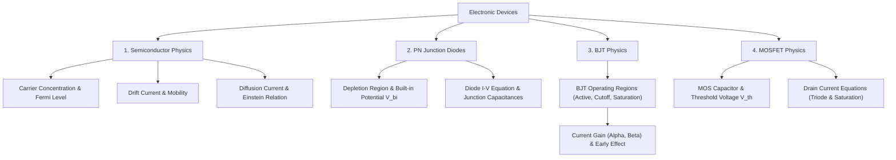

# 04 Electronic Devices

> **Domain:** 02 Engineering Foundations  
> **Target Audience:** Undergraduate ECE / GATE ECE / Microelectronics  
> **Prerequisites:** Basic physics, semiconductor concepts, calculus  

---

## 1. Overview & Objectives

Electronic Devices deals with carrier transport physics in semiconductors and the device physics of PN junctions, BJTs, and MOSFETs that power modern microelectronics.

### Key Objectives
1. **Semiconductor Physics:** Carrier concentration, drift/diffusion currents, mobility, Einstein relation, Fermi energy level.
2. **PN Junction:** Depletion layer, built-in potential, I-V characteristics, junction capacitance (diffusion vs transition).
3. **Bipolar Junction Transistor (BJT):** Operation modes, Ebers-Moll model, amplification, early effect.
4. **MOSFET Physics:** MOS Capacitor (accumulation, depletion, inversion), threshold voltage, I-V characteristics (Triode & Saturation).
5. **Optoelectronic & Special Devices:** Zener diode, LED, Photodiode, Solar Cell.

---

## 2. Topic Breakdown & Syllabus

---

## 3. Core Equations

| Concept | Equation | Application |
|---------|----------|-------------|
| **Einstein Relation** | $\frac{D_n}{\mu_n} = \frac{D_p}{\mu_p} = V_T = \frac{k T}{q}$ | Carrier diffusion-drift modeling |
| **Diode I-V** | $I = I_s \left( e^{\frac{V}{\eta V_T}} - 1 \right)$ | Diode circuit analysis |
| **MOSFET Saturation Current** | $I_D = \frac{1}{2} \mu_n C_{ox} \frac{W}{L} (V_{GS} - V_{th})^2$ | Transistor amplifier/switch design |
| **Built-in Potential** | $V_{bi} = V_T \ln \left( \frac{N_A N_D}{n_i^2} \right)$ | PN junction depletion analysis |

---

## 4. Navigation & Cross-References

- [Parent Directory](../README.md)
- [05 Analog Circuits](../05-analog-circuits/README.md)
- [06 Digital Logic](../06-digital-logic/README.md)
- [Knowledge Graph](../../KNOWLEDGE_GRAPH.md)
