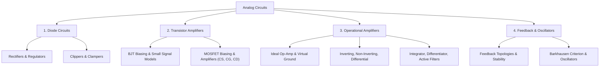

# 05 Analog Circuits

> **Domain:** 02 Engineering Foundations  
> **Target Audience:** Undergraduate ECE / GATE ECE / Analog Circuit Designers  
> **Prerequisites:** 02 Network Theory, 04 Electronic Devices  

---

## 1. Overview & Objectives

Analog Circuits covers the analysis and design of analog electronic systems, including diode clippers/clampers, transistor small-signal amplifiers, operational amplifier (op-amp) configurations, feedback topologies, and sinusoidal oscillators.

### Key Objectives
1. **Diode Applications:** Analyze rectifiers, limiters, clippers, clampers, and Zener voltage regulators.
2. **Amplifier Biasing & Small-Signal Models:** Master DC biasing and AC small-signal models ($r_e$, hybrid-$\pi$) for BJT and MOSFET amplifiers.
3. **Op-Amp Circuits:** Analyze ideal/non-ideal op-amp circuits: Inverting, Non-inverting, Summing, Differential, Integrator, Differentiator, Active Filters.
4. **Feedback Topologies:** Evaluate Voltage-Series, Voltage-Shunt, Current-Series, Current-Shunt feedback topologies.
5. **Oscillators:** Understand Barkhausen criterion; design RC Phase Shift, Wien Bridge, Hartley, Colpitts oscillators.

---

## 2. Topic Breakdown & Syllabus

---

## 3. Core Equations

| Concept | Equation | Application |
|---------|----------|-------------|
| **Inverting Op-Amp Gain** | $A_v = -\frac{R_f}{R_{in}}$ | Inverting amplifier design |
| **Non-Inverting Op-Amp Gain** | $A_v = 1 + \frac{R_f}{R_1}$ | High input impedance amplifier |
| **Barkhausen Criterion** | $|A\beta| = 1 \quad \text{and} \quad \angle A\beta = 0^\circ \text{ or } 360^\circ$ | Oscillator design |
| **Feedback Gain** | $A_f = \frac{A}{1 + A\beta}$ | Negative feedback stabilization |

---

## 4. Navigation & Cross-References

- [Parent Directory](../README.md)
- [02 Network Theory](../02-network-theory/README.md)
- [04 Electronic Devices](../04-electronic-devices/README.md)
- [Knowledge Graph](../../KNOWLEDGE_GRAPH.md)
