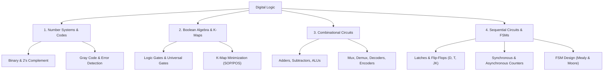

# 06 Digital Logic

> **Domain:** 02 Engineering Foundations  
> **Target Audience:** Undergraduate ECE / CS / Digital Designers  
> **Prerequisites:** Basic high-school mathematics and logic  

---

## 1. Overview & Objectives

Digital Logic bridges physical electronic devices and high-level digital systems. It covers Boolean algebra, logic minimization, combinational building blocks, sequential state machines, and semiconductor memory families.

### Key Objectives
1. **Number Systems & Codes:** Binary, Octal, Hexadecimal, 2's Complement, Gray Code, BCD arithmetic.
2. **Boolean Algebra & Minimization:** Karnaugh Maps (up to 5 variables), Quine-McCluskey method, SOP/POS forms.
3. **Combinational Circuits:** Adders, Subtractors, Multiplexers, Demultiplexers, Decoders, Encoders, Priority Encoders.
4. **Sequential Circuits:** Latches & Flip-Flops (SR, JK, D, T), Excitation tables, Counters, Shift Registers.
5. **Finite State Machines (FSM):** Mealy vs Moore models, State Diagrams, State Minimization, State Encoding.

---

## 2. Topic Breakdown & Syllabus

---

## 3. Core Equations & Truth Tables

| Gate | Function | Expression |
|------|----------|------------|
| **XOR** | Difference / Parity | $Y = A \oplus B = A\bar{B} + \bar{A}B$ |
| **Full Adder Sum** | Addition | $S = A \oplus B \oplus C_{in}$ |
| **Full Adder Carry** | Carry Out | $C_{out} = AB + BC_{in} + AC_{in}$ |
| **D Flip-Flop** | Next State | $Q_{next} = D$ |
| **JK Flip-Flop** | Next State | $Q_{next} = J\bar{Q} + \bar{K}Q$ |

---

## 4. Navigation & Cross-References

- [Parent Directory](../README.md)
- [03 FPGA and Digital Design](../../03-fpga-and-digital-design/README.md)
- [05 Computer Architecture](../../05-computer-architecture/README.md)
- [Knowledge Graph](../../KNOWLEDGE_GRAPH.md)
