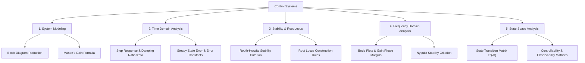

# 07 Control Systems

> **Domain:** 02 Engineering Foundations  
> **Target Audience:** Undergraduate ECE / Electrical / Control Engineers  
> **Prerequisites:** Differential Equations, Laplace Transforms, Linear Algebra  

---

## 1. Overview & Objectives

Control Systems treats feedback modeling and stability analysis for continuous and discrete dynamic systems. It equips learners with frequency-domain and state-space tools required for robotics, automotive, aerospace, and industrial automation.

### Key Objectives
1. **System Modeling:** Block diagrams, Reduction rules, Signal Flow Graphs, Mason's Gain Formula.
2. **Time Domain Analysis:** Transient response of 1st and 2nd order systems, Peak Overshoot, Settling Time, Steady-State Error ($K_p, K_v, K_a$).
3. **Stability Analysis:** Routh-Hurwitz criterion, Root Locus techniques.
4. **Frequency Domain Analysis:** Bode plots, Nyquist plots, Phase Margin, Gain Margin.
5. **State Space Analysis:** State transition matrix $\Phi(t)$, Controllability, Observability.

---

## 2. Topic Breakdown & Syllabus

---

## 3. Core Equations

| Concept | Equation | Application |
|---------|----------|-------------|
| **2nd Order Transfer Function** | $T(s) = \frac{\omega_n^2}{s^2 + 2\zeta\omega_n s + \omega_n^2}$ | Standard second-order system model |
| **Peak Overshoot (%PO)** | $\%PO = 100 \cdot e^{-\frac{\zeta \pi}{\sqrt{1-\zeta^2}}}$ | Transient response specification |
| **Mason's Gain Formula** | $T = \frac{\sum P_k \Delta_k}{\Delta}$ | Signal flow graph reduction |
| **State Transition Matrix** | $\Phi(t) = \mathcal{L}^{-1}\{(sI - A)^{-1}\}$ | Time-domain solution of state equations |

---

## 4. Navigation & Cross-References

- [Parent Directory](../README.md)
- [01 Engineering Mathematics](../01-engineering-mathematics/README.md)
- [03 Signals and Systems](../03-signals-and-systems/README.md)
- [Knowledge Graph](../../KNOWLEDGE_GRAPH.md)
