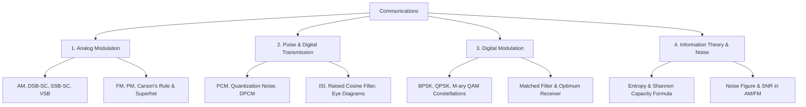

# 08 Communications

> **Domain:** 02 Engineering Foundations  
> **Target Audience:** Undergraduate ECE / GATE ECE / Telecom Engineers  
> **Prerequisites:** 03 Signals & Systems, 11 Probability & Random Processes  

---

## 1. Overview & Objectives

Communications analyzes the transmission of information over physical channels subject to bandwidth limitations and noise.

### Key Objectives
1. **Analog Communication:** AM (DSB-SC, SSB-SC, VSB), FM (Narrowband/Wideband), PM, Superheterodyne receivers.
2. **Pulse Modulation:** PAM, PWM, PPM, Quantization, PCM, DPCM, Delta Modulation, ISI & Nyquist criterion.
3. **Digital Modulation Schemes:** BPSK, QPSK, BFSK, QAM, Constellation diagrams, Coherent/Non-coherent detection.
4. **Noise & Random Processes:** Thermal noise, SNR calculations, Noise Figure, Equivalent Noise Temperature.
5. **Information Theory:** Entropy, Mutual Information, Shannon Channel Capacity theorem, Source/Channel coding.

---

## 2. Topic Breakdown & Syllabus

---

## 3. Core Equations

| Concept | Equation | Application |
|---------|----------|-------------|
| **Carson's Rule (FM Bandwidth)** | $B_T = 2(\Delta f + f_m) = 2 f_m (\beta + 1)$ | FM channel bandwidth calculation |
| **PCM Bit Rate** | $R_b = n \cdot f_s \ge 2 n f_{max}$ | Digital voice/video transmission |
| **Shannon Channel Capacity** | $C = B \log_2 \left( 1 + \frac{S}{N} \right)$ | Maximum theoretical data rate |
| **PCM Quantization SNR** | $SNR_{dB} \approx 6.02 n + 1.76$ | ADC resolution vs dynamic range |

---

## 4. Navigation & Cross-References

- [Parent Directory](../README.md)
- [03 Signals and Systems](../03-signals-and-systems/README.md)
- [11 Probability and Statistics](../11-probability-and-statistics/README.md)
- [Knowledge Graph](../../KNOWLEDGE_GRAPH.md)
