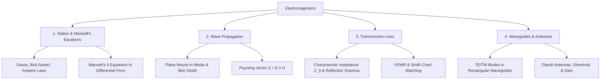

# 09 Electromagnetics

> **Domain:** 02 Engineering Foundations  
> **Target Audience:** Undergraduate ECE / GATE ECE / RF Engineers  
> **Prerequisites:** Vector Calculus, Differential Equations  

---

## 1. Overview & Objectives

Electromagnetics covers static and time-varying electric and magnetic fields, electromagnetic wave propagation, transmission lines, waveguides, and basic antenna parameters.

### Key Objectives
1. **Electrostatics & Magnetostatics:** Coulomb's Law, Gauss's Law, Biot-Savart Law, Ampere's Circuital Law.
2. **Maxwell's Equations:** Integral & Differential forms, Boundary Conditions, Poynting Vector & Power flow.
3. **EM Wave Propagation:** Uniform plane waves, Phase velocity, Group velocity, Intrinsic impedance, Skin depth.
4. **Transmission Lines:** Characteristic impedance $Z_0$, Reflection coefficient $\Gamma$, VSWR, Smith Chart matching.
5. **Waveguides & Antennas:** Rectangular Waveguides (TE/TM modes), Cutoff frequency, Antenna gain, Directivity, Radiation resistance.

---

## 2. Topic Breakdown & Syllabus

---

## 3. Maxwell's Equations Reference

| Equation | Differential Form | Integral Form | Physical Law |
|----------|-------------------|---------------|--------------|
| **Gauss's Law (E)** | $\nabla \cdot \vec{D} = \rho_v$ | $\oiint \vec{D} \cdot d\vec{S} = Q_{enc}$ | Electric charges generate electric fields |
| **Gauss's Law (B)** | $\nabla \cdot \vec{B} = 0$ | $\oiint \vec{B} \cdot d\vec{S} = 0$ | No magnetic monopoles exist |
| **Faraday's Law** | $\nabla \times \vec{E} = -\frac{\partial \vec{B}}{\partial t}$ | $\oint \vec{E} \cdot d\vec{l} = -\frac{\partial}{\partial t}\iint \vec{B} \cdot d\vec{S}$ | Time-varying B-field induces E-field |
| **Ampere-Maxwell Law** | $\nabla \times \vec{H} = \vec{J} + \frac{\partial \vec{D}}{\partial t}$ | $\oint \vec{H} \cdot d\vec{l} = I_{enc} + \frac{\partial}{\partial t}\iint \vec{D} \cdot d\vec{S}$ | Currents & time-varying E-fields induce B-field |

---

## 4. Navigation & Cross-References

- [Parent Directory](../README.md)
- [01 Engineering Mathematics](../01-engineering-mathematics/README.md)
- [Knowledge Graph](../../KNOWLEDGE_GRAPH.md)
