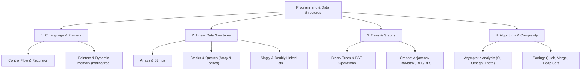

# 10 Programming and Data Structures

> **Domain:** 02 Engineering Foundations  
> **Target Audience:** Undergraduate ECE / CS / Software Engineers  
> **Prerequisites:** Logic and basic mathematics  

---

## 1. Overview & Objectives

Programming and Data Structures establishes the foundations of procedural programming in C, memory management via pointers, dynamic data structures, and algorithmic complexity analysis ($O, \Omega, \Theta$).

### Key Objectives
1. **C Programming Basics:** Control structures, functions, recursion, scope, structures/unions, dynamic memory (`malloc`/`free`).
2. **Pointers & Memory:** Pointer arithmetic, function pointers, multi-dimensional array memory layout, memory leaks.
3. **Linear Data Structures:** Arrays, Stacks (array/linked list implementation), Queues, Circular Queues, Priority Queues.
4. **Linked Structures:** Singly, Doubly, and Circular Linked Lists; Operations (Insert, Delete, Reverse, Cycle Detection).
5. **Non-Linear Data Structures & Algorithms:** Binary Trees, BST, AVL Trees, Heaps, Graph Traversals (BFS, DFS), Sorting (Merge, Quick, Heap) and Searching (Binary Search).

---

## 2. Topic Breakdown & Syllabus



---

## 3. C Implementation Example — Stack via Linked List

```c
#include <stdio.h>
#include <stdlib.h>

typedef struct Node {
    int data;
    struct Node* next;
} Node;

void push(Node** top, int val) {
    Node* newNode = (Node*)malloc(sizeof(Node));
    newNode->data = val;
    newNode->next = *top;
    *top = newNode;
}

int pop(Node** top) {
    if (*top == NULL) return -1;
    Node* temp = *top;
    int val = temp->data;
    *top = (*top)->next;
    free(temp);
    return val;
}
```

---

## 4. Navigation & Cross-References

- [Parent Directory](../README.md)
- [06 Software and Tooling](../../06-software-and-tooling/README.md)
- [04 Embedded Systems](../../04-embedded-systems/README.md)
- [Knowledge Graph](../../KNOWLEDGE_GRAPH.md)
