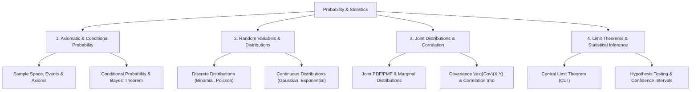

# 11 Probability and Statistics

> **Domain:** 02 Engineering Foundations  
> **Target Audience:** Undergraduate ECE / CS / Data Engineers  
> **Prerequisites:** Calculus, Integration, Set Theory  

---

## 1. Overview & Objectives

Probability and Statistics provides the mathematical foundation for analyzing random phenomena, signal noise, statistical decision-making, and machine learning models.

### Key Objectives
1. **Axiomatic Probability:** Sample spaces, events, Bayes' theorem, total probability rule, independence.
2. **Discrete Random Variables:** PMF, CDF, Mean, Variance, Binomial, Poisson, Uniform distributions.
3. **Continuous Random Variables:** PDF, CDF, Expectation, Variance, Normal (Gaussian), Exponential, Uniform distributions.
4. **Joint Distributions:** Joint PDF/PMF, Marginal distributions, Conditional expectation, Covariance, Correlation Coefficient.
5. **Limit Theorems & Inference:** Law of Large Numbers (LLN), Central Limit Theorem (CLT), Hypothesis Testing (t-test, Z-test).

---

## 2. Topic Breakdown & Syllabus

---

## 3. Core Equations

| Concept | Equation | Application |
|---------|----------|-------------|
| **Bayes' Theorem** | $P(A\|B) = \frac{P(B\|A) P(A)}{P(B)}$ | Inference, classification, noise estimation |
| **Gaussian Distribution** | $f(x) = \frac{1}{\sigma \sqrt{2\pi}} e^{-\frac{(x-\mu)^2}{2\sigma^2}}$ | Noise modeling, channel analysis |
| **Correlation Coefficient** | $\rho_{X,Y} = \frac{\text{Cov}(X,Y)}{\sigma_X \sigma_Y}$ | Signal independence & feature selection |
| **Central Limit Theorem** | $\bar{X}_n \xrightarrow{d} \mathcal{N}\left(\mu, \frac{\sigma^2}{n}\right)$ | Large sample statistical approximation |

---

## 4. Navigation & Cross-References

- [Parent Directory](../README.md)
- [08 Communications](../08-communications/README.md)
- [07 Research and Graduate Study](../../07-research-and-graduate-study/README.md)
- [Knowledge Graph](../../KNOWLEDGE_GRAPH.md)
