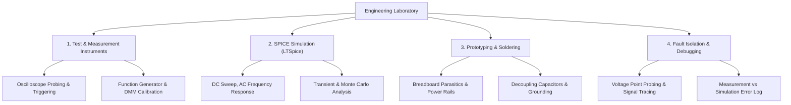

# 12 Engineering Laboratory

> **Domain:** 02 Engineering Foundations  
> **Target Audience:** Undergraduate ECE / Hands-on Hardware Engineers  
> **Prerequisites:** 02 Network Theory, 04 Electronic Devices, 05 Analog Circuits  

---

## 1. Overview & Objectives

Engineering Laboratory connects theoretical circuit/signal models with real-world measurement instruments, PCB breadboarding, SPICE simulations, and systematic hardware debugging techniques.

### Key Objectives
1. **Instrument Operations:** Oscilloscopes (AC/DC coupling, triggering, FFT), Function Generators, Digital Multimeters (DMM), DC Power Supplies.
2. **Circuit Simulation:** LTSpice / KiCad Eeschema schematic entry, DC Sweep, AC Analysis, Transient simulation, Monte Carlo tolerance analysis.
3. **Breadboard & Soldering Best Practices:** Minimizing parasitic capacitance/inductance, decoupling capacitor placement, ground loops.
4. **Practical Debugging:** Systematic fault isolation, voltage probing, current sensing, signal integrity checks.
5. **Lab Documentation:** Engineering notebook entries, measurement tables, error analysis, and comparative plots.

---

## 2. Topic Breakdown & Syllabus

---

## 3. Standard Laboratory Equipment Guide

| Equipment | Primary Function | Key Parameter / Setting |
|-----------|------------------|-------------------------|
| **Digital Storage Oscilloscope (DSO)** | Visualise time-varying signals | Bandwidth, Sampling Rate, Trigger Level, Probe Attenuation (1x/10x) |
| **Function / Arbitrary Waveform Generator** | Inject test signals | Output Impedance ($50\Omega$ vs High-Z), Offset, Amplitude |
| **Digital Multimeter (DMM)** | Measure DC/AC voltage, current, resistance | True RMS measurement, Input Impedance ($10M\Omega$) |
| **DC Bench Power Supply** | Power circuits under test | Current Limit / Constant Current (CC) mode for protection |

---

## 4. Navigation & Cross-References

- [Parent Directory](../README.md)
- [Lab Index](../../LAB_INDEX.md)
- [Lab Template](../../templates/content/lab.md)
- [Knowledge Graph](../../KNOWLEDGE_GRAPH.md)
