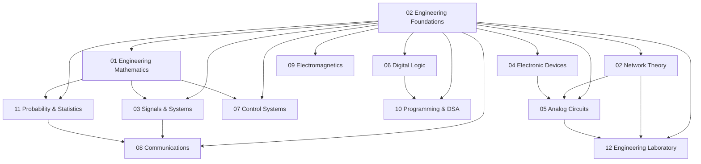

# 02 Engineering Foundations

> **Status:** Active  
> **Domain Classification:** Foundation Engineering & GATE ECE Core  
> **Target Audience:** Undergraduate Engineers, GATE Aspirants, Hardware System Designers  

---

## Domain Overview

`02 Engineering Foundations` is the core technical bedrock of Project Olympus. It contains 12 comprehensive modules spanning continuous and discrete mathematics, semiconductor physics, circuit analysis, digital systems, software algorithms, and practical laboratory measurement techniques.

---

## Directory Modules & Curriculum Index

| # | Module Directory | Focus Area | Key Concepts | Status |
|---|------------------|------------|--------------|--------|
| **01** | [`01-engineering-mathematics/`](01-engineering-mathematics/README.md) | Applied Mathematics | Linear Algebra, Calculus, Differential Equations, Complex Analysis | ✅ Active |
| **02** | [`02-network-theory/`](02-network-theory/README.md) | Circuit Analysis | KVL/KCL, Thevenin/Norton, Transients, Two-Port Networks, Resonance | ✅ Active |
| **03** | [`03-signals-and-systems/`](03-signals-and-systems/README.md) | Signals & LTI Systems | Fourier Series/Transforms, Laplace, Z-Transform, Convolution | ✅ Active |
| **04** | [`04-electronic-devices/`](04-electronic-devices/README.md) | Semiconductor Physics | PN Junctions, BJTs, MOSFETs, Carrier Drift/Diffusion | ✅ Active |
| **05** | [`05-analog-circuits/`](05-analog-circuits/README.md) | Analog Electronics | Diode Circuits, BJT/MOSFET Amplifiers, Op-Amps, Oscillators | ✅ Active |
| **06** | [`06-digital-logic/`](06-digital-logic/README.md) | Digital Systems | Boolean Algebra, K-Maps, Combinational/Sequential Circuits, FSMs | ✅ Active |
| **07** | [`07-control-systems/`](07-control-systems/README.md) | Feedback Control | Transfer Functions, Time Response, Routh-Hurwitz, Bode/Nyquist | ✅ Active |
| **08** | [`08-communications/`](08-communications/README.md) | Telecommunications | AM/FM Modulation, PCM, Digital Modulation (BPSK/QPSK), Information Theory | ✅ Active |
| **09** | [`09-electromagnetics/`](09-electromagnetics/README.md) | Field Theory | Maxwell's Equations, Wave Propagation, Transmission Lines, Antennas | ✅ Active |
| **10** | [`10-programming-and-data-structures/`](10-programming-and-data-structures/README.md) | Computing & DSA | C Programming, Pointers, Arrays, Stacks, Queues, Trees, Sorting | ✅ Active |
| **11** | [`11-probability-and-statistics/`](11-probability-and-statistics/README.md) | Probability Theory | Random Variables, Probability Distributions, CLT, Hypothesis Testing | ✅ Active |
| **12** | [`12-engineering-laboratory/`](12-engineering-laboratory/README.md) | Hands-on Practice | DMM, Oscilloscope, LTSpice Simulation, Prototyping, Debugging | ✅ Active |

---

## Domain Architecture Map

---

## Navigation & Cross-References

- [Parent Directory (Repository Root)](../README.md)
- [03 FPGA and Digital Design](../03-fpga-and-digital-design/README.md)
- [04 Embedded Systems](../04-embedded-systems/README.md)
- [05 Computer Architecture](../05-computer-architecture/README.md)
- [Master Architecture](../MASTER_ARCHITECTURE.md)
- [Knowledge Graph](../KNOWLEDGE_GRAPH.md)
- [Learning Paths](../LEARNING_PATHS.md)
