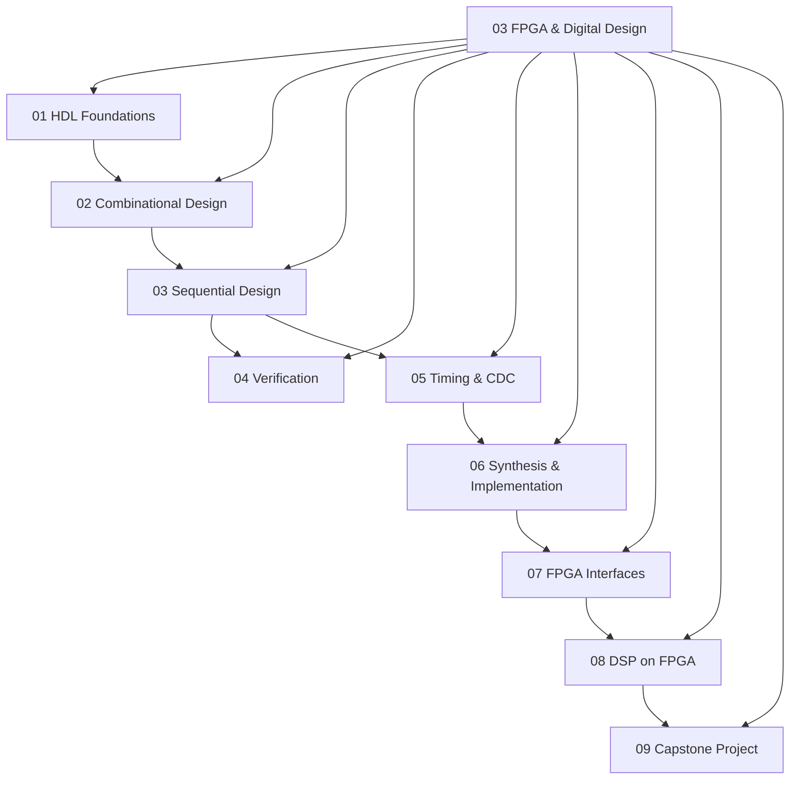

# 03 FPGA and Digital Design

> **Status:** Active  
> **Domain Classification:** Hardware Description Languages, RTL Synthesis & FPGA Systems Engineering  
> **Target Audience:** RTL Design Engineers, FPGA Engineers, Digital Verification Engineers  

---

## Domain Overview

`03 FPGA and Digital Design` provides an end-to-end curriculum for designing, simulating, synthesizing, and closing timing on digital logic systems using Verilog/VHDL and modern FPGA toolchains (Xilinx Vivado / Intel Quartus / Yosys).

---

## Directory Modules & Curriculum Index

| # | Module Directory | Focus Area | Key Concepts | Status |
|---|------------------|------------|--------------|--------|
| **01** | [`01-hdl-foundations/`](01-hdl-foundations/README.md) | HDL Languages | Verilog-2001, SystemVerilog, VHDL, Modules, Vectors, Blocking vs Non-Blocking | ✅ Active |
| **02** | [`02-combinational-design/`](02-combinational-design/README.md) | Combinational Logic | Muxes, Encoders, Decoders, Adders, ALUs, Bit Manipulation | ✅ Active |
| **03** | [`03-sequential-design/`](03-sequential-design/README.md) | Sequential Logic | Flip-Flops, Registers, Counters, Shift Registers, Mealy & Moore FSMs | ✅ Active |
| **04** | [`04-verification/`](04-verification/README.md) | Verification & Simulation | Testbenches, Self-Checking, Assertions, File I/O, Formal Verification | ✅ Active |
| **05** | [`05-timing-and-cdc/`](05-timing-and-cdc/README.md) | Timing Analysis & CDC | Setup/Hold Slack, Clock Domain Crossing, 2-FF Synchronizer, Async FIFO | ✅ Active |
| **06** | [`06-synthesis-and-implementation/`](06-synthesis-and-implementation/README.md) | FPGA Toolchain | LUT Mapping, Place & Route, Resource Utilization, DRC, Bitstream Generation | ✅ Active |
| **07** | [`07-fpga-interfaces/`](07-fpga-interfaces/README.md) | System Interfaces | UART, SPI, I2C, AXI4-Lite, AXI4-Stream, Memory Controllers (DDR) | ✅ Active |
| **08** | [`08-dsp-on-fpga/`](08-dsp-on-fpga/README.md) | Fixed-Point DSP | Fixed-Point Arithmetic, MAC Units, FIR/IIR Filters, NCO, FFT | ✅ Active |
| **09** | [`09-capstone/`](09-capstone/README.md) | Capstone Project | Synthesisable High-Performance FPGA System with Testbench & Timing Closure | ✅ Active |

---

## Domain Architecture Map

---

## Navigation & Cross-References

- [Parent Directory (Repository Root)](../README.md)
- [02 Engineering Foundations](../02-engineering-foundations/README.md)
- [04 Embedded Systems](../04-embedded-systems/README.md)
- [05 Computer Architecture](../05-computer-architecture/README.md)
- [Master Architecture](../MASTER_ARCHITECTURE.md)
- [Knowledge Graph](../KNOWLEDGE_GRAPH.md)
- [Learning Paths](../LEARNING_PATHS.md)
