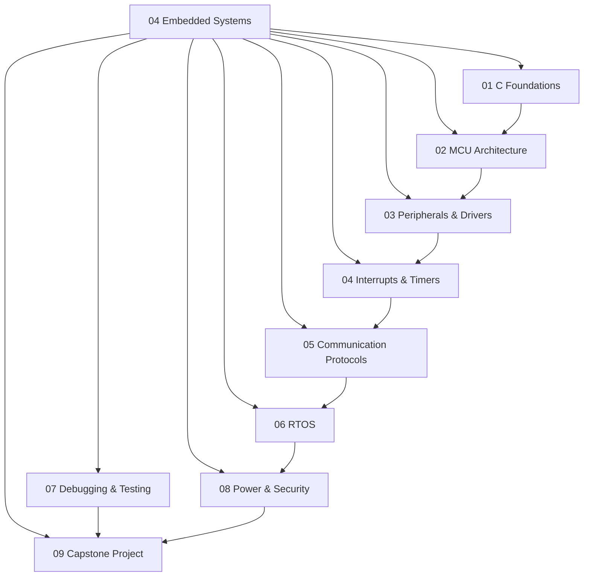

# 04 Embedded Systems

> **Status:** Active  
> **Domain Classification:** Core Embedded Firmware & Real-Time Systems Engineering  
> **Target Audience:** Embedded Software Engineers, Firmware Developers, IoT System Architects  

---

## Domain Overview

`04 Embedded Systems` provides a complete, industry-aligned curriculum for firmware engineering on modern 32-bit microcontrollers (primarily ARM Cortex-M). It spans low-level C memory management, bare-metal register manipulation, peripheral drivers (UART, SPI, I2C, CAN), Real-Time Operating Systems (FreeRTOS), JTAG/SWD debugging, and secure low-power design.

---

## Directory Modules & Curriculum Index

| # | Module Directory | Focus Area | Key Concepts | Status |
|---|------------------|------------|--------------|--------|
| **01** | [`01-c-foundations/`](01-c-foundations/README.md) | Firmware C Programming | MISRA C, Pointers, Memory Mapping, Volatile, Bit Manipulation | ✅ Active |
| **02** | [`02-microcontroller-architecture/`](02-microcontroller-architecture/README.md) | MCU Architecture | ARM Cortex-M (M0/M3/M4/M7), Memory Map, Pipeline, Registers | ✅ Active |
| **03** | [`03-peripherals-and-drivers/`](03-peripherals-and-drivers/README.md) | Hardware Peripherals | GPIO, ADC, DAC, PWM, Timers, DMA Controllers | ✅ Active |
| **04** | [`04-interrupts-and-timers/`](04-interrupts-and-timers/README.md) | Real-Time Handling | NVIC, ISRs, Interrupt Latency, Hardware Timers, Watchdog | ✅ Active |
| **05** | [`05-communication-protocols/`](05-communication-protocols/README.md) | Serial Protocols | UART, SPI, I2C, CAN Bus, USB, Ethernet MAC | ✅ Active |
| **06** | [`06-rtos/`](06-rtos/README.md) | Real-Time OS | FreeRTOS, Task Scheduling, Semaphores, Queues, Mutexes, Rate-Monotonic | ✅ Active |
| **07** | [`07-debugging-and-testing/`](07-debugging-and-testing/README.md) | Verification | JTAG/SWD, OpenOCD, GDB, Unity/CMock Unit Testing, Logic Analyzers | ✅ Active |
| **08** | [`08-power-reliability-security/`](08-power-reliability-security/README.md) | System Reliability | Sleep Modes, Power Budgets, MPU, Secure Boot, Crypto Hardware | ✅ Active |
| **09** | [`09-capstone/`](09-capstone/README.md) | Capstone Project | End-to-End Embedded Product: Hardware, Drivers, RTOS & Testing | ✅ Active |

---

## Domain Architecture Map

---

## Navigation & Cross-References

- [Parent Directory (Repository Root)](../README.md)
- [02 Engineering Foundations](../02-engineering-foundations/README.md)
- [03 FPGA and Digital Design](../03-fpga-and-digital-design/README.md)
- [05 Computer Architecture](../05-computer-architecture/README.md)
- [Master Architecture](../MASTER_ARCHITECTURE.md)
- [Knowledge Graph](../KNOWLEDGE_GRAPH.md)
- [Learning Paths](../LEARNING_PATHS.md)
