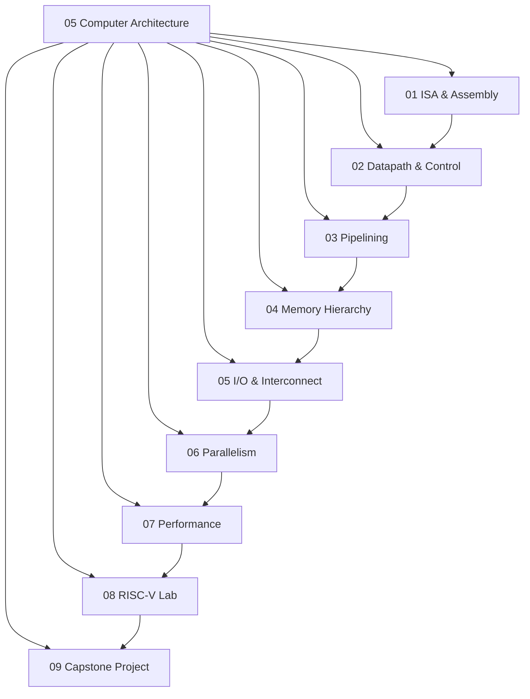

# 05 Computer Architecture

> **Status:** Active  
> **Domain Classification:** Processor Design, Microarchitecture & Systems Performance  
> **Target Audience:** Processor Architects, CPU Hardware Designers, Systems Software Engineers  

---

## Domain Overview

`05 Computer Architecture` investigates how computer software translates to microarchitectural hardware execution. Built around the open RISC-V ISA, this domain details single-cycle, multi-cycle, and 5-stage pipelined datapaths, hazard handling, branch prediction, multi-level cache hierarchies, TLBs, and parallel computer architectures.

---

## Directory Modules & Curriculum Index

| # | Module Directory | Focus Area | Key Concepts | Status |
|---|------------------|------------|--------------|--------|
| **01** | [`01-isa-and-assembly/`](01-isa-and-assembly/README.md) | Instruction Set Architecture | RISC-V RV32I, R/I/S/B/U/J Formats, Assembly, Registers, Calling Conventions | ✅ Active |
| **02** | [`02-datapath-and-control/`](02-datapath-and-control/README.md) | Single-Cycle & Multi-Cycle | ALU, Register File, PC Control, Main Control Unit, Instruction Decoding | ✅ Active |
| **03** | [`03-pipelining/`](03-pipelining/README.md) | Pipelined Processor | 5-Stage Pipeline (IF, ID, EX, MEM, WB), Data Hazards, Forwarding, Control Hazards | ✅ Active |
| **04** | [`04-memory-hierarchy/`](04-memory-hierarchy/README.md) | Caches & Virtual Memory | Direct-Mapped / Set-Associative Caches, Cache Misses, Write Policies, TLB, Page Tables | ✅ Active |
| **05** | [`05-io-and-interconnect/`](05-io-and-interconnect/README.md) | System Buses & I/O | Memory-Mapped I/O, Bus Protocols, DMA, Interrupt Controllers, PCIe/AXI Buses | ✅ Active |
| **06** | [`06-parallelism/`](06-parallelism/README.md) | Parallel Processing | Superscalar, Out-of-Order (Tomasulo), SIMD/Vector, Multi-core & Cache Coherence | ✅ Active |
| **07** | [`07-performance/`](07-performance/README.md) | Benchmarking & Metrics | Iron Law of CPU Performance (CPU Time = IC x CPI x Clock Period), SPEC Marks, Gem5 | ✅ Active |
| **08** | [`08-risc-v-lab/`](08-risc-v-lab/README.md) | Hardware Simulator Lab | Implementing RV32I Processor in Verilog / C++ Simulator | ✅ Active |
| **09** | [`09-capstone/`](09-capstone/README.md) | Capstone Project | Pipelined RISC-V CPU Core with Cache & Hazard Forwarding | ✅ Active |

---

## Domain Architecture Map

---

## Navigation & Cross-References

- [Parent Directory (Repository Root)](../README.md)
- [02 Engineering Foundations](../02-engineering-foundations/README.md)
- [03 FPGA and Digital Design](../03-fpga-and-digital-design/README.md)
- [04 Embedded Systems](../04-embedded-systems/README.md)
- [Master Architecture](../MASTER_ARCHITECTURE.md)
- [Knowledge Graph](../KNOWLEDGE_GRAPH.md)
- [Learning Paths](../LEARNING_PATHS.md)
