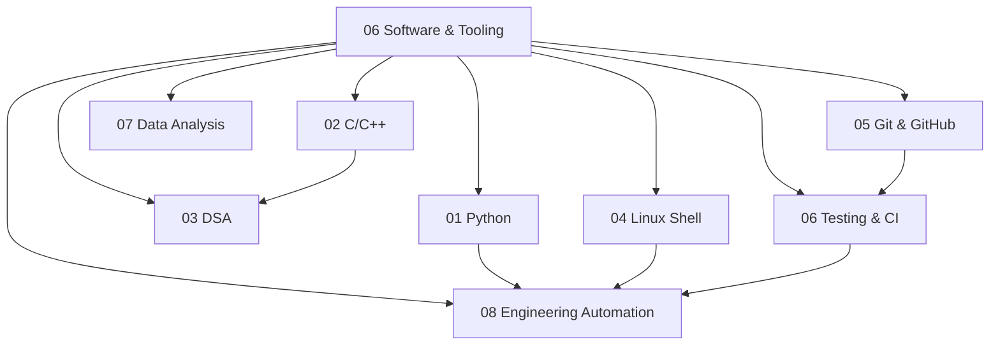

# 06 Software and Tooling

> **Status:** Active  
> **Domain Classification:** Engineering Software, Developer Tooling & Automation  
> **Target Audience:** Systems Software Engineers, Firmware Developers, Automation Engineers  

---

## Domain Overview

`06 Software and Tooling` covers software development practices, language proficiency (Python, C/C++), core computer science concepts (DSA), Linux system usage, version control with Git/GitHub, unit testing frameworks, and python-driven engineering automation.

---

## Directory Modules & Curriculum Index

| # | Module Directory | Focus Area | Key Concepts | Status |
|---|------------------|------------|--------------|--------|
| **01** | [`01-python/`](01-python/README.md) | Python Engineering | OOP, Functional Patterns, Type Hinting, Virtual Environments, Packaging | ✅ Active |
| **02** | [`02-c-cpp/`](02-c-cpp/README.md) | Systems C/C++ | C11/C++17 Standards, Pointers, Memory Model, RAII, STL, Make/CMake | ✅ Active |
| **03** | [`03-data-structures-and-algorithms/`](03-data-structures-and-algorithms/README.md) | DSA | Big-O, Hash Tables, Trees, Graphs, Dynamic Programming, Greedy Methods | ✅ Active |
| **04** | [`04-linux-shell/`](04-linux-shell/README.md) | Linux Environment | Bash Scripting, POSIX CLI Tools, Strace, Grep/Awk/Sed, File Permissions | ✅ Active |
| **05** | [`05-git-and-github/`](05-git-and-github/README.md) | Version Control | Git Internals, Branching Strategies, Rebase, PR Workflows, Merge Conflicts | ✅ Active |
| **06** | [`06-testing-and-ci/`](06-testing-and-ci/README.md) | Quality & CI/CD | Pytest, Unity, GitHub Actions, Code Coverage, Static Analysis (Flake8/Clang-Tidy) | ✅ Active |
| **07** | [`07-data-analysis/`](07-data-analysis/README.md) | Data Science Tools | NumPy, Pandas, Matplotlib, SciPy, Jupyter Notebooks | ✅ Active |
| **08** | [`08-engineering-automation/`](08-engineering-automation/README.md) | Workflow Automation | Repository Validation, Scripting, Build Generators, Data Pipelines | ✅ Active |

---

## Domain Architecture Map

---

## Navigation & Cross-References

- [Parent Directory (Repository Root)](../README.md)
- [02 Engineering Foundations](../02-engineering-foundations/README.md)
- [04 Embedded Systems](../04-embedded-systems/README.md)
- [Master Architecture](../MASTER_ARCHITECTURE.md)
- [Knowledge Graph](../KNOWLEDGE_GRAPH.md)
- [Learning Paths](../LEARNING_PATHS.md)
