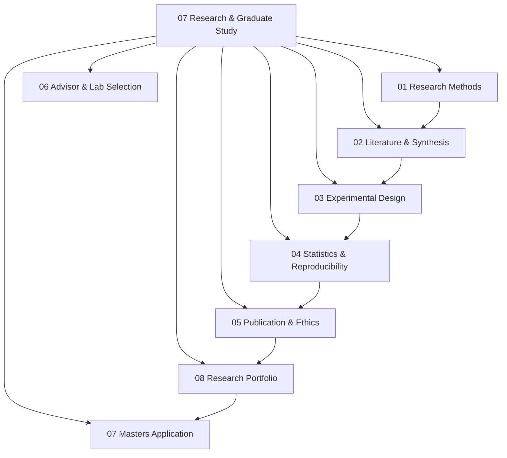

# 07 Research and Graduate Study

> **Status:** Active  
> **Domain Classification:** Academic Research, Scientific Methodology & Graduate Admissions  
> **Target Audience:** Prospective MS/PhD Students, Academic Researchers, R&D Engineers  

---

## Domain Overview

`07 Research and Graduate Study` guides learners through systematic scientific research, academic paper reading/writing, rigorous experimental design, reproducibility practices, advisor selection, and MS/PhD graduate school applications.

---

## Directory Modules & Curriculum Index

| # | Module Directory | Focus Area | Key Concepts | Status |
|---|------------------|------------|--------------|--------|
| **01** | [`01-research-methods/`](01-research-methods/README.md) | Scientific Method | Research Hypotheses, Problem Formulation, Research Cycles, Ethics | ✅ Active |
| **02** | [`02-literature-and-synthesis/`](02-literature-and-synthesis/README.md) | Literature Survey | IEEE Xplore Search, Zotero, Paper Summaries, Systematic Literature Mapping | ✅ Active |
| **03** | [`03-experimental-design/`](03-experimental-design/README.md) | Experimentation | Variables (Independent/Dependent), Controls, Benchmarking, Baselines | ✅ Active |
| **04** | [`04-statistics-and-reproducibility/`](04-statistics-and-reproducibility/README.md) | Statistical Validity | ANOVA, Hypothesis Testing, p-values, Confidence Intervals, Artifact Packaging | ✅ Active |
| **05** | [`05-publication-and-ethics/`](05-publication-and-ethics/README.md) | Academic Writing | LaTeX, IEEE/ACM Paper Structure, Peer Review Process, Publication Ethics | ✅ Active |
| **06** | [`06-advisor-and-lab-selection/`](06-advisor-and-lab-selection/README.md) | Lab Matching | Finding Research Labs, Cold Emailing Professors, Assessing Lab Culture | ✅ Active |
| **07** | [`07-masters-application-system/`](07-masters-application-system/README.md) | Admissions System | Statement of Purpose (SOP), LOR Outreach, GRE Strategy, University Selection | ✅ Active |
| **08** | [`08-research-portfolio/`](08-research-portfolio/README.md) | Portfolio Building | Open-Source Research Artifacts, GitHub Research Repos, Technical Writing | ✅ Active |

---

## Domain Architecture Map

---

## Navigation & Cross-References

- [Parent Directory (Repository Root)](../README.md)
- [02 Engineering Foundations](../02-engineering-foundations/README.md)
- [08 Career and Placement](../08-career-and-placement/README.md)
- [Master Architecture](../MASTER_ARCHITECTURE.md)
- [Knowledge Graph](../KNOWLEDGE_GRAPH.md)
- [Learning Paths](../LEARNING_PATHS.md)
