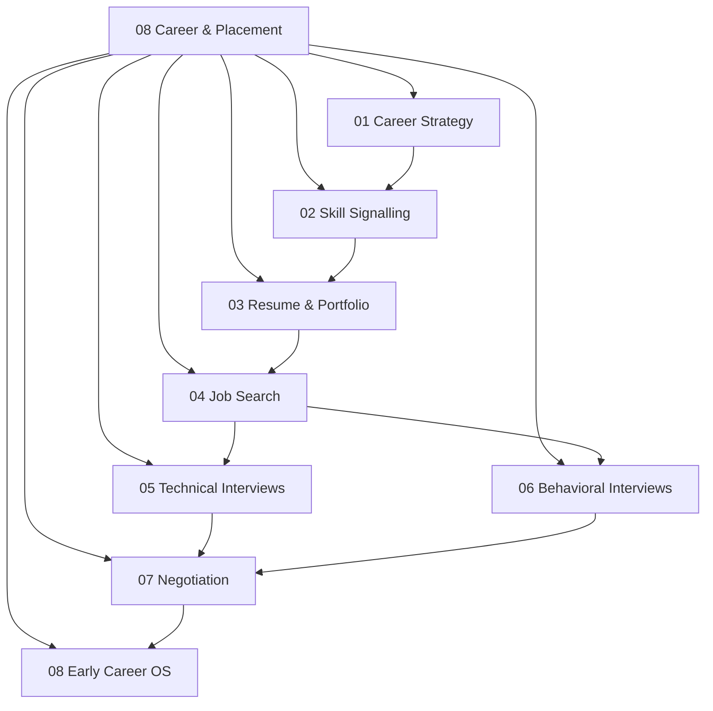

# 08 Career and Placement

> **Status:** Active  
> **Domain Classification:** Professional Career Engineering & Industry Placement System  
> **Target Audience:** Job-Seeking Engineers, Early-Career Professionals, Interview Candidates  

---

## Domain Overview

`08 Career and Placement` details the complete pipeline for landing high-impact engineering roles. It spans career targeting, resume crafting, technical interview preparation (DSA & System Design), behavioral STAR narratives, offer negotiation, and workplace productivity strategies.

---

## Directory Modules & Curriculum Index

| # | Module Directory | Focus Area | Key Concepts | Status |
|---|------------------|------------|--------------|--------|
| **01** | [`01-career-strategy/`](01-career-strategy/README.md) | Role Positioning | Industry Vectors, Target Roles (Embedded, FPGA, Firmware), Skill Matrices | ✅ Active |
| **02** | [`02-skill-signaling/`](02-skill-signaling/README.md) | Technical Proof | Public Artifacts, Open-Source Contributions, Technical Blogging, GitHub Proof | ✅ Active |
| **03** | [`03-resume-and-portfolio/`](03-resume-and-portfolio/README.md) | Career Assets | Single-Page ATS Resume, Action Verbs, Metrics-Driven Bullets, Project Demos | ✅ Active |
| **04** | [`04-job-search/`](04-job-search/README.md) | Pipeline Management | Cold Emailing, Referral Networks, Application Tracking System, Pipeline KPIs | ✅ Active |
| **05** | [`05-technical-interviews/`](05-technical-interviews/README.md) | Technical Interviews | Coding Rounds (DSA), Hardware Design Rounds, System Architecture, Whiteboarding | ✅ Active |
| **06** | [`06-behavioral-interviews/`](06-behavioral-interviews/README.md) | Behavioral Rounds | STAR Technique, Leadership Principles, Conflict Resolution Stories, Culture Fit | ✅ Active |
| **07** | [`07-negotiation-and-decisions/`](07-negotiation-and-decisions/README.md) | Offer Evaluation | Compensation Breakdown (Base, Equity, Bonus), Counter-Offers, Decision Matrix | ✅ Active |
| **08** | [`08-early-career-operating-system/`](08-early-career-operating-system/README.md) | Workplace OS | 30-60-90 Day Plan, Managing Up, Professional Network, Skill Maintenance | ✅ Active |

---

## Domain Architecture Map

---

## Navigation & Cross-References

- [Parent Directory (Repository Root)](../README.md)
- [06 Software and Tooling](../06-software-and-tooling/README.md)
- [07 Research and Graduate Study](../07-research-and-graduate-study/README.md)
- [Master Architecture](../MASTER_ARCHITECTURE.md)
- [Knowledge Graph](../KNOWLEDGE_GRAPH.md)
- [Learning Paths](../LEARNING_PATHS.md)
