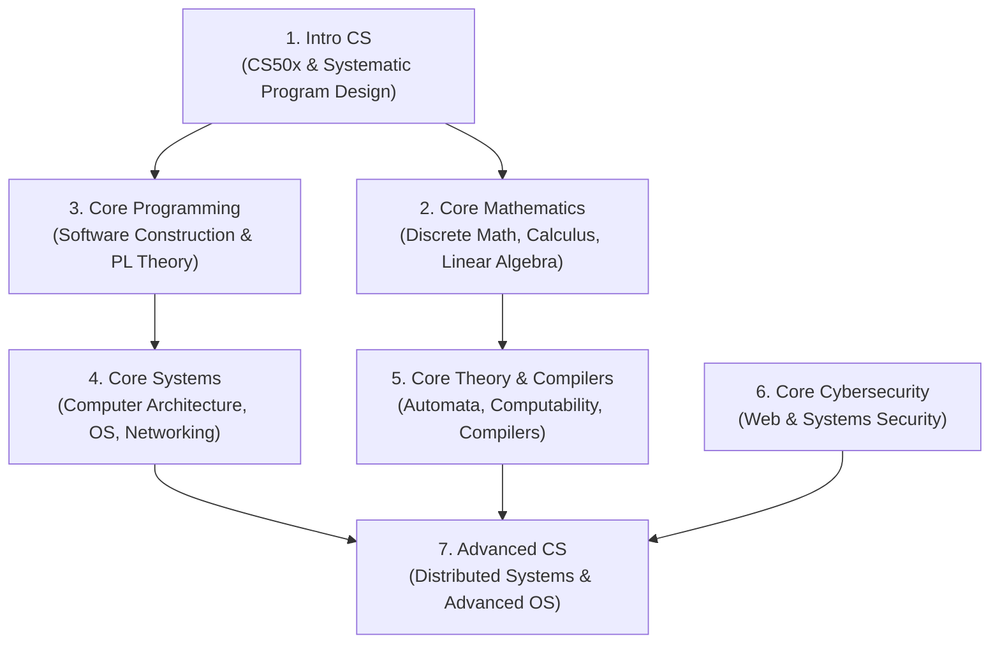
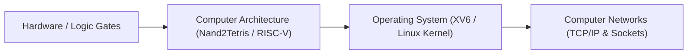

# OSSU Computer Science Foundations

> **Module ID:** `14-OSSU-CS-CORE`  
> **Source Reference:** Open Source Society University (OSSU) Computer Science Curriculum (`github.com/ossu/computer-science`)  
> **Prerequisites:** High-school algebra & basic logic  

---

## Module Overview

The **OSSU Computer Science Curriculum** provides a complete undergraduate-level computer science education using world-class courses from MIT, Harvard, UC Berkeley, Stanford, and Princeton. 

This module structures the entire OSSU track into 7 clear learning pillars:

---

## 1. Intro CS

### 1.1 Computational Thinking (CS50x)
- **Concepts:** C primitives, memory allocation, pointers, algorithms, algorithmic complexity, data structures (arrays, linked lists, hash tables, trees), web fundamentals (HTML/CSS/JS, Flask/Python), database basics (SQL).
- **Deliverables:** Problem sets including Scratch, Mario, Credit, Filter, Recover, Speller, and SQL Database queries.

### 1.2 Systematic Program Design (How to Code)
- **Concepts:** Designing Programs from scratch, Systematic Problem Solving using Racket / Python, Data Definitions, Compound Data, Self-Referential Data, Arbitrary-Sized Data, Helper Functions, Generative Recursion, Accumulators.
- **Reference:** *How to Design Programs (HtDP)* by Felleisen et al.

---

## 2. Core Mathematics

### 2.1 Discrete Mathematics
- **Logic & Proofs:** Propositional logic, predicate calculus, direct proofs, proof by contradiction, mathematical induction, structural induction.
- **Set Theory & Relations:** Sets, functions, equivalence relations, partial orders.
- **Combinatorics & Graph Theory:** Permutations, combinations, Pigeonhole Principle, graph representations, Euler & Hamilton paths, graph coloring, trees, planar graphs.

### 2.2 Calculus (Single & Multivariable)
- Limits, continuity, derivatives, optimization problems, integrals, Fundamental Theorem of Calculus, sequences and series, Taylor series, partial derivatives, gradient vectors, double/triple integrals.

### 2.3 Linear Algebra
- Vector spaces, linear transformations, matrix algebra, systems of linear equations (Gaussian Elimination), determinants, eigenvalues & eigenvectors, Singular Value Decomposition (SVD), applications in graphics and machine learning.

---

## 3. Core Programming & Programming Languages

### 3.1 Software Construction & Object-Oriented Design
- **Concepts:** Data Abstraction, Interfaces, Polymorphism, Subtyping vs Subclassing, Design Patterns (Factory, Observer, Strategy, Singleton, Decorator), Unit Testing (JUnit/PyTest), Refactoring.

### 3.2 Programming Language Theory & Functional Programming
- **Concepts:** Functional Paradigm (Standard ML, Racket, Ruby), Pattern Matching, Higher-Order Functions, Immutability, Lexical Scope, Closure semantics, Dynamic Typing vs Static Typing, Type Inference (Hindley-Milner), Metaprogramming.

---

## 4. Core Systems

### 4.1 Computer Architecture (Nand2Tetris / RISC-V)
- **Hardware Layer:** Boolean logic, logic gates, ALU design, sequential logic, registers, RAM.
- **Architecture Layer:** Hack CPU / RISC-V RV32I ISA, Machine Code, Assembler, Virtual Machine translator, High-level language compiler, Simple OS kernel.
- **Advanced Architecture:** Pipelining, instruction-level parallelism (ILP), branch prediction, cache hierarchies (L1/L2/L3), cache coherence (MESI protocol), memory-mapped I/O.

### 4.2 Operating Systems
- **Processes & Threads:** Process State lifecycle, Context Switching, POSIX `fork()`/`exec()`, Threads, Concurrency, Synchronization primitives (Mutexes, Semaphores, Condition Variables), Deadlocks (Banker's Algorithm).
- **Memory Management:** Virtual Memory, Paging, Page Tables, TLB (Translation Lookaside Buffer), Page Replacement Algorithms (LRU, Clock), Memory-mapped files.
- **File Systems:** Inodes, File Descriptors, Directory Structures, Journaling (ext4), Virtual File System (VFS).

### 4.3 Computer Networking
- **OSI & TCP/IP Stack:** Physical, Data Link, Network (IP, ICMP, BGP, OSPF), Transport (TCP, UDP), Application (HTTP/1.1, HTTP/2, HTTP/3, DNS, TLS).
- **Socket Programming:** Non-blocking sockets, IO multiplexing (`select`, `poll`, `epoll`), TCP handshake, congestion control (Reno, Cubic), flow control (Sliding Window).

---

## 5. Core Theory & Compilers

### 5.1 Automata & Computability
- **Formal Languages:** Regular Expressions, Finite Automata (DFA, NFA, NFA-to-DFA conversion), Pumping Lemma for Regular Languages.
- **Context-Free Languages:** Context-Free Grammars (CFG), Pushdown Automata (PDA), Chomsky Normal Form.
- **Computability:** Turing Machines, Church-Turing Thesis, Halting Problem, Undecidability proofs.
- **Complexity Theory:** Time & Space complexity classes (P, NP, NP-Complete, NP-Hard, Cook-Levin Theorem, reductions).

### 5.2 Compiler Construction
- **Lexical Analysis:** Tokenization, Flex / Lex specs.
- **Parsing:** Context-Free Grammars, LL(k) & LR(k) parsers, Bison / Yacc, Abstract Syntax Trees (AST).
- **Semantic Analysis:** Symbol tables, type checking, scope resolution.
- **Intermediate Representation & Optimization:** LLVM IR, Dead Code Elimination, Constant Folding, Loop Invariant Code Motion.
- **Code Generation:** Target Assembly generation (x86-64 / RISC-V), Register Allocation (Graph Coloring).

---

## 6. Core Cybersecurity

- **Cryptography:** Symmetric Encryption (AES-GCM), Asymmetric Encryption (RSA, ECC), Hash Functions (SHA-256), Digital Signatures, Public Key Infrastructure (PKI), TLS 1.3 Handshake.
- **Web Security:** OWASP Top 10 vulnerabilities, Cross-Site Scripting (XSS), Cross-Site Request Forgery (CSRF), SQL Injection, Content Security Policy (CSP), Same-Origin Policy (SOP).
- **Systems Security:** Memory safety vulnerabilities, Buffer Overflows, Return-Oriented Programming (ROP), Address Space Layout Randomization (ASLR), Stack Canaries.

---

## 7. Advanced CS: Distributed Systems

- **Consensus Protocols:** Paxos, Raft Consensus Algorithm, Byzantine Fault Tolerance (BFT).
- **Distributed Systems Architecture:** Vector Clocks, Logical Clocks (Lamport Timestamps), Consistent Hashing, Two-Phase Commit (2PC), Eventual Consistency vs Strong Consistency (CAP Theorem & PACELC Theorem).
- **Storage Systems:** Distributed Hash Tables (DHT / Chord), Google File System (GFS), MapReduce, Spanner.

---

## Recommended Primary Resources & Links

1. **OSSU CS Repository:** `https://github.com/ossu/computer-science`
2. **Harvard CS50x:** `https://cs50.harvard.edu/x/`
3. **Nand2Tetris:** `https://www.nand2tetris.org/`
4. **MIT 6.004 (Computation Structures):** `https://csg.csail.mit.edu/6.004/`
5. **MIT 6.824 (Distributed Systems):** `https://pdos.csail.mit.edu/6.824/`
