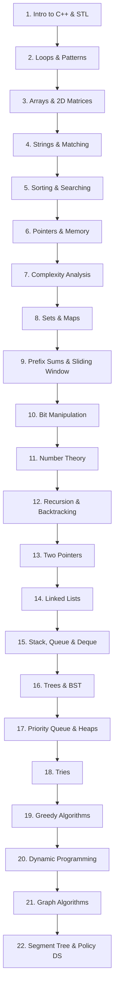

# C++ Data Structures, Algorithms & Competitive Programming

> **Module ID:** `14-DSA-AND-COMPETITIVE-PROGRAMMING`  
> **Source Reference:** Handwritten Roadmap (Image 5) + Competitive Programming Algorithms (`cp-algorithms.com`)  
> **Language Focus:** Modern C++ (C++17 / C++20)  

---

## Roadmap Overview

This module covers all **22 core topics** required to master Data Structures, Algorithms, and Competitive Programming (LeetCode Hard, Codeforces 1600+, AtCoder, and Technical Interviews):



---

## 22-Topic Detailed Syllabus

### 1. Introduction to C++
- C++ compilation pipeline, Fast I/O (`cin.tie(NULL)`, `\n`), Data Types, Modulo operations, Headers (`<bits/stdc++.h>`), C++ STL Containers (`vector`, `pair`, `tuple`).

### 2. Loops and Pattern Printing
- Nested loops, Pyramid patterns, Inverted patterns, Diamond patterns, Number spirals.

### 3. Arrays / 2D Arrays
- 1D Array operations, Matrix Transpose, Matrix Multiplication, 2D Vector initialization, Spiral Matrix Traversal, Rotate Matrix 90 degrees.

### 4. Strings
- C++ `std::string` functions, Substrings, Palindromes, String Matching Algorithms: KMP (Knuth-Morris-Pratt & LPS array), Rabin-Karp Hash, Z-Algorithm.

### 5. Sorting and Searching
- **Sorting:** Bubble, Selection, Insertion, Merge Sort, Quick Sort (Lomuto vs Hoare partitioning), Counting Sort, Radix Sort, `std::sort` (Introsort).
- **Searching:** Linear Search, Binary Search on Arrays, Binary Search on Answer / Monotonic Functions.

### 6. Pointers / Pass by Value, Reference & Address
- Memory Addresses, Pointer Arithmetic, Double Pointers, Dynamic Memory Allocation (`new`/`delete`), References (`&`), Pass by Value vs Pass by Reference (`const &`).

### 7. Time and Space Complexity Analysis
- Big-O ($O$), Big-Omega ($\Omega$), Big-Theta ($\Theta$) notations, Space Complexity, Auxiliary Space, Master Theorem for Divide-and-Conquer Recurrences, Amortized Analysis (Dynamic Array expansion).

### 8. Sets and Maps
- `std::set`, `std::multiset`, `std::map` (Self-Balancing Red-Black Trees, $O(\log N)$ Operations).
- `std::unordered_set`, `std::unordered_map` (Hash Tables, $O(1)$ Average, Custom Hash Functions to prevent anti-hash tests).

### 9. Prefix Sums / Sliding Window / Contribution
- 1D & 2D Prefix Sum Arrays, Difference Array technique, Fixed-size Sliding Window, Variable-size Sliding Window, Contribution Technique (Sum of Subarray Minimums/Maximums).

### 10. Bit Manipulation
- Bitwise operators (`&`, `|`, `^`, `~`, `<<`, `>>`), Checking/setting/clearing $k$-th bit, Count set bits (`__builtin_popcount`), Power of 2 check, Bitmasking subsets, Submask enumeration (`for(int s=m; s; s=(s-1)&m)`).

### 11. Number Theory Basics
- GCD & LCM (Euclidean Algorithm, Extended GCD), Sieve of Eratosthenes ($O(N \log \log N)$), Prime Factorization in $O(\sqrt{N})$, Modular Arithmetic (Modular Addition, Multiplication, Exponentiation $A^B \pmod M$), Fermat's Little Theorem, Euler's Totient Function ($\phi(N)$), Chinese Remainder Theorem (CRT).

### 12. Recursion and Backtracking
- Recursion Trees, Base Cases, Tail Recursion, Backtracking Framework, Subsets Generation, Permutations Generation, N-Queens Problem, Sudoku Solver, Word Search.

### 13. Two Pointers
- Opposite Direction Pointers (Pair Sum in sorted array, Container With Most Water), Same Direction Pointers (Remove Duplicates, Move Zeroes), 3Sum & 4Sum problems.

### 14. Linked List
- Singly Linked List, Doubly Linked List, Circular Linked List, In-place Reversal, Cycle Detection (Floyd's Tortoise and Hare), Intersection of Two Lists, Merge Two Sorted Lists.

### 15. Stack / Queue / Deque
- Stack implementation (Array/List), Queue implementation, Circular Queue, Monotonic Stack (Next Greater Element, Largest Rectangle in Histogram), Monotonic Queue (Sliding Window Maximum).

### 16. Binary Tree / BST
- Tree Traversals (Inorder, Preorder, Postorder, Level-Order), Height & Diameter of Binary Tree, Lowest Common Ancestor (LCA), Binary Search Tree (BST) Insertion/Deletion/Validation, AVL Tree concepts.

### 17. Priority Queue / Heap
- Binary Min-Heap & Max-Heap from scratch, `std::priority_queue`, Heapify algorithm ($O(N)$ build), Top $K$ Frequent Elements, K-way Merge, Find Median from Data Stream.

### 18. Trie (Prefix Tree)
- Trie Node structure, Word Insertion, Search, Prefix Matching, Bitwise Trie (Maximum XOR Pair, Maximum Subarray XOR).

### 19. Greedy Algorithms
- Activity Selection / Interval Scheduling, Fractional Knapsack, Job Sequencing, Huffman Coding, Minimum Spanning Tree rationale.

### 20. Dynamic Programming (DP)
- **State Definition & Transitions:** Memoization (Top-Down) vs Tabulation (Bottom-Up).
- **Classic DP Patterns:** 1D DP (Fibonacci, Climbing Stairs, House Robber), 2D Grid DP (Unique Paths, Min Path Sum), Knapsack (0/1 Knapsack, Unbounded Knapsack), Longest Common Subsequence (LCS), Edit Distance, Matrix Chain Multiplication (MCM), DP on Trees, DP with Bitmask.

### 21. Graph Algorithms
- **Representations:** Adjacency Matrix, Adjacency List.
- **Traversals:** Breadth-First Search (BFS), Depth-First Search (DFS), Connected Components.
- **Shortest Paths:** Dijkstra's Algorithm (Priority Queue $O((V+E)\log V)$), Bellman-Ford Algorithm ($O(VE)$), Floyd-Warshall Algorithm ($O(V^3)$), 0-1 BFS.
- **Minimum Spanning Tree (MST):** Disjoint Set Union (DSU) with Path Compression & Rank, Kruskal's Algorithm, Prim's Algorithm.
- **Topological Sorting:** Kahn's Algorithm (BFS), DFS-based Topological Sort.
- **Advanced Graph Topics:** Tarjan's & Kosaraju's Strongly Connected Components (SCC), Bridges & Articulation Points.

### 22. Segment Tree / Ordered Set
- **Segment Tree:** Point Update, Range Query ($O(\log N)$), Lazy Propagation for Range Updates.
- **Fenwick Tree (Binary Indexed Tree - BIT):** Point Update, Prefix Sum Query ($O(\log N)$).
- **Policy-Based Data Structures (GNU PBDS):** `ordered_set` (`find_by_order`, `order_of_key`).

---

## C++ Code Template for Competitive Programming

```cpp
#include <bits/stdc++.h>
using namespace std;

#define FAST_IO ios_base::sync_with_stdio(false); cin.tie(NULL);
typedef long long ll;
typedef vector<int> vi;
typedef vector<ll> vll;

void solve() {
    // Solution logic here
}

int main() {
    FAST_IO;
    int t = 1;
    if (cin >> t) {
        while (t--) {
            solve();
        }
    }
    return 0;
}
```

---

## Recommended Practice Resources

1. **Harvard CS50:** CS & C++ Fundamentals
2. **Abdul Bari Algorithms Course:** Core Algorithm Analysis & Visualization
3. **Pavel Marvin Playlist:** Advanced Competitive Programming & Data Structures
4. **Codeforces Edu & CP Algorithms:** `cp-algorithms.com`
5. **Practice Platforms:** Codeforces, LeetCode, AtCoder
