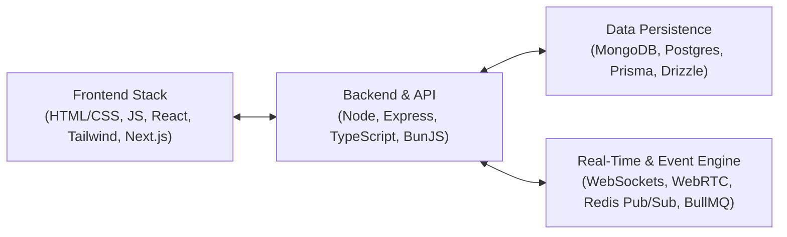
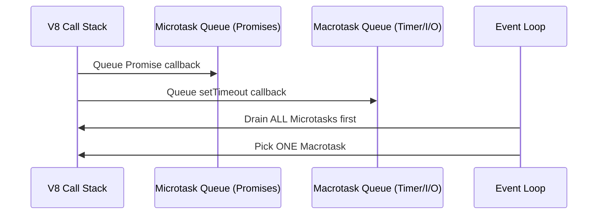

# Full-Stack Web Architecture & Systems

> **Module ID:** `14-FULLSTACK-WEB-ARCHITECTURE`  
> **Source Reference:** Handwritten Roadmap (Image 1)  
> **Core Stack:** TypeScript, Node.js, Next.js 14, React 18, PostgreSQL, Redis, WebSockets  

---

## Module Overview

This module covers all **16 topics** required to architect high-performance, full-stack production applications:

---

## 16-Topic Curriculum Roadmap

### 1. HTML / CSS & Modern Layout Systems
- **HTML5:** Semantic Elements (`<main>`, `<article>`, `<header>`, `<nav>`), Form Validation, Accessibility (a11y / ARIA roles), SEO Meta tags & Open Graph protocol.
- **CSS3:** Box Model, Flexbox (Axis, Alignment, Shrink/Grow), CSS Grid (Grid Templates, Fractional Units, Auto-fit/Auto-fill), CSS Variables, Glassmorphism, Responsive Design (Media Queries, Container Queries).

### 2. JS Basics & ES6+ Features
- Variables (`var`, `let`, `const`), Lexical Scoping, Hoisting, Closures, First-Class & Higher-Order Functions, Array Methods (`map`, `filter`, `reduce`), Destructuring, Spread/Rest operators, Prototypes & Prototypal Inheritance, ES Classes.

### 3. JS Engine Architecture
- **V8 Engine:** Parser, Ignition Interpreter, TurboFan JIT Compiler, Memory Heap, Call Stack, Garbage Collection (Mark-and-Sweep, Orinoco generational GC).

### 4. Async JavaScript
- Callbacks & Callback Hell, Promises (States, Chaining, `Promise.all`, `Promise.allSettled`, `Promise.race`), `async`/`await` syntax, Event Loop architecture (Call Stack, Microtask Queue / Promises, Macrotask Queue / `setTimeout`).

### 5. Node.js vs Browser JS Runtime
- **Node.js Internals:** V8 Engine + libuv (C++ Event Loop & Thread Pool), System Calls (`fs`, `net`, `http`), Buffer & Streams (`Readable`, `Writable`, `Transform`), CommonJS (`require`) vs ES Modules (`import`).
- **Browser JS:** DOM Manipulation, Web APIs (`fetch`, `localStorage`, `IndexedDB`, `Web Workers`).

### 6. HTTP Protocol & Express.js
- **HTTP/1.1 & HTTP/2:** Methods (GET, POST, PUT, DELETE, PATCH), Status Codes, Request/Response Headers, CORS, Cookies & Sessions, JWT Authentication (Header, Payload, Signature Verification).
- **Express.js:** Application Middleware, Router, Error Handling Middleware, Rate Limiting, Input Validation (`Zod` / `Joi`).

### 7. Databases & MongoDB
- NoSQL Document Store concepts, BSON format, Mongoose ORM Schemas & Models, CRUD operations, Indexing (Single, Compound, Text Index), MongoDB Aggregation Pipeline (`$match`, `$group`, `$lookup`, `$unwind`).

### 8. Postgres + Prisma / Drizzle ORM
- **PostgreSQL:** Relational Schemas, Primary Keys, Foreign Keys, SQL Joins (INNER, LEFT, RIGHT, FULL), Transactions & ACID Guarantees, Indexing (B-Tree, GIN, GiST), Connection Pooling (`pgBouncer`).
- **Modern ORMs:** Type-safe database queries with **Prisma ORM** & **Drizzle ORM**, Migrations, Schema Relationships.

### 9. TypeScript Deep Dive
- Basic Types, Type Inference, Interfaces vs Type Aliases, Union & Intersection Types, Generics (`<T>`), Type Narrowing (`instanceof`, `typeof`, Type Guards), Utility Types (`Partial`, `Pick`, `Omit`, `Record`, `ReturnType`), `tsconfig.json` optimization.

### 10. Turborepo & Monorepo Architecture
- Monorepo structure, Workspace management (`pnpm` / `npm` workspaces), Turborepo pipeline configuration (`turbo.json`), Task Dependencies, Caching build outputs across team CI/CD.

### 11. BunJS Runtime
- Bun Native Engine (JavaScriptCore), Ultra-fast Package Manager (`bun install`), Built-in SQLite, Fast HTTP server (`Bun.serve`), TypeScript execution out of the box.

### 12. React.js Internal Architecture
- **Core React 18:** JSX, Virtual DOM, Reconciliation Algorithm (React Fiber), Component Lifecycle, Hooks (`useState`, `useEffect`, `useMemo`, `useCallback`, `useRef`, `useReducer`, `useContext`), Custom Hooks, Concurrent Mode (`useTransition`, `useDeferredValue`).

### 13. TailwindCSS & Component Design Systems
- Utility-first CSS paradigm, Just-In-Time (JIT) Engine, Custom Theme Configuration, Dark Mode support, Radix UI / shadcn/ui unstyled accessible component primitives.

### 14. Next.js 14 App Router
- React Server Components (RSC) vs Client Components (`"use client"`), File-based Routing (`layout.tsx`, `page.tsx`, `loading.tsx`, `error.tsx`), Server Actions, Static Site Generation (SSG), Server-Side Rendering (SSR), Incremental Static Regeneration (ISR), Middleware, Metadata API.

### 15. WebSockets & WebRTC
- **WebSockets:** Full-duplex TCP communication, `ws` / `socket.io`, Connection upgrades, Heartbeats / Reconnection logic.
- **WebRTC:** Peer-to-Peer Audio/Video & Data Channels, Signaling Servers, STUN (Session Traversal Utilities for NAT) & TURN (Traversal Using Relays around NAT) Server Architecture, SDP (Session Description Protocol) Exchange.

### 16. Queues & Pub/Sub Systems
- Message Brokers, Event-Driven Architecture, Redis Pub/Sub, Heavy Job Queues (BullMQ / Celery), Apache Kafka Topic Partitions & Consumer Groups.

---

## Industry Projects (from Image 1 Roadmap)

1. **Todo App:** Full-stack CRUD application with React, Express, PostgreSQL & Prisma.
2. **Lovable Clone (Easy):** Web application builder frontend with component drag-and-drop & live preview.
3. **Codeforces Clone:** Competitive programming platform with user authentication, problem contest system, and code execution queue.
4. **High-Frequency Trading App:** Real-time financial market dashboard using WebSockets, WebRTC data channels, Redis Pub/Sub, and Next.js 14.

---

## Recommended Learning Resources

1. **React Documentation:** `https://react.dev`
2. **Angela Yu Web Development Course:** Full-Stack Fundamentals
3. **Open-Source Projects to Test Skills:**
   - **GSoC Organizations:** Node.js, React, Zulip, PostgreSQL, Rocket.Chat
   - **Open-Source Companies:** Supabase, Vercel, Prisma, Cal.com
