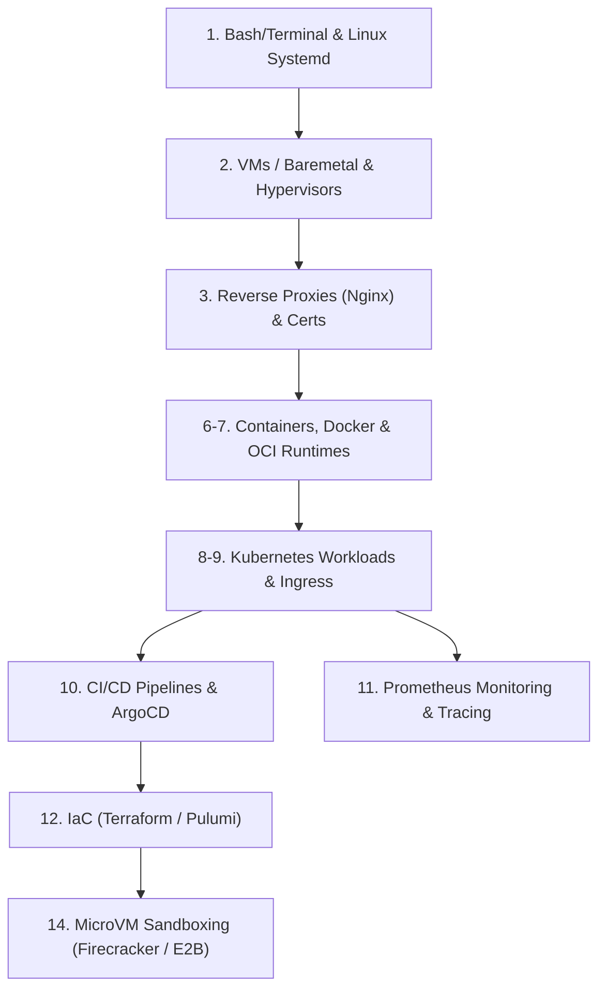

# DevOps, Cloud Native & Systems Infrastructure

> **Module ID:** `14-DEVOPS-CLOUD-AND-INFRASTRUCTURE`  
> **Source Reference:** Handwritten Roadmap (Image 2)  
> **Core Technologies:** Linux, Docker, Kubernetes, Terraform, AWS Firecracker, Prometheus, Nginx  

---

## Module Overview

This module covers all **14 topics** required to design, deploy, and manage production-grade cloud native infrastructure and microservice runtimes:

---

## 14-Topic Infrastructure Roadmap

### 1. Bash / Terminal Mastery & Shell Scripting
- POSIX Shell scripting, Environment variables, I/O Redirection (`>`, `>>`, `<`), Piping (`|`), Text Processing tools (`grep`, `sed`, `awk`, `cut`, `sort`, `uniq`), Process signals (`SIGTERM`, `SIGKILL`), Systemd service units & timers.

### 2. VMs vs Baremetal Machines
- Baremetal server provisioning, Type-1 Hypervisors (ESXi, KVM/QEMU) vs Type-2 Hypervisors (VirtualBox), CPU Virtualization extensions (Intel VT-x, AMD-V), Virtual Disk Formats (`qcow2`, `raw`, `vmdk`).

### 3. Process Management & Reverse Proxies
- Background process management (`nohup`, `tmux`, `systemctl`), Reverse Proxy Architecture with **Nginx** / **Caddy** / **HAProxy**, Virtual Hosts, Location Blocks, Load Balancing algorithms (Round Robin, Least Connections, IP Hash), SSL Termination.

### 4. Certificates & Cert Management
- Public Key Infrastructure (PKI), TLS/SSL Handshake, Certificate Authorities (CAs), Let's Encrypt ACME protocol, Cert-Manager in Kubernetes, Certificate Renewal Automation.

### 5. Auto-Scaling Groups (ASGs) & Managed Instance Groups (MIGs)
- AWS Auto Scaling Groups (ASGs) & GCP Managed Instance Groups (MIGs), Launch Templates, Target Tracking & Step Scaling Policies, Health Checks, Cooldown Periods, Multi-AZ High Availability.

### 6. Containers & Container Runtimes
- Linux Kernel Primitives: **Namespaces** (PID, NET, MNT, IPC, UTS, USER) & **Control Groups (cgroups v2)**, Open Container Initiative (OCI) Specifications, Low-level runtimes (`runc`), High-level runtimes (`containerd`, `CRI-O`).

### 7. Docker Deep Dive
- Docker Engine Architecture, Writing Production `Dockerfile`s, Multi-Stage Builds for minimal image size, Layer Caching optimization, `docker-compose.yml`, Container Networking (Bridge, Host, Overlay networks), Storage Volumes (`bind mounts`, `named volumes`).

### 8. Kubernetes Part 1: Architecture & Workloads
- **Control Plane Components:** `kube-apiserver`, `etcd`, `kube-scheduler`, `kube-controller-manager`.
- **Worker Node Components:** `kubelet`, `kube-proxy`, Container Runtime.
- **Core Objects:** Pods, Deployments, ReplicaSets, Services (`ClusterIP`, `NodePort`, `LoadBalancer`), ConfigMaps, Secrets, Liveness & Readiness Probes.

### 9. Kubernetes Part 2: Advanced Networking & Ingress
- Ingress Controllers (Nginx Ingress, Traefik), StatefulSets & Headless Services, Persistent Volumes (PV) & Persistent Volume Claims (PVC), StorageClasses, NetworkPolicies, Service Mesh (Istio / Linkerd) Sidecar Proxy architecture.

### 10. CI/CD Pipelines
- Automated Testing & Deployment, GitHub Actions Workflow configuration (`.github/workflows`), GitLab CI/CD, Matrix builds, Cache optimization, GitOps deployment with **ArgoCD** / **Flux**.

### 11. Monitoring & Observability
- **Metrics:** Prometheus Architecture, PromQL Queries, Exporters (`node_exporter`), Alertmanager.
- **Dashboards:** Grafana Visualization.
- **Logging & Tracing:** Centralized Logging (Loki / ELK Stack), Distributed Tracing with **OpenTelemetry** & **Jaeger**.

### 12. Infrastructure as Code (IaC)
- Declarative Infrastructure provisioning using **Terraform** / **Pulumi**, HCL Syntax, Resources, Data Sources, State Files (`terraform.tfstate`), Remote Backends with Locking (S3 + DynamoDB), Modules, Drift Detection.

### 13. CDNs & Object Stores
- Content Delivery Networks (Cloudflare, AWS CloudFront), Edge Caching, Cache Invalidations, Object Storage Architecture (AWS S3, MinIO), Presigned URLs, Lifecycle Rules.

### 14. MicroVM Sandboxing & AWS Firecracker
- Secure Multi-Tenant Code Execution, **AWS Firecracker** MicroVM architecture, KVM-based minimal hypervisor, Fast Startup (~5ms), Low Overhead memory footprint, Comparison: Docker vs gVisor vs Firecracker.

---

## Infrastructure Projects (from Image 2 Roadmap)

1. **E2B Sandbox Platform Clone:** Cloud-based secure code execution sandbox built with Firecracker MicroVMs & gRPC API.
2. **Replit Infrastructure Clone:** Multi-tenant browser IDE platform with container provisioning, reverse proxy routing, and WebSockets terminal connection.
3. **Cloudflare Workers Engine Clone:** Edge compute platform running isolated V8 isolates or Wasm runtimes.

---

## Technical Resources & Engineering Blogs

1. **E2B Engineering Blog:** `https://e2b.dev/blog`
2. **Modal Labs Engineering Blog:** `https://modal.com/blog`
3. **Kubernetes Official Documentation:** `https://kubernetes.io/docs/`
4. **AWS Firecracker Source:** `https://firecracker-microvm.github.io/`
