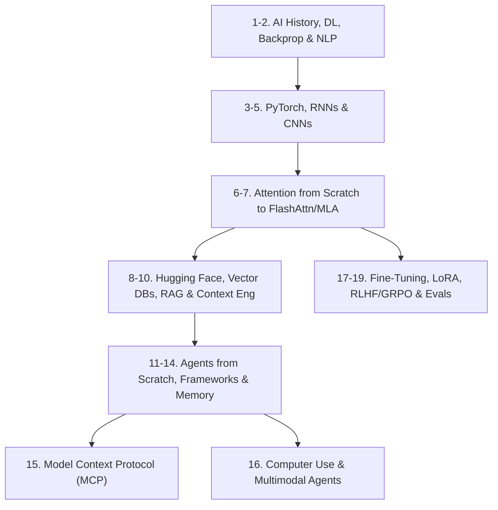
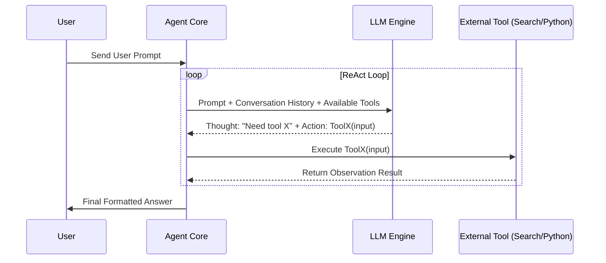

# AI Engineering, Applied LLMs & Autonomous Agents

> **Module ID:** `14-AI-ENGINEERING-AND-AGENTIC-SYSTEMS`  
> **Source Reference:** Handwritten Roadmap (Image 3)  
> **Core Frameworks:** PyTorch, Hugging Face, LangChain/LangGraph, LlamaIndex, MCP, Unsloth  

---

## Module Overview

This module covers all **20 topics** required to master modern AI Engineering, Large Language Models (LLMs), RAG systems, and Autonomous Agentic Architectures:

---

## 20-Topic AI Engineering Roadmap

### 1. History of AI: From Perceptrons to Transformers
- Early AI symbolic systems, Perceptrons, Multi-Layer Perceptrons (MLP), Statistical NLP, Word Embeddings (Word2Vec, GloVe), Recurrent Architectures, Attention Mechanism revolution (Vaswani et al., 2017).

### 2. Deep Learning Fundamentals: Backprop & NLP
- Loss Functions (Cross-Entropy, MSE), Activation Functions (ReLU, GELU, Swish), Optimization Algorithms (SGD, Adam, AdamW), Forward Pass, Backpropagation algorithm via Chain Rule.

### 3. Neural Networks with PyTorch
- PyTorch Tensors, Tensor Operations, Autograd Engine (`loss.backward()`), Custom `nn.Module` classes, Dataset & DataLoader pipelines, GPU Acceleration (`cuda` / `mps`).

### 4. Optional Extra Class: Sequential Models (RNNs, LSTMs, GRUs)
- Sequential Data Processing, Vanishing & Exploding Gradient problems, Long Short-Term Memory (LSTM) Cell Gates (Input, Forget, Output), Gated Recurrent Units (GRU).

### 5. Optional Extra Class: Convolutional Neural Networks (CNNs)
- Spatial Feature Extraction, Convolution Filters, Stride, Padding, Pooling (Max/Average), Architectures (ResNet, VGG), Vision Transformers (ViT).

### 6. Coding Simple Attention from Scratch
- Query ($Q$), Key ($K$), Value ($V$) projections, Scaled Dot-Product Attention equation:
  $$\text{Attention}(Q, K, V) = \text{softmax}\left(\frac{QK^T}{\sqrt{d_k}}\right)V$$
- Writing Multi-Head Attention (MHA) in Python/PyTorch.

### 7. Vanilla Attention to Industry Variants & Optimizations
- **KV Caching:** Eliminating redundant key-value computations during auto-regressive generation.
- **Multi-Query Attention (MQA):** Shared single key-value head across all query heads.
- **Grouped-Query Attention (GQA):** Grouped key-value heads (used in Llama 2/3).
- **Multi-Head Latent Attention (MLA):** Low-rank compression of KV cache (used in DeepSeek V2/V3).
- **FlashAttention:** Exact attention with IO-awareness & GPU SRAM tiling.

### 8. Hugging Face Ecosystem End-to-End
- `transformers` library, Loading pretrained models & tokenizers, `datasets` library, Hugging Face Model Hub, Spaces deployment, Inference Endpoints.

### 9. Instrumenting LLM Calls, Observability & Tracing
- Tracking token usage, latency, cost, and execution steps, OpenTelemetry instrumentation, Tracing tools (LangSmith, Phoenix, OpenInference, Helicone).

### 10. Vector Databases & RAG Architecture
- Dense Retrieval vs Sparse Retrieval (BM25), Embedding Models (OpenAI, BGE, Nomic), Vector Indexes (HNSW, IVF-PQ), Vector Databases (Qdrant, Pinecone, Milvus, ChromaDB), Advanced RAG (HyDE, Reranking with Cohere/BGE-Reranker, Parent-Child Chunking).

### 11. Context Engineering
- Context Window management, Dynamic Summarization, System Prompt Structuring, Few-Shot Prompting, Chain-of-Thought (CoT), Structured JSON Output (Pydantic / Instructor).

### 12. Building AI Agents from First Principles
- **The ReAct Loop (Reason + Act):** Thought -> Action -> Action Input -> Observation -> Thought -> Final Answer. Writing an autonomous agent loop in raw Python without external frameworks.

### 13. Agent Frameworks
- Production Agent Frameworks: **LangGraph** (State Graphs, Cycles, Human-in-the-loop), **CrewAI** (Role-playing multi-agent teams), **LlamaIndex Agents**.

### 14. Agent Memory Frameworks
- Short-term Conversation Memory, Epistemic Memory, Semantic Memory in Vector Stores, Hierarchical Memory summarization.

### 15. Model Context Protocol (MCP)
- Anthropic **Model Context Protocol (MCP)** Architecture: MCP Clients, MCP Servers, Dynamic Tool Discovery, Resources & Prompts protocol over Stdio and SSE transports.

### 16. Computer Use & Multimodal Agents
- Vision-Language Models (Claude 3.5 Sonnet Vision, GPT-4o), Screen Capture, Coordinate Calculation, Mouse Click / Keypress Action Automation, Web Browsing Agents (Playwright).

### 17. What is Model Finetuning?
- Full Parameter Finetuning vs Parameter-Efficient Fine-Tuning (PEFT), Low-Rank Adaptation (**LoRA**), Quantized LoRA (**QLoRA** - 4-bit NormalFloat), Target Modules ($q\_proj, v\_proj$).

### 18. Finetuning an LLM for Any Use Case
- Preparing Supervised Fine-Tuning (SFT) Datasets, Formatting Alpaca / ShareGPT formats, Fast Finetuning with **Unsloth**, Hugging Face TRL (`SFTTrainer`).

### 19. Reinforcement Learning Fine-Tuning & Evals
- **RLHF & DPO:** Direct Preference Optimization (DPO), Proximal Policy Optimization (PPO), Group Relative Policy Optimization (GRPO - used in DeepSeek R1 reasoning models).
- **Evaluation Frameworks:** Automated Evals, LLM-as-a-Judge, Ragas, Benchmark Testing (GSM8K, HumanEval, MMLU).

### 20. Advanced Multimodal Tangents
- Real-time Audio Agents (WebSockets + OpenAI Realtime API / Whisper), Text-to-Speech (XTTS, ElevenLabs), Image/Video Generation Models (Flux, Stable Diffusion, HunyuanVideo).

---

## Agentic AI Projects (from Image 3 Roadmap)

1. **Autonomous Agent Framework from Scratch:** Production Python agent engine with ReAct loop, tool registration, streaming, and error recovery.
2. **RL Finetuning Project + Evals Suite:** Fine-tuning an open LLM on custom domain data with DPO/GRPO and building an evaluation harness.
3. **Devin Autonomous Engineer Clone:** Terminal & Web browser agent capable of taking a GitHub issue, writing code, running tests, and opening PRs.
4. **Memory & Knowledge Framework:** Long-term hierarchical memory layer for LLM agents.

---

## Recommended Learning Resources

1. **Andrej Karpathy YouTube Channel:** *Zero to Hero* Series (Building GPT/Transformer from scratch)
2. **Anthropic Engineering Blog:** `https://www.anthropic.com/engineering`
3. **Cognition AI Blog:** `https://cognition.ai/blog/1`
4. **LangChain Blog:** `https://blog.langchain.com/`
5. **3Blue1Brown:** Deep Learning & Neural Networks Series
6. **Coursera (Free):** Deep Learning Specialization by Andrew Ng
