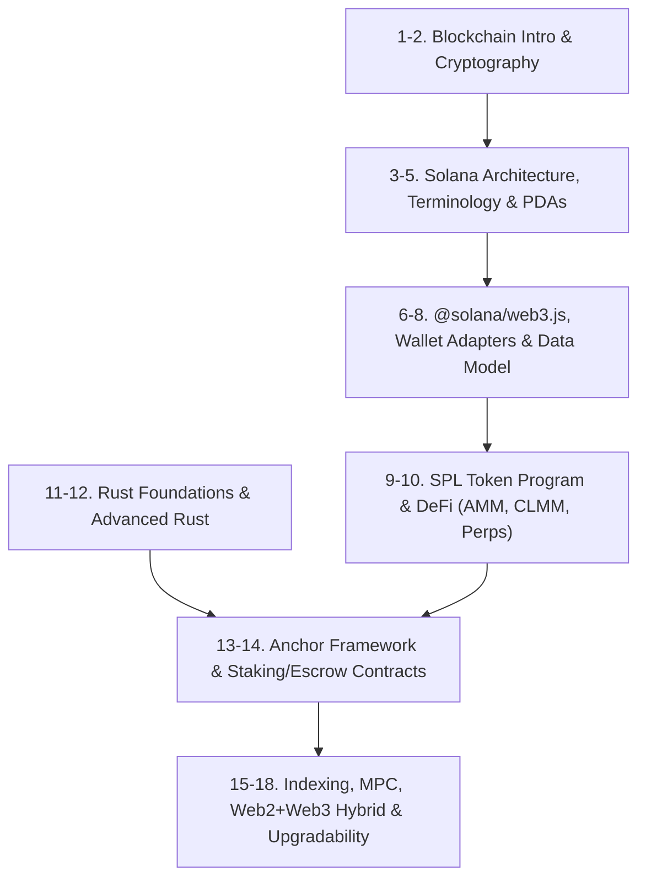

# Web3, Solana Architecture & Smart Contracts

> **Module ID:** `14-WEB3-SOLANA-AND-DECENTRALIZED-SYSTEMS`  
> **Source Reference:** Handwritten Roadmap (Image 4)  
> **Core Stack:** Solana, Rust, Anchor Framework, `@solana/web3.js`, TypeScript  

---

## Module Overview

This module covers all **18 topics** required to design, develop, and audit high-throughput decentralized applications and smart contracts on Solana:

---

## 18-Topic Web3 & Solana Roadmap

### 1. Introduction to Blockchains
- Distributed Ledger Technology (DLT), Peer-to-Peer Networks, Block Header structure, Cryptographic Hashing, Proof of Work (PoW) vs Proof of Stake (PoS), State Machines.

### 2. Cryptography for Web3
- Elliptic Curve Cryptography (ECC), Ed25519 Curve (Solana Keypairs), Secp256k1 (Ethereum), Public / Private Key Generation, SHA-256 & Keccak-256, Digital Signatures (`sign` & `verify`).

### 3. Solana Architecture & Proof of History (PoH)
- **Proof of History (PoH):** Verifiable Delay Function (VDF) clock before consensus.
- **Tower BFT:** PoH-optimized Practical Byzantine Fault Tolerance.
- **Sealevel:** World's first parallel smart contract runtime (Non-overlapping transaction execution).
- **Gulf Stream:** Mempool-less transaction forwarding protocol.
- **Turbine:** Block propagation protocol.

### 4. Solana Terminology & Ownership Model
- Accounts Model (Solana accounts store state, not code), System Program, Executable Accounts, Account Ownership rules, Lamports, Rent & Rent Exemption threshold.

### 5. Program Derived Addresses (PDAs)
- Off-curve Public Keys generated deterministically using Seeds + Program ID (`Pubkey::find_program_address`), Bump Seeds, Signer Seeds (`CpiContext::new_with_signer`).

### 6. Client Libraries (`@solana/web3.js` & Gill)
- Connecting to Solana RPC JSON-API, Keypair management, Building & Signing Transactions, Instruction Layouts, `sendAndConfirmTransaction`, Gill client library.

### 7. Solana Wallet Adapter
- Integrating browser wallets (Phantom, Solflare, Backpack), `@solana/wallet-adapter-react`, Wallet Provider, Connection Provider, Handling user signatures on client side.

### 8. Solana Data Model & Serialization
- Account Data Layouts, Struct Packing, **Borsh (Binary Object Representation Serializer for Hashing)** vs Anchor account discriminator (8-byte SHA-256 hash).

### 9. Token Program & SPL Tokens
- SPL Token Standard, Mint Account, Token Account, Associated Token Account (ATA), Token Extensions (Transfer hooks, Confidential transfers, Permanent delegate).

### 10. Decentralized Finance (DeFi) Architecture
- **Automated Market Makers (AMM):** Constant Product Formula ($x \cdot y = k$).
- **Concentrated Liquidity Market Makers (CLMM):** Liquidity active within specific price ticks (Raydium / Uniswap v3 model).
- **Dynamic Liquidity Market Makers (DLMM):** Bin-based liquidity pools.
- **Perpetual Futures (Perps):** Oracle pricing (Pyth), Funding Rates, Liquidation Engines.

### 11. Rust Fundamentals
- Variables & Mutability, Primitive & Compound Types, Functions, Control Flow, **Ownership, Borrowing (`&`, `&mut`), and Lifetimes (`'a`)**, Structs, Enums & Pattern Matching (`match`, `if let`).

### 12. Advanced Rust
- Error Handling (`Result<T, E>`, `Option<T>`, `?` operator), Traits & Generic Types, Iterators & Closures, Smart Pointers (`Box`, `Rc`, `Arc`, `RefCell`), Concurrency (`threads`, `channels`, `async/await`), Unsafe Rust.

### 13. Anchor Framework
- Anchor CLI, `[program]` macro, `#[derive(Accounts)]` Validation Structs, Account Constraint Macros (`#[account(init, payer = user, space = 8 + 32)]`), IDL (Interface Definition Language) generation.

### 14. Common Smart Contract Patterns
- **Staking Contracts:** Token lockup, Reward calculation based on time & stake weight.
- **Escrow Contracts:** Trustless two-party asset exchange using PDAs.
- **Vault Contracts:** Sol/Token deposit and withdrawal safety controls.

### 15. On-Chain & Off-Chain Indexing
- Querying historical blockchain data, Geyser Plugins (Raw streaming of account updates), Indexing services (Helius, Shyft, Custom RPC Webhooks).

### 16. Multi-Party Computation (MPC) & Shamir's Secret Sharing
- Threshold Cryptography, Key Generation Protocols (TSS), Shamir's $(k, n)$ Secret Sharing scheme, Non-custodial Wallet Security without single point of failure.

### 17. Ad-Hoc Web2 + Web3 Hybrid Architectures
- Off-chain computation with on-chain verification, Decentralized Oracles (Pyth Network, Switchboard), Gasless transactions via Fee Payers.

### 18. Partially Centralized Contracts & Governance
- Upgradeable Programs, Program Data Account, Multisig Upgrade Authorities (Squads Protocol), Emergency Pause Switches.

---

## Web3 & Decentralized Projects (from Image 4 Roadmap)

1. **Decentralized Exchange (DEX):** Constant Product & CLMM AMM smart contracts on Solana built with Anchor & Rust.
2. **Centralized Exchange Engine (CEX):** High-speed off-chain Rust orderbook matcher with on-chain settlement.
3. **Non-Custodial Web3 Wallet:** Multi-chain browser & mobile wallet supporting SPL tokens, SOL transfers, and MPC key management.
4. **Prediction Market Platform:** Decentralized binary outcome prediction market using Pyth oracles and AMM liquidity.
5. **Smart Contract Suite:** Production-tested Anchor implementations for Staking, Escrows, and Multisig Vaults.

---

## Recommended Learning Resources

1. **Solana Foundation Official Curriculum:** `https://github.com/solana-foundation/curriculum`
2. **Bitcoin Whitepaper:** `https://bitcoin.org/bitcoin.pdf` (Satoshi Nakamoto)
3. **Jon Gjengset Rust Video Series:** *Crust of Rust* (Advanced Systems & Concurrency)
4. **Anchor Framework Documentation:** `https://www.anchor-lang.com/`
