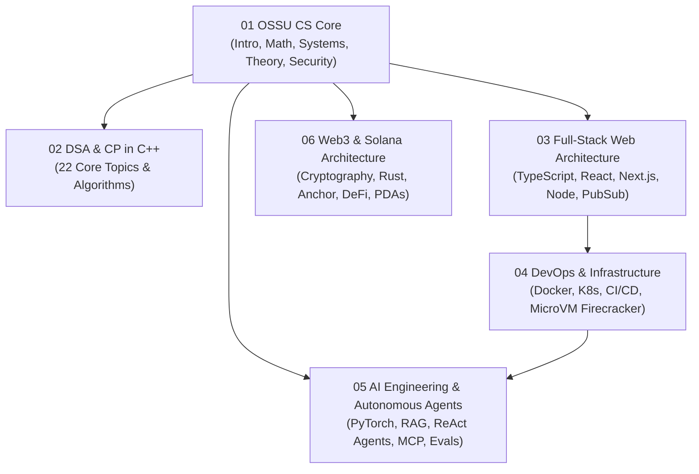

# 14 Computer Science and Full-Stack Mastery

> **Status:** Active  
> **Domain Classification:** Computer Science Foundations, Full-Stack Web Architecture, Cloud Native Infrastructure, AI Engineering, Web3 Systems & Competitive Programming  
> **Target Audience:** Software Engineers, Computer Scientists, Full-Stack Architects, AI Engineers, DevOps Practitioners, Systems Programmers  

---

## Domain Overview

`14 Computer Science and Full-Stack Mastery` represents the complete synthesis of classical computer science education (based on the Open Source Society University curriculum) and cutting-edge software engineering disciplines.

This domain bridges low-level theory—from automata, discrete math, and computer architecture—to production-grade software engineering across cloud infrastructure, distributed databases, autonomous AI agents, Solana smart contracts, and competitive programming in C++.

---

## Directory Modules & Curriculum Index

| # | Module Directory | Focus Area | Key Concepts | Status |
|---|------------------|------------|--------------|--------|
| **01** | [`01-ossu-cs-core/`](01-ossu-cs-core/README.md) | OSSU CS Core & Advanced | CS50, Discrete Math, Calculus, Programming Languages, Compilers, OS, Networks, Automata, Cybersecurity | ✅ Active |
| **02** | [`02-dsa-and-competitive-programming/`](02-dsa-and-competitive-programming/README.md) | C++ DSA & Competitive Programming | 22 Handcrafted Modules: STL, Bitmask, Sliding Window, DP, Trees, Graphs, Segment Trees, Fenwick Trees | ✅ Active |
| **03** | [`03-fullstack-web-architecture/`](03-fullstack-web-architecture/README.md) | Full-Stack Web Architecture | JS V8 Engine, Node vs Browser, Express, Postgres/Prisma, TypeScript, Turborepo, BunJS, Next.js 14, WebRTC, Pub/Sub | ✅ Active |
| **04** | [`04-devops-cloud-and-infrastructure/`](04-devops-cloud-and-infrastructure/README.md) | DevOps & Systems Infrastructure | Bash, VMs, Nginx, Cert-Manager, ASGs, OCI Containers, Docker, Kubernetes 1 & 2, CI/CD, IaC, Firecracker MicroVMs | ✅ Active |
| **05** | [`05-ai-engineering-and-agentic-systems/`](05-ai-engineering-and-agentic-systems/README.md) | AI Engineering & Autonomous Agents | PyTorch, Transformers, Attention Variations (MQA, GQA, MLA), Vector DBs, RAG, ReAct Agents, Memory, MCP, Fine-Tuning, Evals | ✅ Active |
| **06** | [`06-web3-solana-and-decentralized-systems/`](06-web3-solana-and-decentralized-systems/README.md) | Web3 & Solana Architecture | Cryptography, Solana Sealevel, PDAs, Token Extensions, DeFi (AMM/CLMM), Rust, Anchor Framework, Indexing, MPC | ✅ Active |

---

## Registered Engineering Projects

| Project ID | Project Name | Domain Area | Target Deliverable | Status |
|------------|--------------|-------------|--------------------|--------|
| **CS-PROJECT-01** | **Codeforces Clone Platform** | Full-Stack | Next.js 14 + Express + Judge Engine for automated C++ code execution | ✅ Active |
| **CS-PROJECT-02** | **High-Frequency Trading App** | Full-Stack | Real-time WebSocket + WebRTC + Redis Pub/Sub trading dashboard | ✅ Active |
| **CS-PROJECT-03** | **Firecracker MicroVM Sandbox** | DevOps / Cloud | Multi-tenant code execution engine using AWS Firecracker & Docker | ✅ Active |
| **CS-PROJECT-04** | **Replit Platform Clone** | DevOps / Cloud | Web-based IDE infrastructure with container runtimes & reverse proxies | ✅ Active |
| **CS-PROJECT-05** | **Autonomous AI Agent Framework** | AI Engineering | First-principles agent execution loop with Memory, Tools & MCP protocol | ✅ Active |
| **CS-PROJECT-06** | **Devin Autonomous Engineer Clone** | AI Engineering | Multimodal terminal & browser agent with RL fine-tuning & evaluation suite | ✅ Active |
| **CS-PROJECT-07** | **Solana Decentralized Exchange (DEX)** | Web3 / Solana | Constant Product & CLMM AMM smart contracts written in Rust & Anchor | ✅ Active |
| **CS-PROJECT-08** | **Non-Custodial Web3 Wallet** | Web3 / Solana | Rust + React Native wallet with Shamir Secret Sharing & MPC security | ✅ Active |

---

## Navigation & Cross-References

- [Parent Directory (Repository Root)](../README.md)
- [Master Architecture](../MASTER_ARCHITECTURE.md)
- [Knowledge Graph](../KNOWLEDGE_GRAPH.md)
- [Learning Paths](../LEARNING_PATHS.md)
- [Project Index](../PROJECT_INDEX.md)
