# Knowledge Graph

> **Generated by:** OLYMPUS Orchestrator v4 — Part II, Section 13
> **Purpose:** Map every engineering domain, topic, and concept in Project Olympus as a connected graph. No node should be isolated.

---

## Domain Map

```mermaid
flowchart TD
    ROOT["🏛 Project Olympus\nEngineering OS"]

    subgraph FOUNDATIONS["02 Engineering Foundations"]
        MATH["Engineering Mathematics"]
        NET["Network Theory"]
        SIG["Signals & Systems"]
        ELD["Electronic Devices"]
        ANA["Analog Circuits"]
        DIG["Digital Logic"]
        CTL["Control Systems"]
        COM["Communications"]
        EM["Electromagnetics"]
        PROG["Programming & DSA"]
        PROB["Probability & Statistics"]
    end

    subgraph FPGA["03 FPGA & Digital Design"]
        HDL["HDL Foundations\n(Verilog/VHDL)"]
        COMB["Combinational Design"]
        SEQ["Sequential Design"]
        VER["Verification"]
        TIM["Timing & CDC"]
        SYN["Synthesis & Implementation"]
        FPGAI["FPGA Interfaces"]
        DSP_F["DSP on FPGA"]
    end

    subgraph EMBED["04 Embedded Systems"]
        CFOUND["C Foundations"]
        MCU["Microcontroller Architecture"]
        PERIPH["Peripherals & Drivers"]
        INT["Interrupts & Timers"]
        PROTO["Communication Protocols"]
        RTOS["RTOS"]
        DBG["Debugging & Testing"]
        PWR["Power, Reliability & Security"]
    end

    subgraph ARCH["05 Computer Architecture"]
        ISA["ISA & Assembly"]
        DP["Datapath & Control"]
        PIPE["Pipelining"]
        MEM["Memory Hierarchy"]
        IO["I/O & Interconnect"]
        PAR["Parallelism"]
        PERF["Performance"]
        RISCV["RISC-V Lab"]
    end

    subgraph SW["06 Software & Tooling"]
        PY["Python"]
        CCPP["C / C++"]
        DSA["Data Structures & Algorithms"]
        LINUX["Linux & Shell"]
        GIT["Git & GitHub"]
        TEST["Testing & CI"]
        DATA["Data Analysis"]
        AUTO["Engineering Automation"]
    end

    subgraph RES["07 Research & Graduate Study"]
        RMETH["Research Methods"]
        LIT["Literature & Synthesis"]
        EXP["Experimental Design"]
        STAT["Statistics & Reproducibility"]
        PUB["Publication & Ethics"]
        ADV["Advisor & Lab Selection"]
        MAPP["Masters Application"]
        RPRT["Research Portfolio"]
    end

    subgraph CAREER["08 Career & Placement"]
        CSTR["Career Strategy"]
        SKILL["Skill Signalling"]
        RESU["Resume & Portfolio"]
        JOBS["Job Search"]
        TECH["Technical Interviews"]
        BEH["Behavioral Interviews"]
        NEG["Negotiation"]
        EARC["Early Career OS"]
    end

    ROOT --> FOUNDATIONS
    ROOT --> FPGA
    ROOT --> EMBED
    ROOT --> ARCH
    ROOT --> SW
    ROOT --> RES
    ROOT --> CAREER

    MATH --> SIG
    MATH --> CTL
    MATH --> PROB
    PROB --> COM
    PROB --> STAT
    SIG --> COM
    SIG --> DSP_F
    DIG --> HDL
    DIG --> COMB
    DIG --> SEQ
    DIG --> MCU
    NET --> ANA
    NET --> ELD
    ELD --> ANA
    COMB --> SEQ
    SEQ --> VER
    SEQ --> TIM
    TIM --> SYN
    SYN --> FPGAI
    SYN --> DSP_F
    CFOUND --> MCU
    CFOUND --> PERIPH
    PROG --> CFOUND
    PROG --> DSA
    MCU --> PERIPH
    MCU --> INT
    PERIPH --> PROTO
    INT --> RTOS
    RTOS --> PWR
    DBG --> PWR
    ISA --> DP
    DP --> PIPE
    PIPE --> MEM
    MEM --> IO
    IO --> PAR
    MCU --> ISA
    HDL --> ISA
    PY --> DATA
    PY --> AUTO
    CCPP --> CFOUND
    DSA --> TECH
    LINUX --> AUTO
    GIT --> AUTO
    TEST --> DBG
    TECH --> MAPP
    CSTR --> JOBS
    RESU --> JOBS
    SKILL --> RESU
    JOBS --> NEG
    RES --> RPRT
    RPRT --> MAPP
```



---

## Prerequisite Chains

### Chain 1 — Digital to FPGA

```
Binary & Boolean Algebra
    → Digital Logic (DIG)
    → HDL Foundations (Verilog/VHDL)
    → Combinational Design
    → Sequential Design
    → Finite State Machines
    → Verification (simulation, testbench)
    → Timing Analysis & CDC
    → Synthesis & Implementation
    → FPGA Interfaces (SPI, I2C, AXI)
    → DSP on FPGA
    → Capstone Project
```

### Chain 2 — Programming to Embedded Systems

```
Programming Fundamentals
    → C Foundations (pointers, memory, MISRA)
    → Microcontroller Architecture (ARM Cortex-M)
    → Peripherals & Drivers (GPIO, ADC, PWM)
    → Interrupts & Timers
    → Communication Protocols (UART, SPI, I2C, CAN)
    → RTOS (FreeRTOS / Zephyr)
    → Debugging & Testing (JTAG, unit test)
    → Power, Reliability & Security
    → Capstone Project
```

### Chain 3 — Architecture to Systems

```
ISA & Assembly (RISC-V / ARM)
    → Datapath & Control Design
    → Pipelining (hazards, forwarding)
    → Memory Hierarchy (cache, TLB, virtual memory)
    → I/O & Interconnect
    → Parallelism (ILP, TLP)
    → Performance Analysis
    → RISC-V Lab
    → Capstone
```

### Chain 4 — Mathematics to Control & DSP

```
Engineering Mathematics (Calculus, LA, DE)
    → Signals & Systems (Fourier, Laplace, Z-transform)
    → Control Systems (PID, state space, stability)
    → Digital Signal Processing
    → Communications (modulation, channel coding)
    → DSP on FPGA
```

### Chain 5 — Research to Career

```
Literature & Synthesis
    → Experimental Design
    → Statistics & Reproducibility
    → Publication & Ethics
    → Research Portfolio
    → Masters Application System
```

---

## Cross-Domain Relationships

| From | To | Relationship |
|------|----|-------------|
| Digital Logic | FPGA & HDL | Prerequisite |
| Signals & Systems | DSP on FPGA | Prerequisite |
| C Foundations | Embedded Systems | Prerequisite |
| Computer Architecture | Embedded Systems | Complements |
| Programming & DSA | Technical Interviews | Enables |
| Probability & Statistics | Research Methods | Prerequisite |
| Research Portfolio | Masters Application | Enables |
| Control Systems | Embedded Systems | Extends |
| Linux & Shell | Embedded Systems | Tool dependency |
| Git & GitHub | All domains | Tool dependency |
| Python | Data Analysis, Automation | Foundation |

---

## Domain Maturity Status

| Domain | Status | Content Available |
|--------|--------|------------------|
| 01 Operation Renaissance | ✅ Implemented | Full curriculum |
| 02 Engineering Foundations | 🔴 Scaffold | READMEs only |
| 03 FPGA & Digital Design | 🔴 Scaffold | READMEs only |
| 04 Embedded Systems | 🔴 Scaffold | READMEs only |
| 05 Computer Architecture | 🔴 Scaffold | READMEs only |
| 06 Software & Tooling | 🔴 Scaffold | READMEs only |
| 07 Research & Graduate Study | 🔴 Scaffold | READMEs only |
| 08 Career & Placement | 🔴 Scaffold | READMEs only |
| 09 Communication & Leadership | 🔴 Scaffold | READMEs only |
| 10 Entrepreneurship & Deep Tech | 🔴 Scaffold | READMEs only |
| 11 Finance, Wealth & Investing | 🔴 Scaffold | READMEs only |
| 12 Health, Resilience & Performance | 🔴 Scaffold | READMEs only |
| 13 Legacy & Stewardship | 🔴 Scaffold | READMEs only |

---

## Related Documents

- [Learning Paths](LEARNING_PATHS.md)
- [Master Architecture](MASTER_ARCHITECTURE.md)
- [Project Index](PROJECT_INDEX.md)
- [Assessment Index](ASSESSMENT_INDEX.md)
- [References Glossary](references/glossary.md)
