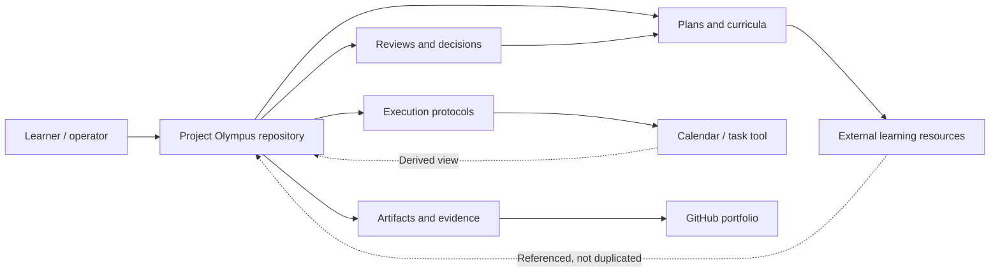
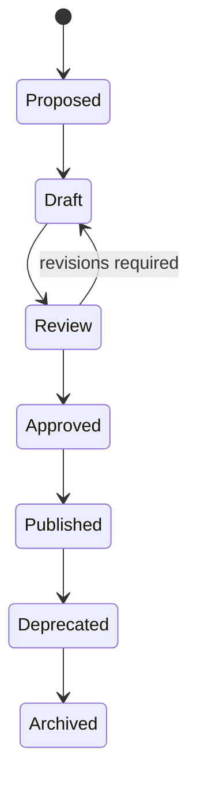
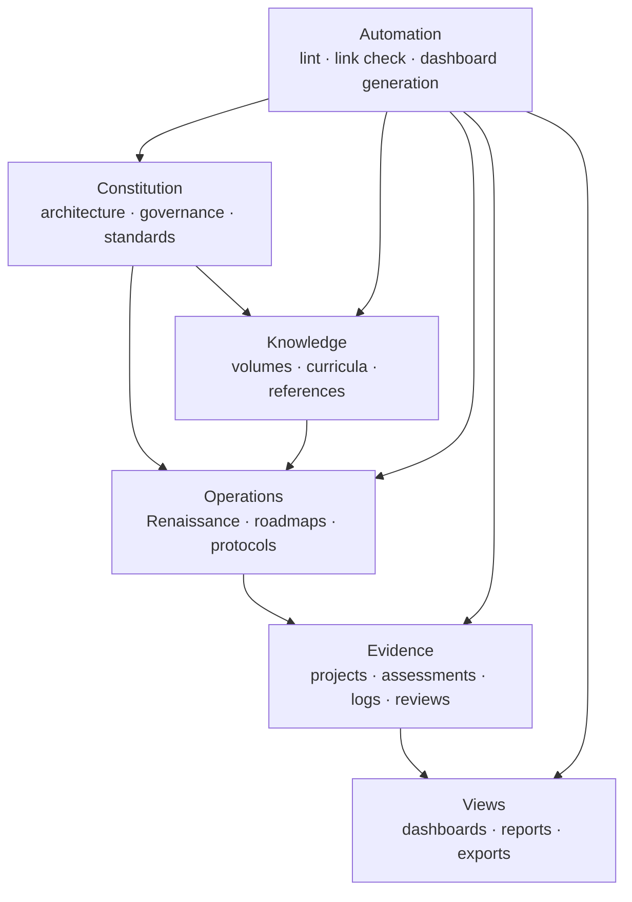
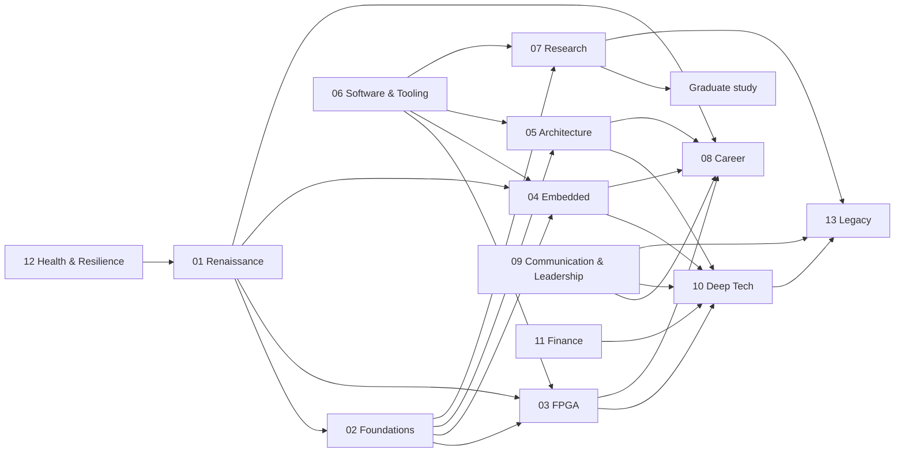
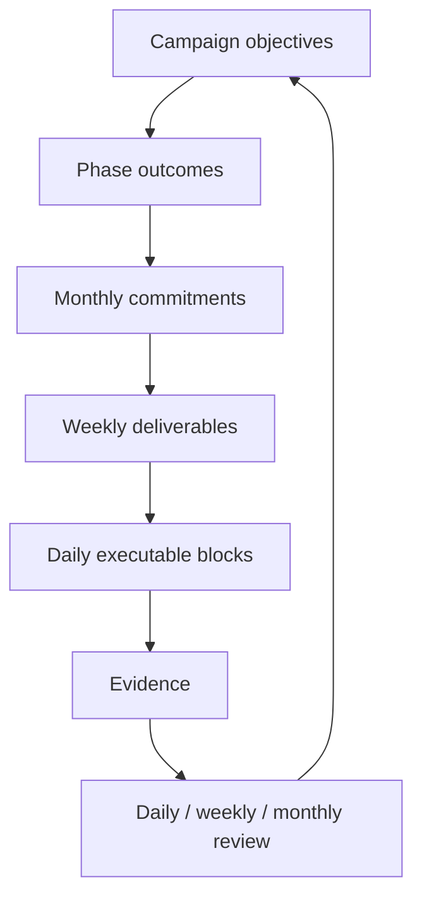
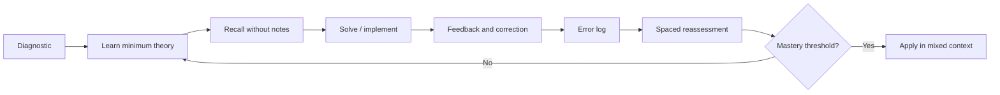
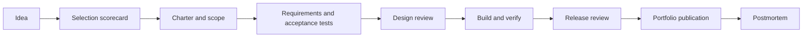
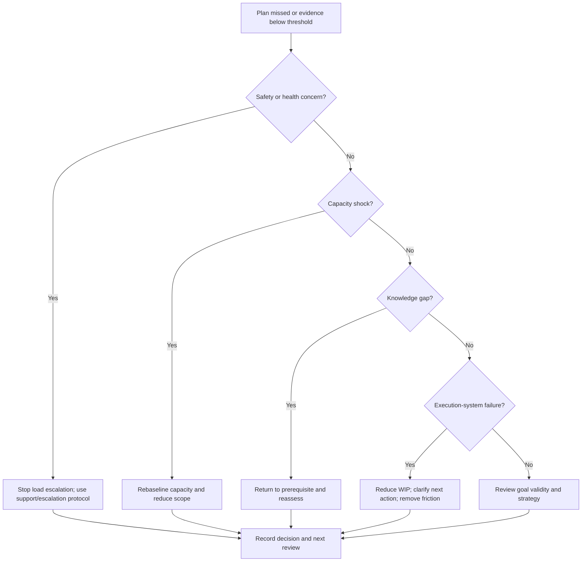

# Project Olympus — Master Architecture

> **Document class:** Engineering Architecture Specification  
> **Repository:** `project-olympus`  
> **System version:** `v0.1`  
> **Document status:** Architecture baseline  
> **Campaign:** Operation Renaissance, August 1–January 31 (184 days; year-configurable)  
> **Authority:** This document is the constitution and architectural source of truth for Project Olympus.

---

## 0. Document Control

| Field | Requirement |
|---|---|
| Owner | Project maintainer |
| Approvers | Maintainer, technical reviewer, editorial reviewer |
| Review cycle | Quarterly and before every minor or major release |
| Change mechanism | Architecture Decision Record (ADR) plus pull request |
| Normative language | **MUST**, **MUST NOT**, **SHOULD**, **SHOULD NOT**, and **MAY** have their RFC 2119 meanings |
| Canonical location | `/MASTER_ARCHITECTURE.md` |
| Supersession | A newer tagged version supersedes an older version; history remains in Git |

### 0.1 Purpose

This specification defines the complete information architecture, content contracts, execution systems, governance, quality controls, and implementation sequence for Project Olympus. It is sufficiently prescriptive for another author or AI system to construct the repository without inventing structure or requesting clarification.

### 0.2 Scope

Project Olympus is a Markdown-native, version-controlled Engineering Operating System spanning:

1. Operation Renaissance: a 184-day undergraduate engineering execution campaign.
2. Engineering foundations and specialization.
3. GATE EC/ECE preparation and placement readiness.
4. FPGA, embedded systems, and computer architecture.
5. Portfolio and research readiness.
6. Communication, health, resilience, and personal finance.
7. Graduate study, deep technology, entrepreneurship, investing, leadership, and legacy.

It specifies systems and curricula; it does not guarantee admissions, ranks, employment, income, health outcomes, or business success.

### 0.3 Non-goals

The repository is not:

- a motivational book;
- a diary or social-media feed;
- a substitute for licensed medical, mental-health, legal, or financial advice;
- a collection of copied course notes;
- a promise of deterministic outcomes;
- a task manager that duplicates external tools without an exportable Markdown source of truth.

### 0.4 System boundary



---

## 1. Project Vision

Project Olympus shall be a durable personal engineering institution: a repository that converts long-horizon ambitions into traceable curricula, executable cycles, verified artifacts, and evidence-based decisions. It shall remain useful across education, employment, research, venture creation, capital allocation, leadership, and stewardship.

## 2. Mission Statement

Design and maintain a modular Engineering Operating System that helps its operator maximize the probability of meaningful outcomes through controllable actions, explicit trade-offs, measurable evidence, deliberate review, and cumulative technical work.

## 3. Core Philosophy

1. **Probability, not promises.** The system improves odds; it does not claim control over external selection or markets.
2. **Evidence over intention.** Completed problems, tested code, written explanations, health logs, and review decisions count; aspiration alone does not.
3. **Artifacts compound.** Each learning cycle should produce reusable notes, code, experiments, reports, or teaching material.
4. **Fundamentals precede acceleration.** Mathematics, circuits, digital logic, programming, and communication are load-bearing.
5. **Feedback closes the loop.** Plans without measurement and review are incomplete systems.
6. **Recovery is designed.** Missed work triggers triage and replanning, not concealed schedule compression.
7. **Whole-system constraints matter.** Sleep, physical capacity, emotional state, finances, and commitments constrain technical execution.
8. **Long-term optionality.** Decisions should preserve multiple credible paths until evidence supports specialization.

## 4. Engineering Principles

| ID | Principle | Architectural consequence |
|---|---|---|
| EP-01 | Single Source of Truth | Every datum has one canonical file; dashboards reference or generate from it. |
| EP-02 | DRY | Shared definitions live in glossaries, registries, and templates. |
| EP-03 | Modularity | Volumes and systems expose explicit dependencies and deliverables. |
| EP-04 | Traceability | Objectives map to actions, evidence, KPIs, reviews, and decisions. |
| EP-05 | Verification | Deliverables have acceptance criteria and evidence paths. |
| EP-06 | Reversibility | Experiments and time-boxed decisions precede irreversible commitments. |
| EP-07 | Fault tolerance | Recovery protocols handle missed days, illness, overload, and failed projects. |
| EP-08 | Observability | Dashboards report leading actions, lagging evidence, capacity, and risk. |
| EP-09 | Configuration over duplication | Dates, targets, and tool choices live in configuration files. |
| EP-10 | Progressive disclosure | Quickstarts lead to protocols; protocols lead to reference material. |

## 5. Design Principles

- **Markdown-first:** core content MUST remain readable without proprietary software.
- **Git-friendly:** prefer small text files, stable headings, semantic filenames, and line-oriented data.
- **Human-operable:** no essential workflow may require automation.
- **Automation-assisted:** validation and aggregation SHOULD be scriptable.
- **Local-first:** personal operational data SHOULD remain private and portable.
- **Accessible:** diagrams require prose summaries; images require alt text; color cannot be the only signal.
- **Time-aware:** campaign documents separate reusable protocol from cycle-specific configuration.
- **Evidence-tiered:** claims distinguish primary literature, standards, textbooks, expert synthesis, and practitioner evidence.
- **Safety-bounded:** health, finance, and resilience modules state escalation limits and professional-care boundaries.

## 6. Repository Philosophy

The repository has four planes:

| Plane | Function | Canonical content |
|---|---|---|
| Constitution | Stable rules | Architecture, governance, standards, ADRs |
| Knowledge | What to learn | Volumes, chapter designs, references, glossaries |
| Operations | What to do | Campaigns, protocols, plans, checklists |
| Evidence | What happened | Logs, assessments, projects, reviews, decisions |

Content moves through a controlled lifecycle:



---

## 7. Information Architecture

### 7.1 Architectural layers



### 7.2 Canonical data ownership

| Information | Source of truth | Derived consumers |
|---|---|---|
| Campaign dates and capacity | `config/renaissance.yml` | Roadmap, calendars, dashboards |
| Objectives and measures | `01-operation-renaissance/01-charter/objectives.md` | KPI registry, reviews |
| Chapter metadata | Chapter `README.md` front matter | Catalog and dependency graph |
| Tasks | Active cycle plan files | Daily/weekly dashboards |
| KPI definitions | `data/registries/kpi-registry.yml` | KPI dashboard, review templates |
| KPI observations | `private/data/kpi-observations.csv` | Generated charts |
| References | `references/bibliography.bib` | Chapter reference sections |
| Terminology | `references/glossary.md` | All modules |
| Decisions | `governance/decisions/` | Roadmaps and retrospectives |
| Portfolio evidence | `projects/project-registry.yml` | Portfolio dashboard |

### 7.3 Traceability model

Every major objective MUST implement:

`Objective → Leading action → Evidence → Measure → Review cadence → Decision rule`

Example schema:

| Field | Example |
|---|---|
| Objective | Improve digital-design competence |
| Leading action | Complete planned design and verification sessions |
| Evidence | RTL, testbench, waveform, design note |
| Measure | Acceptance tests passed; explanation rubric score |
| Review | Weekly project review |
| Decision rule | Advance, remediate prerequisite, reduce scope, or stop |

---

## 8. Complete Repository Hierarchy

The following tree is normative. Empty directories MUST contain `.gitkeep` until populated. Generated output MUST be reproducible and clearly labeled.

```text
project-olympus/
├── README.md
├── MASTER_ARCHITECTURE.md
├── LICENSE
├── CITATION.cff
├── CODE_OF_CONDUCT.md
├── CONTRIBUTING.md
├── SECURITY.md
├── CHANGELOG.md
├── ROADMAP.md
├── VERSION
├── .editorconfig
├── .gitattributes
├── .gitignore
├── .markdownlint.yml
├── .vale.ini
├── mkdocs.yml
├── requirements.txt
├── package.json
├── config/
│   ├── README.md
│   ├── project.yml
│   ├── learner-profile.example.yml
│   ├── renaissance.example.yml
│   ├── toolchain.yml
│   └── privacy.yml
├── governance/
│   ├── README.md
│   ├── charter.md
│   ├── principles.md
│   ├── maintenance-policy.md
│   ├── deprecation-policy.md
│   ├── risk-register.md
│   ├── claims-and-evidence-policy.md
│   ├── safety-and-escalation-policy.md
│   ├── decisions/
│   │   ├── README.md
│   │   ├── ADR-000-template.md
│   │   └── ADR-001-repository-architecture.md
│   └── reviews/
│       ├── architecture-review.md
│       ├── editorial-review.md
│       └── annual-system-review.md
├── docs/
│   ├── index.md
│   ├── quickstart.md
│   ├── navigation.md
│   ├── system-model.md
│   ├── lifecycle.md
│   ├── faq.md
│   └── migration-guide.md
├── 01-operation-renaissance/
│   ├── README.md
│   ├── 00-quickstart/
│   │   ├── README.md
│   │   ├── preflight-checklist.md
│   │   ├── baseline-assessment.md
│   │   └── first-week-setup.md
│   ├── 01-charter/
│   │   ├── mission.md
│   │   ├── objectives.md
│   │   ├── success-model.md
│   │   ├── controllables-vs-outcomes.md
│   │   ├── constraints.md
│   │   └── exit-criteria.md
│   ├── 02-roadmap/
│   │   ├── README.md
│   │   ├── 184-day-roadmap.md
│   │   ├── phase-0-mobilize.md
│   │   ├── phase-1-foundations.md
│   │   ├── phase-2-build.md
│   │   ├── phase-3-integrate.md
│   │   ├── phase-4-demonstrate.md
│   │   ├── phase-5-consolidate.md
│   │   ├── milestones.md
│   │   ├── dependency-map.md
│   │   └── capacity-model.md
│   ├── 03-execution-system/
│   │   ├── daily-system.md
│   │   ├── weekly-system.md
│   │   ├── monthly-system.md
│   │   ├── semester-integration.md
│   │   ├── timeboxing-protocol.md
│   │   ├── work-in-progress-limits.md
│   │   ├── prioritization-protocol.md
│   │   ├── interruption-protocol.md
│   │   └── shutdown-protocol.md
│   ├── 04-study-system/
│   │   ├── curriculum-integration.md
│   │   ├── learning-cycle.md
│   │   ├── active-recall.md
│   │   ├── spaced-practice.md
│   │   ├── interleaving.md
│   │   ├── problem-solving.md
│   │   ├── error-log-protocol.md
│   │   ├── note-making.md
│   │   ├── concept-mastery-rubric.md
│   │   └── assessment-protocol.md
│   ├── 05-gate-system/
│   │   ├── README.md
│   │   ├── syllabus-map.md
│   │   ├── subject-sequencing.md
│   │   ├── diagnostic-tests.md
│   │   ├── concept-cycle.md
│   │   ├── problem-practice-cycle.md
│   │   ├── previous-year-questions.md
│   │   ├── mock-test-system.md
│   │   ├── revision-system.md
│   │   ├── error-taxonomy.md
│   │   └── score-analysis.md
│   ├── 06-placement-system/
│   │   ├── README.md
│   │   ├── role-targeting.md
│   │   ├── competency-matrix.md
│   │   ├── resume-system.md
│   │   ├── application-pipeline.md
│   │   ├── aptitude-plan.md
│   │   ├── coding-plan.md
│   │   ├── core-ece-interviews.md
│   │   ├── behavioral-interviews.md
│   │   ├── mock-interviews.md
│   │   └── offer-evaluation.md
│   ├── 07-project-system/
│   │   ├── README.md
│   │   ├── portfolio-strategy.md
│   │   ├── project-selection.md
│   │   ├── project-lifecycle.md
│   │   ├── scope-control.md
│   │   ├── requirements-and-tests.md
│   │   ├── engineering-notebook.md
│   │   ├── documentation-and-demo.md
│   │   ├── review-gates.md
│   │   └── postmortem.md
│   ├── 08-research-system/
│   │   ├── research-readiness.md
│   │   ├── literature-search.md
│   │   ├── paper-reading.md
│   │   ├── question-formulation.md
│   │   ├── experiment-design.md
│   │   ├── reproducibility.md
│   │   ├── research-notebook.md
│   │   └── advisor-communication.md
│   ├── 09-communication-system/
│   │   ├── technical-writing.md
│   │   ├── speaking-practice.md
│   │   ├── design-review.md
│   │   ├── presentation-practice.md
│   │   ├── professional-correspondence.md
│   │   └── communication-rubric.md
│   ├── 10-health-system/
│   │   ├── scope-and-safety.md
│   │   ├── sleep-protocol.md
│   │   ├── physical-activity.md
│   │   ├── nutrition-basics.md
│   │   ├── ergonomics.md
│   │   ├── fatigue-monitoring.md
│   │   └── escalation-boundaries.md
│   ├── 11-resilience-system/
│   │   ├── scope-and-safety.md
│   │   ├── stress-observation.md
│   │   ├── emotional-regulation-toolkit.md
│   │   ├── support-network.md
│   │   ├── setback-review.md
│   │   └── professional-help-boundaries.md
│   ├── 12-finance-system/
│   │   ├── scope-and-disclaimer.md
│   │   ├── cash-flow-basics.md
│   │   ├── emergency-buffer.md
│   │   ├── debt-and-credit.md
│   │   ├── insurance-basics.md
│   │   ├── investing-foundations.md
│   │   └── fraud-and-risk.md
│   ├── 13-review-system/
│   │   ├── daily-close.md
│   │   ├── weekly-review.md
│   │   ├── monthly-review.md
│   │   ├── phase-gate-review.md
│   │   ├── mid-campaign-review.md
│   │   ├── final-review.md
│   │   └── after-action-review.md
│   ├── 14-recovery-system/
│   │   ├── failure-classification.md
│   │   ├── missed-day-recovery.md
│   │   ├── missed-week-recovery.md
│   │   ├── illness-and-emergency.md
│   │   ├── overload-recovery.md
│   │   ├── academic-crisis.md
│   │   ├── project-failure.md
│   │   └── restart-protocol.md
│   ├── 15-dashboards/
│   │   ├── README.md
│   │   ├── command-center.md
│   │   ├── today.md
│   │   ├── this-week.md
│   │   ├── campaign-status.md
│   │   ├── gate-dashboard.md
│   │   ├── placement-dashboard.md
│   │   ├── project-dashboard.md
│   │   ├── learning-dashboard.md
│   │   ├── health-capacity-dashboard.md
│   │   └── risk-dashboard.md
│   ├── 16-kpis/
│   │   ├── README.md
│   │   ├── measurement-model.md
│   │   ├── leading-indicators.md
│   │   ├── lagging-indicators.md
│   │   ├── guardrail-metrics.md
│   │   ├── metric-dictionary.md
│   │   └── anti-gaming-rules.md
│   └── 17-appendices/
│       ├── calendar-map.md
│       ├── workload-scenarios.md
│       ├── tool-options.md
│       ├── troubleshooting.md
│       └── campaign-glossary.md
├── 02-engineering-foundations/
│   ├── README.md
│   ├── 01-engineering-mathematics/
│   ├── 02-network-theory/
│   ├── 03-signals-and-systems/
│   ├── 04-electronic-devices/
│   ├── 05-analog-circuits/
│   ├── 06-digital-logic/
│   ├── 07-control-systems/
│   ├── 08-communications/
│   ├── 09-electromagnetics/
│   ├── 10-programming-and-data-structures/
│   ├── 11-probability-and-statistics/
│   └── 12-engineering-laboratory/
├── 03-fpga-and-digital-design/
│   ├── README.md
│   ├── 01-hdl-foundations/
│   ├── 02-combinational-design/
│   ├── 03-sequential-design/
│   ├── 04-verification/
│   ├── 05-timing-and-cdc/
│   ├── 06-synthesis-and-implementation/
│   ├── 07-fpga-interfaces/
│   ├── 08-dsp-on-fpga/
│   └── 09-capstone/
├── 04-embedded-systems/
│   ├── README.md
│   ├── 01-c-foundations/
│   ├── 02-microcontroller-architecture/
│   ├── 03-peripherals-and-drivers/
│   ├── 04-interrupts-and-timers/
│   ├── 05-communication-protocols/
│   ├── 06-rtos/
│   ├── 07-debugging-and-testing/
│   ├── 08-power-reliability-security/
│   └── 09-capstone/
├── 05-computer-architecture/
│   ├── README.md
│   ├── 01-isa-and-assembly/
│   ├── 02-datapath-and-control/
│   ├── 03-pipelining/
│   ├── 04-memory-hierarchy/
│   ├── 05-io-and-interconnect/
│   ├── 06-parallelism/
│   ├── 07-performance/
│   ├── 08-risc-v-lab/
│   └── 09-capstone/
├── 06-software-and-tooling/
│   ├── README.md
│   ├── 01-python/
│   ├── 02-c-cpp/
│   ├── 03-data-structures-and-algorithms/
│   ├── 04-linux-shell/
│   ├── 05-git-and-github/
│   ├── 06-testing-and-ci/
│   ├── 07-data-analysis/
│   └── 08-engineering-automation/
├── 07-research-and-graduate-study/
│   ├── README.md
│   ├── 01-research-methods/
│   ├── 02-literature-and-synthesis/
│   ├── 03-experimental-design/
│   ├── 04-statistics-and-reproducibility/
│   ├── 05-publication-and-ethics/
│   ├── 06-advisor-and-lab-selection/
│   ├── 07-masters-application-system/
│   └── 08-research-portfolio/
├── 08-career-and-placement/
│   ├── README.md
│   ├── 01-career-strategy/
│   ├── 02-skill-signaling/
│   ├── 03-resume-and-portfolio/
│   ├── 04-job-search/
│   ├── 05-technical-interviews/
│   ├── 06-behavioral-interviews/
│   ├── 07-negotiation-and-decisions/
│   └── 08-early-career-operating-system/
├── 09-communication-and-leadership/
│   ├── README.md
│   ├── 01-technical-writing/
│   ├── 02-presentations/
│   ├── 03-collaboration/
│   ├── 04-feedback-and-conflict/
│   ├── 05-project-leadership/
│   ├── 06-systems-thinking/
│   └── 07-engineering-management/
├── 10-entrepreneurship-and-deep-tech/
│   ├── README.md
│   ├── 01-problem-discovery/
│   ├── 02-customer-and-market/
│   ├── 03-deep-tech-validation/
│   ├── 04-product-and-roadmap/
│   ├── 05-intellectual-property/
│   ├── 06-regulation-and-safety/
│   ├── 07-business-model-and-finance/
│   ├── 08-team-and-operations/
│   └── 09-venture-experiments/
├── 11-finance-wealth-and-investing/
│   ├── README.md
│   ├── 01-personal-finance/
│   ├── 02-risk-and-insurance/
│   ├── 03-investing-foundations/
│   ├── 04-portfolio-construction/
│   ├── 05-tax-and-regulatory-awareness/
│   ├── 06-entrepreneurial-finance/
│   └── 07-financial-governance/
├── 12-health-resilience-and-performance/
│   ├── README.md
│   ├── 01-sleep-and-recovery/
│   ├── 02-physical-capacity/
│   ├── 03-nutrition-literacy/
│   ├── 04-ergonomics-and-injury-prevention/
│   ├── 05-stress-and-emotional-skills/
│   ├── 06-support-and-professional-care/
│   └── 07-sustainable-performance/
├── 13-legacy-and-stewardship/
│   ├── README.md
│   ├── 01-ethics-and-responsibility/
│   ├── 02-mentorship-and-teaching/
│   ├── 03-institution-building/
│   ├── 04-knowledge-preservation/
│   ├── 05-civic-and-social-impact/
│   └── 06-succession-and-legacy/
├── projects/
│   ├── README.md
│   ├── project-registry.yml
│   ├── idea-backlog.md
│   ├── active/
│   ├── completed/
│   ├── archived/
│   └── exemplars/
├── assessments/
│   ├── README.md
│   ├── baseline/
│   ├── formative/
│   ├── summative/
│   ├── rubrics/
│   ├── question-banks/
│   └── results.example/
├── dashboards/
│   ├── README.md
│   ├── index.md
│   ├── learning.md
│   ├── projects.md
│   ├── career.md
│   ├── research.md
│   ├── finance.md
│   ├── health.md
│   └── long-horizon.md
├── templates/
│   ├── README.md
│   ├── content/
│   │   ├── volume-readme.md
│   │   ├── chapter-design.md
│   │   ├── concept-note.md
│   │   ├── lab.md
│   │   ├── tutorial.md
│   │   └── reference-note.md
│   ├── planning/
│   │   ├── annual-plan.md
│   │   ├── campaign-plan.md
│   │   ├── phase-plan.md
│   │   ├── monthly-plan.md
│   │   ├── weekly-plan.md
│   │   └── daily-plan.md
│   ├── review/
│   │   ├── daily-close.md
│   │   ├── weekly-review.md
│   │   ├── monthly-review.md
│   │   ├── phase-gate.md
│   │   ├── after-action-review.md
│   │   └── annual-review.md
│   ├── engineering/
│   │   ├── project-charter.md
│   │   ├── requirements-specification.md
│   │   ├── design-document.md
│   │   ├── test-plan.md
│   │   ├── test-report.md
│   │   ├── lab-notebook.md
│   │   ├── design-review.md
│   │   └── project-postmortem.md
│   ├── research/
│   │   ├── paper-note.md
│   │   ├── literature-matrix.csv
│   │   ├── research-question.md
│   │   ├── experiment-plan.md
│   │   ├── research-log.md
│   │   └── reproducibility-checklist.md
│   ├── career/
│   │   ├── role-scorecard.md
│   │   ├── application-record.md
│   │   ├── interview-review.md
│   │   └── offer-decision.md
│   ├── decisions/
│   │   ├── adr.md
│   │   ├── decision-record.md
│   │   └── pre-mortem.md
│   └── checklists/
│       ├── content-quality.md
│       ├── project-release.md
│       ├── portfolio-release.md
│       └── campaign-close.md
├── data/
│   ├── README.md
│   ├── schemas/
│   │   ├── chapter.schema.json
│   │   ├── kpi.schema.json
│   │   ├── project.schema.json
│   │   ├── reference.schema.json
│   │   └── review.schema.json
│   ├── registries/
│   │   ├── content-registry.yml
│   │   ├── dependency-registry.yml
│   │   ├── kpi-registry.yml
│   │   ├── project-registry.yml
│   │   ├── risk-registry.yml
│   │   └── template-registry.yml
│   ├── examples/
│   └── generated/
├── references/
│   ├── README.md
│   ├── bibliography.bib
│   ├── source-register.yml
│   ├── glossary.md
│   ├── acronyms.md
│   ├── standards-index.md
│   ├── courses-index.md
│   ├── books-index.md
│   ├── papers-index.md
│   └── web-resources-index.md
├── assets/
│   ├── README.md
│   ├── brand/
│   │   ├── logo-source.svg
│   │   ├── wordmark-source.svg
│   │   ├── colors.md
│   │   └── typography.md
│   ├── diagrams/
│   │   ├── source/
│   │   └── exported/
│   ├── images/
│   │   ├── source/
│   │   ├── optimized/
│   │   └── licenses.csv
│   ├── icons/
│   └── fonts/
│       └── licenses.md
├── exports/
│   ├── README.md
│   ├── excel/
│   │   ├── renaissance-dashboard.xlsx
│   │   ├── gate-analysis.xlsx
│   │   ├── application-tracker.xlsx
│   │   ├── project-portfolio.xlsx
│   │   └── finance-model.xlsx
│   ├── notion/
│   │   ├── README.md
│   │   ├── database-schema.md
│   │   ├── relation-map.md
│   │   ├── import-order.md
│   │   └── csv/
│   ├── pdf/
│   └── web/
├── scripts/
│   ├── README.md
│   ├── validate_frontmatter.py
│   ├── check_links.py
│   ├── check_references.py
│   ├── check_tree.py
│   ├── build_catalog.py
│   ├── build_dependency_graph.py
│   ├── build_dashboards.py
│   ├── build_calendar.py
│   ├── export_excel.py
│   ├── export_notion.py
│   └── release_check.py
├── tests/
│   ├── README.md
│   ├── test_frontmatter.py
│   ├── test_links.py
│   ├── test_schemas.py
│   ├── test_tree.py
│   ├── test_generated_files.py
│   └── fixtures/
├── .github/
│   ├── CODEOWNERS
│   ├── dependabot.yml
│   ├── ISSUE_TEMPLATE/
│   │   ├── content-defect.yml
│   │   ├── feature-request.yml
│   │   └── config.yml
│   ├── PULL_REQUEST_TEMPLATE.md
│   └── workflows/
│       ├── validate.yml
│       ├── link-check.yml
│       ├── build-docs.yml
│       ├── accessibility.yml
│       └── release.yml
├── private/
│   ├── README.md
│   ├── .gitignore
│   ├── config/
│   ├── data/
│   ├── logs/
│   ├── reviews/
│   └── sensitive/
└── archive/
    ├── README.md
    ├── campaigns/
    ├── deprecated/
    └── migrations/
```

### 8.1 Repeated chapter directory contract

Each curriculum directory under volumes `02`–`13` MUST contain:

```text
NN-topic/
├── README.md
├── 01-<chapter-slug>.md
├── 02-<chapter-slug>.md
├── labs/
│   └── README.md
├── assessments/
│   └── README.md
├── projects/
│   └── README.md
└── references.md
```

This contract prevents the main tree from repeating hundreds of mechanically identical files while still defining every required file class and location.

---

## 9. Volume and Chapter Plan

### 9.1 Universal chapter specification

Every chapter file is a design brief, not prose content, until its status becomes `draft`. It MUST contain:

```yaml
---
id: VOL-AREA-CHAPTER
title: Chapter title
type: chapter
status: planned
version: 0.1.0
owners: [role-or-handle]
objective: One measurable instructional objective
learning_outcomes:
  - Observable outcome using an assessable verb
dependencies: [chapter-id]
estimated_length_words: 3000
estimated_effort_hours: 6
difficulty: foundation
deliverables: [artifact-id]
related: [chapter-id]
references: [source-id]
last_reviewed: YYYY-MM-DD
review_due: YYYY-MM-DD
---
```

Difficulty MUST be one of `orientation`, `foundation`, `intermediate`, `advanced`, or `capstone`. Dependencies MUST be IDs, not prose.

### 9.2 Chapter sequence by volume

The following table defines every planned instructional chapter. Each listed chapter inherits the metadata contract above; its objective is the phrase after the colon. Learning outcomes are to explain, apply, analyze, and produce the named artifact at the stated level unless narrowed in the chapter brief.

| Volume | Chapters, in dependency order | Typical length / difficulty | Principal deliverable |
|---|---|---|---|
| 02 Engineering Foundations | Engineering mathematics: linear algebra; calculus; differential equations; complex variables; transforms. Network theory: laws; theorems; transients; two-port networks. Signals: representation; LTI systems; Fourier; Laplace; sampling; discrete-time systems. Devices: semiconductor physics; diodes; transistors; device models. Analog: amplifiers; feedback; op-amps; oscillators; filters. Digital: Boolean algebra; combinational; sequential; FSMs; memories. Control: modeling; time response; stability; frequency response; compensation. Communications: analog; digital; information basics; noise. Electromagnetics: fields; waves; transmission lines; antennas. Programming: Python; C; algorithms; numerical work. Probability: random variables; distributions; estimation. Laboratory: measurement; uncertainty; instruments; reporting. | 2,000–6,000 words; foundation–advanced | Solved problem sets, simulations, laboratory reports, mastery assessments |
| 03 FPGA & Digital Design | HDL semantics; combinational RTL; sequential RTL; FSM architecture; reusable modules; self-checking testbenches; assertions and coverage; timing constraints; metastability and CDC; synthesis; place-and-route; resource/performance trade-offs; UART/SPI/I²C; memory interfaces; fixed-point arithmetic; DSP pipelines; capstone specification; verification; implementation; demo. | 2,500–5,000; foundation–capstone | Synthesizable RTL, verification evidence, timing report, FPGA demo |
| 04 Embedded Systems | C memory model; bit operations; build/link process; MCU core and memory map; GPIO; timers; ADC/DAC; interrupts; UART/SPI/I²C/CAN; device drivers; state machines; RTOS tasks; synchronization; scheduling; debugging; unit/HIL testing; power; reliability; security basics; capstone. | 2,500–5,000; foundation–capstone | Firmware repository, driver tests, hardware demo, engineering report |
| 05 Computer Architecture | Abstraction and performance; ISA; assembly; datapath; control; single-cycle CPU; pipelining; hazards; branch prediction; cache; virtual memory; storage; buses; multicore; coherence; accelerators; benchmarking; RISC-V tools; soft-core lab; capstone. | 2,500–6,000; intermediate–capstone | RISC-V programs, CPU model, benchmarks, architecture trade study |
| 06 Software & Tooling | Python engineering; C/C++; data structures; algorithm analysis; Linux environment; shell automation; Git; collaborative GitHub; unit/integration testing; CI; numerical/data analysis; reproducible environments; engineering automation. | 1,500–4,000; foundation–advanced | Tested utilities, CI pipeline, analysis notebook, automation tool |
| 07 Research & Graduate Study | Nature of research; research ethics; literature search; critical reading; synthesis; question formulation; hypotheses; experimental design; measurement validity; statistical inference; uncertainty; reproducibility; research software; scientific writing; peer review; advisor/lab selection; program selection; application evidence; research portfolio. | 2,000–5,000; foundation–advanced | Literature review, proposal, reproducible experiment, application dossier |
| 08 Career & Placement | Career hypotheses; role taxonomy; competency gaps; evidence strategy; resume; portfolio; networking; search pipeline; applications; aptitude; coding interviews; ECE interviews; system/design interviews; behavioral evidence; mock interviews; negotiation; offer decision; first 90 days; career review. | 1,500–4,000; orientation–advanced | Role scorecard, resume, portfolio, interview evidence, decision record |
| 09 Communication & Leadership | Audience and purpose; technical structure; visual explanation; editing; presentations; design reviews; meeting systems; collaboration; feedback; conflict; project planning; risk; delegation; systems thinking; organizational design; engineering management fundamentals. | 1,500–4,000; foundation–advanced | Technical memo, presentation, design review, team operating agreement |
| 10 Entrepreneurship & Deep Tech | Problem discovery; customer evidence; market structure; feasibility; technology readiness; prototype experiments; product requirements; roadmap; IP landscape; regulation; safety; business models; unit economics; funding; hiring; operations; venture governance; kill/pivot/continue experiments. | 2,000–5,000; intermediate–advanced | Evidence-backed opportunity thesis, prototype, risk register, venture memo |
| 11 Finance, Wealth & Investing | Cash flow; emergency reserves; debt; credit; insurance; fraud; financial statements; return and risk; diversification; asset classes; fees and taxes; portfolio policy; rebalancing; behavioral risk; entrepreneurial finance; governance and professional-advice boundaries. | 1,500–4,000; orientation–advanced | Personal policy statement, risk inventory, scenario model; no security recommendations |
| 12 Health, Resilience & Performance | Scope and safety; sleep; activity; strength/cardiorespiratory basics; nutrition literacy; ergonomics; fatigue; stress awareness; emotional regulation skills; social support; professional-care boundaries; workload design; recovery; sustainable performance. | 1,500–3,500; orientation–intermediate | Capacity plan, safety checklist, trend log, escalation plan |
| 13 Legacy & Stewardship | Engineering ethics; responsible innovation; mentorship; teaching; documentation; open knowledge; institution building; governance; succession; archives; civic impact; long-horizon allocation; legacy review. | 1,500–4,000; intermediate–advanced | Ethics case, mentorship plan, institutional charter, succession archive |

### 9.3 Appendix plan

Each volume MUST include:

1. Glossary and acronyms.
2. Formula/reference sheet where relevant.
3. Tools and setup guide.
4. Troubleshooting guide.
5. Assessment blueprint.
6. Deliverable rubrics.
7. Curated sources with evidence tier and access date.
8. Cross-volume dependency map.
9. Revision history.
10. Safety, ethics, or regulatory notes where applicable.

### 9.4 Dependency graph



---

## 10. Operation Renaissance Architecture

Operation Renaissance receives approximately 40% of authored implementation effort in `v0.1`. It integrates, but does not duplicate, the curricula in other volumes.

### 10.1 Campaign phase model

| Phase | Days | Purpose | Required exit evidence |
|---|---:|---|---|
| 0 Mobilize | 1–7 | Configure system, establish baselines, constrain scope | Configuration, diagnostics, calendar, risk register |
| 1 Foundations | 8–49 | Repair critical prerequisites and establish routines | Mastery evidence, first project specification, stable weekly review |
| 2 Build | 50–98 | Increase problem-solving and implementation volume | Tested intermediate project, GATE topic coverage evidence |
| 3 Integrate | 99–133 | Combine theory, projects, placement, and communication | Integrated demo, mock interviews, timed assessments |
| 4 Demonstrate | 134–168 | Produce externally legible evidence and simulate selection environments | Portfolio releases, full mocks, reviewed resume, presentations |
| 5 Consolidate | 169–184 | Close gaps, archive evidence, decide next cycle | Final review, capability map, next-cycle decision record |

Dates are generated from `campaign_start` and `campaign_end`; phase day ranges are canonical. Any date exception is recorded in configuration, never patched into protocols.

### 10.2 Planning hierarchy



### 10.3 Daily system contract

The daily plan MUST contain:

- date and available capacity;
- one primary deliverable and at most two secondary deliverables;
- scheduled deep-work blocks;
- minimum health and recovery guardrails;
- explicit stop condition;
- evidence links;
- blockers and carryover decision;
- daily close of no more than ten minutes.

No unfinished task automatically rolls forward. It is deleted, reduced, rescheduled, or escalated during review.

### 10.4 Weekly system contract

The weekly plan MUST:

1. Review evidence and capacity from the prior week.
2. Select no more than three weekly outcomes.
3. Reserve buffer capacity of at least 15%.
4. Allocate time across GATE/foundations, project/portfolio, placement/communication, and recovery.
5. Identify one principal risk and mitigation.
6. Schedule a timed assessment or artifact review.
7. End with a written continue/change/stop decision.

### 10.5 Monthly and phase-gate contract

Monthly review compares planned versus observed capacity, learning evidence, project progress, application readiness, and guardrail trends. Phase advancement requires exit evidence, not calendar passage alone. When evidence is missing, the operator MUST choose remediation, scope reduction, or a documented risk acceptance.

### 10.6 Study system



Mastery MUST be defined with a rubric including conceptual explanation, unaided retrieval, representative problem solving, transfer to a novel problem, and error recurrence.

### 10.7 GATE system

The GATE subsystem maps the current official EC/ECE syllabus to prerequisites, concept notes, problem sets, previous-year questions, spaced revisions, sectional tests, and full mocks. The syllabus and exam rules are versioned external dependencies and MUST be revalidated for each exam cycle. Metrics emphasize accuracy by topic, calibrated speed, error recurrence, and mock-test review completion—not rank predictions.

### 10.8 Placement system

The placement subsystem begins with target role families and competency matrices. It then produces a resume, portfolio evidence, application pipeline, aptitude/coding/core-ECE practice, behavioral evidence bank, mock interviews, and offer decision records. Application counts are leading indicators; interviews and offers are uncontrollable outcomes.

### 10.9 Project system

Every active project MUST pass gates:



At most two projects may be active. One should demonstrate depth; the other may be a smaller skills probe. A project without verification, documentation, and a reproducible demo is not portfolio-ready.

### 10.10 KPI model

| Layer | Purpose | Examples | Decision use |
|---|---|---|---|
| Leading | Controllable execution | Planned blocks completed, problems reviewed, commits with tests | Adjust process and capacity |
| Evidence | Demonstrated capability | Rubric scores, tests passed, artifacts released | Advance or remediate |
| Lagging | External response | Mock scores, interview invitations, selection results | Update strategy, never self-worth |
| Guardrail | System health | Sleep opportunity, fatigue trend, injury/illness, financial stress | Reduce load or escalate support |

Rules:

- Each KPI has owner, formula, unit, source, cadence, target band, and action thresholds.
- Metrics MUST NOT reward low-quality volume.
- Dashboards show trends and uncertainty, not false precision.
- Sensitive health, finance, and application data belongs under ignored `private/`.
- A metric unused in a decision for two review cycles SHOULD be retired.

### 10.11 Failure recovery decision tree



Backlogs MUST NOT be “caught up” through unsafe workload compression. Recovery protects minimum viable continuity, then restores normal load gradually.

---

## 11. Naming Convention

| Item | Standard | Example |
|---|---|---|
| Directories | Lowercase kebab-case; numeric prefixes only for ordered navigation | `03-fpga-and-digital-design/` |
| Markdown files | Lowercase kebab-case | `weekly-review.md` |
| IDs | Uppercase stable namespace | `REN-GATE-004` |
| ADRs | Zero-padded number | `ADR-012-kpi-storage.md` |
| Dates | ISO 8601 | `2026-08-01` |
| Versions | Semantic Versioning | `0.1.0` |
| Images | `<module>-<concept>-<variant>.<ext>` | `fpga-cdc-two-flop-v1.svg` |
| Data | Lowercase kebab-case with schema-stable headers | `kpi-observations.csv` |
| Templates | Noun or event name | `phase-gate.md` |
| Generated files | Header containing generator and timestamp; path under `generated/` | `data/generated/catalog.json` |

Renames MUST update inbound links and registries in the same pull request.

---

## 12. Version Control Strategy

### 12.1 Branching

- `main` is protected and always publishable.
- Work branches use `content/`, `feature/`, `fix/`, `research/`, or `release/`.
- Changes enter through pull requests with passing validation.
- Large chapter work SHOULD be split by independently reviewable artifact.

### 12.2 Commits

Use Conventional Commits:

```text
content(renaissance): design weekly review protocol
feat(dashboard): add KPI aggregation
fix(links): repair architecture cross-references
docs(governance): clarify evidence tiers
```

Commits SHOULD be atomic and MUST NOT mix generated output, unrelated editorial changes, and functional script changes without justification.

### 12.3 Releases

- Patch: corrections without structural change.
- Minor: new modules, chapters, templates, or backward-compatible schemas.
- Major: incompatible architecture, data, or navigation changes.
- Release artifacts: tag, changelog, migration guide where required, validation report, static documentation bundle.

### 12.4 Content status

`planned → draft → technical-review → editorial-review → approved → published → deprecated → archived`

Only `approved` or `published` content appears in stable navigation.

---

## 13. Documentation, Writing, and Editorial Standards

### 13.1 Documentation contract

Every document MUST answer:

1. What is this?
2. Who uses it and when?
3. What inputs or prerequisites are required?
4. What procedure, model, or decision does it define?
5. What output or evidence results?
6. How is correctness checked?
7. What related documents govern or extend it?

### 13.2 Writing standards

- Use precise, neutral, direct language.
- Prefer testable verbs: derive, calculate, implement, compare, justify, verify.
- Separate fact, inference, recommendation, and local policy.
- Avoid motivational rhetoric, inflated claims, shame, and productivity folklore.
- Define acronyms on first use and register recurring terminology.
- State assumptions, validity limits, uncertainty, and safety boundaries.
- Use examples to clarify a rule, not replace it.
- Prefer second person only in procedures; use impersonal language in specifications.

### 13.3 Evidence standards

| Tier | Source | Use |
|---|---|---|
| A | Standards, official specifications, systematic reviews, primary authoritative data | Normative or high-stakes claims |
| B | Peer-reviewed research, established textbooks | Technical and learning claims |
| C | Reputable institutional guidance and expert synthesis | Practical interpretation |
| D | Practitioner reports and case studies | Contextual examples, explicitly qualified |
| E | Anecdote or hypothesis | Experiments only; never presented as established fact |

Sources MUST include stable identifier or URL, author/organization, date, access date for mutable web material, evidence tier, and the claim supported. Health and financial claims require scheduled review.

### 13.4 Editorial review

Technical review checks correctness and completeness. Editorial review checks structure, clarity, terminology, accessibility, and house style. The author MUST NOT be the sole approver of high-risk content.

---

## 14. Formatting and Markdown Standards

### 14.1 Markdown

- One H1 per file; do not skip heading levels.
- Use ATX headings and fenced code blocks.
- Wrap prose at 100–120 characters where practical; do not hard-wrap tables.
- Use relative links within the repository.
- Add an explicit anchor only when a durable inbound reference requires it.
- Use task lists only for executable checks, never decorative summaries.
- Avoid raw HTML unless Markdown cannot express an accessible requirement.
- Add YAML front matter to chapters, templates, protocols, and generated dashboards.

### 14.2 Code blocks

Every executable block MUST specify language and, when relevant:

- toolchain/version;
- expected input;
- expected output;
- execution context;
- safety or hardware assumptions;
- source/license if adapted.

Code intended for use MUST be tested or labeled `illustrative`.

### 14.3 Tables

Tables are for comparison, registries, matrices, and compact structured data. They MUST have:

- descriptive headers;
- consistent units;
- defined abbreviations;
- no essential multi-paragraph prose;
- a prose alternative when accessibility or mobile rendering suffers.

Large operational tables SHOULD be stored as CSV/YAML and rendered into Markdown.

### 14.4 Images

- Prefer SVG for diagrams and PNG/WebP for raster images.
- Store editable source separately from optimized export.
- Every image MUST have meaningful alt text or be marked decorative.
- Third-party assets require license, creator, source URL, and modification status in `assets/images/licenses.csv`.
- Do not use screenshots where text or a native diagram is maintainable.

---

## 15. Diagram, Flowchart, Decision Tree, and Mind Map Standards

### 15.1 General diagram rules

- Mermaid is the default source format.
- One diagram answers one question.
- Node labels use nouns for states/components and verbs for actions.
- Direction is `LR` for short processes and `TB` for hierarchies or long flows.
- Every diagram includes a preceding purpose statement and following prose summary.
- Color is optional and never the sole carrier of meaning.
- Cycles must be intentional and labeled.
- Cross-volume diagrams live in `assets/diagrams/source/`; local diagrams remain near their document.

### 15.2 Flowcharts

Flowcharts MUST show a single start, explicit action nodes, decision diamonds expressed as questions, labeled branches, and terminal or return states. Avoid crossing edges and more than nine primary nodes; decompose larger flows.

### 15.3 Decision trees

Every decision tree MUST specify:

- decision owner;
- inputs and evidence freshness;
- thresholds;
- reversible versus irreversible branches;
- escalation path;
- review date after the decision.

### 15.4 Mind maps

Mind maps MAY be used for discovery and domain overview, not as a normative procedure. The central concept is singular; branches use parallel categories; depth SHOULD NOT exceed four levels. A corresponding linear outline is required.

---

## 16. Cross-reference and Internal Linking Standards

1. Every document has a stable `id`.
2. Links use descriptive text, never “click here.”
3. Chapters list `Dependencies`, `Related`, `Deliverables`, and `References`.
4. Dependency links are directional and stored in the registry.
5. Related links are non-normative and MUST be used sparingly.
6. Root-relative repository paths are used in registries; relative Markdown links are used in prose.
7. Link checking runs on every pull request.
8. Deleted pages receive a migration note or redirect in published documentation.
9. Bidirectional backlinks are generated; authors MUST NOT maintain backlink lists manually.

---

## 17. Template Standards

Templates MUST include:

- purpose and applicability;
- front matter;
- instructions in HTML comments so they disappear from rendered output;
- required and optional fields;
- acceptance criteria;
- related templates;
- version and owner.

Template changes are schema changes. A breaking field rename requires a migration note and version increment.

### 17.1 Required chapter design body

```markdown
# <Chapter Title>

## Objective
## Learning Outcomes
## Scope
## Out of Scope
## Dependencies
## Concept Map
## Section Plan
## Learning Activities
## Assessments
## Deliverables and Acceptance Criteria
## Estimated Length and Effort
## Difficulty
## Related Chapters
## References and Evidence Notes
## Review Checklist
```

### 17.2 Required engineering project template

It MUST contain problem statement, users, constraints, non-goals, requirements, architecture, interfaces, risk register, verification plan, milestones, bill of materials if applicable, reproducibility instructions, release criteria, and postmortem.

---

## 18. Checklist Standards

- Each item is binary or names an allowed response such as `pass/fail/not-applicable`.
- Each item begins with an action verb.
- Evidence-required items include an evidence field.
- Safety-critical items cannot be silently marked not applicable.
- Checklists state owner, trigger, completion condition, and retention path.
- More than 20 items SHOULD be grouped by phase or risk.
- A checklist does not replace professional judgment; exception handling requires a note.

---

## 19. Dashboard Standards

Dashboards are decision interfaces, not data-entry sources.

Each dashboard MUST show:

1. reporting period and last refresh;
2. objective or question answered;
3. status with explicit thresholds;
4. trend, target band, and confidence/coverage where relevant;
5. evidence links;
6. risks and blockers;
7. next decision and owner;
8. data-quality warnings.

Status vocabulary is `on-track`, `at-risk`, `off-track`, `blocked`, or `insufficient-data`. Red/amber/green color may supplement but never replace text.

### 19.1 Command center hierarchy

| View | Time horizon | Maximum primary measures |
|---|---:|---:|
| Today | 1 day | 5 |
| This week | 7 days | 8 |
| Campaign | 184 days | 12 |
| Long horizon | 1–10 years | 10 |

---

## 20. Review Standards

| Review | Cadence | Inputs | Mandatory outputs |
|---|---|---|---|
| Daily close | Daily | Plan, evidence, blockers | Closure, carryover decision, first next action |
| Weekly review | Weekly | KPI trend, deliverables, capacity | Three outcomes, risk, calendar allocation |
| Monthly review | Monthly | Four weekly reviews, milestone status | Scope/capacity adjustment |
| Phase gate | At phase boundary | Exit criteria and evidence | Advance/remediate/accept-risk decision |
| Project design review | Before build | Requirements, architecture, risks | Approved changes and test plan |
| Release review | Before publication | QA report, licenses, links | Publish/reject decision |
| Annual system review | Annual | Outcomes, decisions, content health | Roadmap and deprecations |

Review files distinguish observation, interpretation, decision, owner, due date, and evidence.

---

## 21. Quality Assurance Standards

### 21.1 Definition of done

A content artifact is done only when:

- required front matter validates;
- objectives and outcomes are measurable;
- dependencies resolve;
- technical claims are sourced;
- examples/code are verified;
- links pass;
- diagrams render and have prose summaries;
- accessibility checks pass;
- terminology matches glossary;
- safety boundaries are present where relevant;
- reviewer approval is recorded;
- version and review date are updated.

### 21.2 Automated quality gates

CI MUST validate:

1. repository tree and required files;
2. Markdown lint;
3. front matter against JSON Schema;
4. internal and external links;
5. duplicate IDs;
6. unresolved dependencies and cycles;
7. bibliography/source IDs;
8. code tests;
9. generated-file freshness;
10. image license and alt-text metadata;
11. spelling/style rules;
12. secret scanning.

### 21.3 Manual quality gates

- subject-matter correctness;
- curricular coherence;
- realistic workload;
- assessment validity;
- diagram legibility;
- ethical and safety review;
- usability by a new operator;
- mobile and print readability.

### 21.4 Quality scorecard

Each release is scored 0–2 on correctness, completeness, traceability, maintainability, accessibility, evidence quality, safety, and usability. No dimension may score 0; release average MUST be at least 1.75.

---

## 22. Publishing Standards

1. `main` is the canonical public source.
2. Static web documentation is generated with MkDocs.
3. PDF and spreadsheet files are convenience exports, never canonical sources.
4. Public releases exclude `private/`, secrets, personal data, proprietary course content, and unlicensed assets.
5. Every release includes version, date, changelog, known limitations, and validation status.
6. URLs and headings SHOULD remain stable; breaking navigation changes require redirects or a migration map.
7. Generated documentation MUST identify the source commit.
8. Publication MUST pass a privacy and license review.

---

## 23. Excel and Notion Export Architecture

Excel workbooks are derived operational views. Each workbook MUST include `README`, `Config`, `Data`, `Dashboard`, and `Change Log` sheets; formulas must not embed undocumented constants. Protected cells and input cells require visual distinction and text labels.

Notion exports are optional adapters. Markdown/YAML/CSV remains canonical. The Notion relation model mirrors stable IDs for objectives, projects, tasks, evidence, KPIs, reviews, and references. `exports/notion/import-order.md` defines dependency-safe import order. No Notion-only data may be required to reconstruct the system.

---

## 24. Security, Privacy, Safety, and Ethics

- No credentials, private keys, identity documents, medical records, detailed financial account data, or confidential employer/research information enter Git.
- Personal observations live in ignored `private/` paths; examples use synthetic data.
- Backup and retention policy is documented in `private/README.md`.
- Security vulnerabilities are reported through `SECURITY.md`, not public issues.
- Human-subject research requires applicable ethical approval; the repository does not waive institutional obligations.
- Projects involving hazardous voltage, RF exposure, batteries, machinery, biological materials, or regulated systems require explicit domain-specific safety review.
- Health and resilience content gives general educational guidance and clear professional-help boundaries.
- Financial content teaches principles and governance; it does not issue personalized investment, tax, legal, or insurance instructions.

---

## 25. Maintenance and Scalability

### 25.1 Ownership

Each volume has a content owner and reviewer. Cross-cutting registries have a maintainer. High-risk domains require a qualified reviewer before publication.

### 25.2 Review cadence

| Content type | Maximum review interval |
|---|---:|
| Architecture and governance | 12 months |
| GATE rules/syllabus and admissions/application guidance | Each cycle |
| Software/toolchain instructions | 6 months |
| Health, finance, law, regulation, security | 6 months or on material change |
| Foundational technical theory | 24 months |
| External links | Monthly automated check |

### 25.3 Deprecation

Deprecated content gains status, reason, replacement link, migration steps, and removal target. It remains accessible for at least one minor release unless unsafe or legally problematic.

### 25.4 Scaling rule

A new volume is justified only when it has a distinct audience decision, at least five planned chapters, independent ownership, and more than three cross-links from existing modules. Otherwise it is added as a chapter or appendix.

---

## 26. Acceptance Criteria for Repository v0.1

The architecture is implemented when:

- the normative tree exists;
- all root governance and standard files are approved;
- Operation Renaissance is fully designed and configured for one cycle;
- every volume has a README, chapter designs, appendix plan, and dependency links;
- all templates exist and validate;
- KPI, project, risk, reference, and content registries validate;
- dashboards render from example data;
- link, schema, tree, and test checks run in CI;
- one FPGA or embedded exemplar traverses the entire project lifecycle;
- one weekly and one phase review are dry-run with synthetic data;
- documentation site and public release bundle build reproducibly;
- privacy, license, accessibility, editorial, and technical release reviews pass.

---

## 27. Development Roadmap: 25 Implementation Prompts

Each prompt produces a pull-request-sized increment. Prompts MUST use this architecture as normative input, preserve stable IDs, run validation, and report assumptions.

| # | Implementation prompt | Required output |
|---:|---|---|
| 1 | Scaffold the normative repository tree and root metadata without authoring curriculum prose. | Directory structure, root files, ignore rules, placeholder READMEs |
| 2 | Implement governance, architecture decisions, evidence policy, safety boundaries, risk management, and maintenance policy. | `governance/` complete |
| 3 | Implement Markdown, editorial, diagram, citation, accessibility, and cross-reference standards as reusable contributor guidance. | Standards in `docs/` and contribution checks |
| 4 | Implement schemas and registries for content, dependencies, KPIs, projects, risks, reviews, references, and templates. | Valid JSON Schemas plus example data |
| 5 | Implement the complete template library and validate every template against its contract. | `templates/` complete |
| 6 | Implement validation scripts, unit tests, linting, and GitHub Actions quality gates. | `scripts/`, `tests/`, workflows |
| 7 | Design Operation Renaissance charter, success model, constraints, controllables, and exit criteria. | `01-charter/` complete |
| 8 | Design the configurable 184-day roadmap, six phases, milestones, capacity model, and generated calendar. | `02-roadmap/`, calendar generator |
| 9 | Design Renaissance daily, weekly, monthly, prioritization, WIP, interruption, and shutdown protocols. | `03-execution-system/` complete |
| 10 | Design the evidence-based learning, retrieval, spacing, interleaving, problem-solving, notes, error-log, and assessment protocols. | `04-study-system/` complete |
| 11 | Design the cycle-versioned GATE EC/ECE syllabus map, sequencing, practice, previous-year-question, mock, revision, and analysis systems. | `05-gate-system/` complete |
| 12 | Design role targeting, competency mapping, resume, applications, aptitude, coding, core-ECE, behavioral, mock interview, and offer systems. | `06-placement-system/` complete |
| 13 | Design the project/portfolio lifecycle, gates, requirements, verification, notebook, documentation, demo, and postmortem system. | `07-project-system/` complete |
| 14 | Design Renaissance research and communication readiness systems with rubrics and evidence requirements. | `08-research-system/`, `09-communication-system/` |
| 15 | Design health, resilience, and finance subsystems with evidence tiers, privacy controls, guardrails, and professional escalation boundaries. | `10`–`12` Renaissance systems |
| 16 | Design review, KPI, dashboard, anti-gaming, and failure-recovery systems; populate synthetic examples. | `13`–`17`, campaign dashboards |
| 17 | Design every Engineering Foundations chapter brief, lab, assessment, project, reference plan, and dependency. | Volume `02` complete at planned status |
| 18 | Design every FPGA and Digital Design chapter brief and one end-to-end exemplar project specification. | Volume `03`, exemplar design |
| 19 | Design every Embedded Systems and Computer Architecture chapter brief with labs, assessments, and capstones. | Volumes `04` and `05` |
| 20 | Design every Software and Tooling chapter brief and reproducible toolchain setup. | Volume `06` |
| 21 | Design every Research/Graduate Study and Career/Placement chapter brief with application-cycle configuration points. | Volumes `07` and `08` |
| 22 | Design every Communication/Leadership and Entrepreneurship/Deep-Tech chapter brief, including ethics and decision gates. | Volumes `09` and `10` |
| 23 | Design every Finance/Investing, Health/Resilience, and Legacy/Stewardship chapter brief with qualified-review flags. | Volumes `11`–`13` |
| 24 | Implement generated dashboards, catalogs, dependency graphs, Excel exports, Notion schemas, MkDocs site, and release packaging. | Working derived views and exports |
| 25 | Execute full architecture, technical, editorial, accessibility, privacy, license, security, and dry-run acceptance review; baseline `v0.1.0`. | QA report, resolved defects, changelog, signed release checklist, tag candidate |

### 27.1 Prompt execution rules

For every implementation prompt:

1. Read this document and applicable ADRs.
2. Declare files to be created or changed.
3. Preserve canonical ownership and avoid duplicate facts.
4. Produce designs before long-form content.
5. Add or update tests.
6. Run all relevant quality gates.
7. Record unresolved risks and assumptions.
8. Update registries, links, changelog, and roadmap.
9. Stop if a change contradicts the architecture; propose an ADR instead.
10. Return a concise implementation and validation report.

---

## 28. Architectural Decision Summary

| Decision | Rationale |
|---|---|
| Operation Renaissance is Module 1, not a separate repository | Preserves long-term integration and avoids duplicated curricula |
| Campaign dates are configurable | The Aug 1–Jan 31 system remains reusable across years |
| Markdown/YAML/CSV are canonical | Portability, diffability, and long-term maintainability |
| Dashboards and office-tool files are derived | Prevents divergence and vendor lock-in |
| Sensitive operational data is private and ignored | Privacy and safe public publishing |
| Chapter briefs precede chapter prose | Enables coherent curriculum and parallel implementation |
| Evidence and decision rules accompany KPIs | Prevents vanity metrics and deterministic claims |
| Health and finance are bounded educational systems | Supports whole-system operation without exceeding professional scope |
| Generated registries provide backlinks and catalogs | Maintains DRY cross-references at scale |
| Architecture changes require ADRs | Protects constitutional stability while permitting evolution |

---

## 29. Final Constitutional Rule

Project Olympus exists to turn controllable action into verified capability while preserving health, ethics, privacy, and long-term optionality. No module, metric, schedule, tool, or outcome target may override those constraints. When a local instruction conflicts with this architecture, the architecture governs until an approved ADR changes it.
