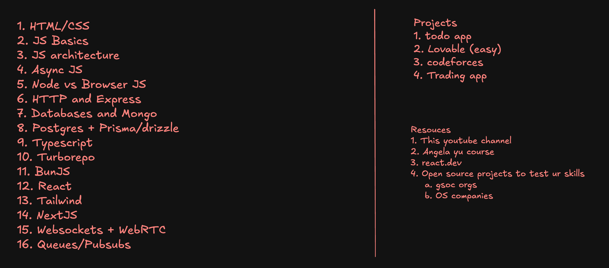

# TARGETS

# PROJECT OLYMPUS

## Duration

- **184 Days**
- Starting from **Ground Zero**
- Objective: **Complete Personal Renaissance**

## Mission

Engineer a complete transformation of:

- Identity
- Career
- Wealth
- Health
- Knowledge
- Discipline
- Social Status
- Purpose

---

# 1. Career

## Secure a Paid Internship

**Target**

- **₹50,000–55,000/month minimum stipend**

**Preferred Domains**

- FPGA
- RTL Design
- ASIC
- VLSI
- Embedded Systems
- Edge AI
- Semiconductor
- Hardware–Software Co-design

### Placement Goal

**Originally stated**

- **₹45–50 LPA+ package**

**Later revised as acceptable**

- **₹20–25 LPA minimum**

**Ultimate Dream**

- Semiconductor company
- Global hardware company
- High-end systems engineering

### Remote Work

**Target Countries**

- Taiwan
- Korea
- Singapore

**Purpose**

- Earn in foreign currency
- Build savings
- Escape low-paying local opportunities

---

# 2. Financial Goals

## Initial Target

- **Earn ₹6,00,000 within six months**

## Long-Term Income

- **₹2,00,000/month**

Through:

- AI Agency
- Freelancing
- Automation
- Consulting
- Software
- Electronics

Ultimate objective:

- Passive income

---

# 3. AI Automation Agency

Build a profitable AI Automation Agency.

**Services**

- GenAI
- AI Agents
- Workflow Automation
- Business Automation
- LLM Systems

**Goal**

- Real clients
- Real revenue

---

# 4. Electronics Mastery

Master:

- Digital Electronics
- Analog Electronics
- Signals & Systems
- Communication Systems
- Control Systems
- Microprocessors
- Computer Architecture
- Electronic Devices
- Network Theory
- Electromagnetics
- Embedded Systems
- ARM
- FPGA
- RTL
- HDL
- Verilog
- SystemVerilog
- VLSI
- ASIC
- SoC
- EDA Tools
- GPU Programming
- Hardware Acceleration
- Chip Design
- Semiconductor Engineering
- Hardware Validation
- Hardware Verification
- Hardware Software Integration

---

# 5. Computer Science Mastery

Become excellent at:

- C
- C++
- Python
- Linux
- Git
- GitHub
- DSA
- Algorithms
- Operating Systems
- Computer Networks
- Database Systems
- OOP
- System Design
- Low-Level Design
- High-Level Design
- Software Engineering
- DevOps
- MLOps
- AI Engineering
- ML
- LLMs
- Automation
- Cloud Basics

---

# 6. Coding Targets

### LeetCode

- **200+ Problems**

### Codeforces

- **1200+ Rating**

### HDLBits

- **100+ Problems**

Goal:

- Become capable of solving problems independently without depending on AI.

---

# 7. GATE Goals

## Primary

### GATE ECE

Original ambition:

- **2-digit AIR**

Also discussed:

- **AIR below 250**

## Secondary

### GATE EIE

- Strong rank

---

# 8. UPSC Engineering Services

Target:

- ESE
- Electronics & Communication

Dream Service:

- **IRMS**

---

# 9. IIT JAM

Subject:

- Mathematics

Target:

- Good rank

Previously discussed:

- **AIR below 250**

---

# 10. Higher Studies

Dream Institutes / Organizations

- IISc Bangalore
- PGCIL pathway
- ISRO
- BARC
- DRDO
- Higher Studies Abroad
- DAAD
- MITACS

---

# 11. Research

Initially:

- **1 Research Paper**

Later expanded:

- **3 Research Papers**

Goal:

- Become capable of real engineering research.

---

# 12. Portfolio

Build:

- Professional GitHub
- Portfolio Website
- LinkedIn
- Resume
- Projects
- Open Source Contributions
- Technical Writing
- Documentation

---

# 13. Engineering Projects

Build serious projects involving:

- Embedded
- FPGA
- AI
- Edge AI
- Automation
- Hardware
- Software
- Systems

---

# 14. Entrepreneurship

Create:

- AI Agency
- Freelancing
- Products
- Services
- Consulting
- Automation Systems

---

# 15. Physical Goals

Current:

- **Very underweight**
- **Below 50 kg**

Target:

- **65–70 kg**

Improve:

- Diet
- Strength
- Energy
- Posture
- Hair
- Sleep
- General Health

---

# 16. Mental Goals

Become:

- Logical
- Practical
- Creative
- Rational
- Emotionally Stable

Reduce:

- Overthinking

---

# 17. Reading

Read:

- **6 Books**

Including:

- Classics
- Literature
- Psychology
- Self-help
- Bhagavad Gita
- Kafka
- Dostoevsky
- Freud (study)

Additional focus:

- Find one book that genuinely helps move on emotionally.

---

# 18. Language

Learn one foreign language.

Candidates:

- Japanese
- Korean
- Spanish
- Italian

Purpose:

- Career
- Migration
- Visa

Target level:

- **JLPT/TOPIK-equivalent intermediate (roughly N4/N3 or similar aspirations)**

---

# 19. Chess

Target:

- **1100+ Elo**

Become competent in:

- Rapid
- Blitz
- Bullet

---

# 20. Communication

Improve:

- Speaking
- Writing
- Storytelling
- Presentation
- Technical Communication
- Networking

---

# 21. Personal Brand

Build presence on:

- GitHub
- LinkedIn
- X (Twitter)
- Engineering Communities

---

# 22. Creativity

Become:

- Inventive
- Original
- Problem Solver
- Innovator

---

# 23. Thinking

Develop:

- First Principles
- Systems Thinking
- Analytical Thinking
- Engineering Thinking
- Mathematical Thinking

---

# 24. Personality

Become:

- Disciplined
- Reliable
- Respected
- Confident
- Independent
- High Agency

---

# 25. Relationships

Rule:

- **No relationship during the transformation phase.**

Primary focus:

- Career
- Health
- Purpose

Only explore relationships after establishing your life.

---

# 26. Identity

Become:

- A Renaissance Engineer
- A Polymath

Bridge:

- Electronics
- Computer Science
- AI
- Business
- Research
- Leadership

---

# 27. Daily Execution Principles

- No compromise.
- No excuses.
- Start from scratch.
- Execution over motivation.
- Overthinking is the enemy.
- Consistency beats intensity.

---

# Numerical Targets Summary

| Target | Value |
| --- | --- |
| Transformation Duration | **184 Days** |
| Earnings Goal | **₹6,00,000** |
| Internship (main goal) | **₹50,000–55,000/month** |
| Internship (older summary value) | **₹30,000–35,000/month** |
| Acceptable Placement | **₹20–25 LPA** |
| Dream Placement | **₹45–50+ LPA** |
| Long-Term Income | **₹2,00,000/month** |
| Research Papers | **1–3** |
| LeetCode | **200+ Problems** |
| HDLBits | **100+ Problems** |
| Codeforces | **1200+ Rating** |
| Books | **6** |
| Body Weight | **50 kg → 65–70 kg** |
| GATE ECE | **2-digit AIR** (also discussed **AIR <250**) |
| GATE EIE | **AIR <250** (discussed) |
| IIT JAM Mathematics | **AIR <250** (discussed) |

## Overall Scope

The source concludes that your planning expanded to **roughly 180 individual goals** spanning:

- Career
- Academics
- Business
- Health
- Cognition
- Communication
- Research
- Identity